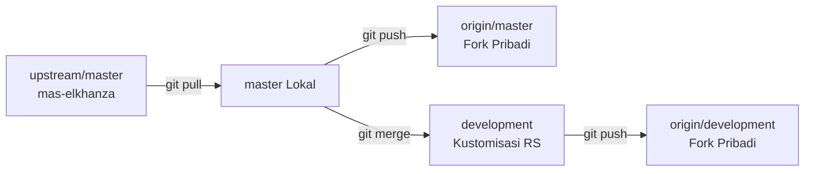

# Panduan Lengkap Konfigurasi Proyek SIMRS Khanza (Pasca Cloning)

Dokumen ini berisi panduan langkah demi langkah untuk melakukan konfigurasi, instalasi dependensi, penyiapan database, serta *build & run* proyek **SIMRS Khanza** setelah melakukan *cloning* dari repository Git.

---

## Daftar Isi
1. [Gambaran Arsitektur Proyek](#1-gambaran-arsitektur-proyek)
2. [Prasyarat Sistem & Kebutuhan Tools](#2-prasyarat-sistem--kebutuhan-tools)
3. [Langkah 1: Setup Repository & Git Remote](#langkah-1-setup-repository--git-remote)
4. [Langkah 2: Menyiapkan Folder Library Fisik (`lib/`)](#langkah-2-menyiapkan-folder-library-fisik-lib)
5. [Langkah 3: Penyiapan Database MySQL / MariaDB](#langkah-3-penyiapan-database-mysql--mariadb)
6. [Langkah 4: Konfigurasi Koneksi Database (`setting/database.xml`)](#langkah-4-konfigurasi-koneksi-database-settingdatabasexml)
7. [Langkah 5: Konfigurasi Editor / IDE](#langkah-5-konfigurasi-editor--ide)
   - [Opsi A: Visual Studio Code (Rekomendasi)](#opsi-a-visual-studio-code-rekomendasi)
   - [Opsi B: Apache NetBeans](#opsi-b-apache-netbeans)
8. [Langkah 6: Build & Run Aplikasi](#langkah-6-build--run-aplikasi)
9. [Langkah 7: Alur Git Workflow & Sinkronisasi Upstream](#langkah-7-alur-git-workflow--sinkronisasi-upstream)
10. [Troubleshooting & Solusi Masalah Umum](#10-troubleshooting--solusi-masalah-umum)

---

## 1. Gambaran Arsitektur Proyek

SIMRS Khanza dibangun menggunakan teknologi Java Desktop (Swing UI) monolitik dengan sistem *build* berbasis **Apache Ant**. 

| Komponen | Spesifikasi / Keterangan |
| :--- | :--- |
| **Bahasa Pemrograman** | Java (JDK 15 / JDK 8+) |
| **UI Framework** | Java Swing & NetBeans GUI Builder (`.form`) |
| **Build System** | Apache Ant (`build.xml`) |
| **Database** | MySQL 5.7+ / MariaDB 10.4+ (Default database: `sik`) |
| **Driver Koneksi** | JDBC MySQL Driver (Terenkripsi AES) |
| **Manajemen Dependensi** | Flat physical JARs di folder `/lib/` (tidak menggunakan Maven/Gradle untuk core desktop) |

---

## 2. Prasyarat Sistem & Kebutuhan Tools

Pastikan komputer/laptop Anda telah terpasang *tools* berikut:

1. **Java Development Kit (JDK):**
   - **Versi yang direkomendasikan:** **JDK 15** (OpenJDK atau Oracle JDK 15).
   - Periksa versi JDK di terminal:
     ```bash
     java -version
     javac -version
     ```
2. **Apache Ant:**
   - Diperlukan untuk kompilasi dan pembuatan file `.jar`.
   - Instalasi di macOS: `brew install ant`
   - Instalasi di Linux (Ubuntu/Debian): `sudo apt install ant`
   - Periksa versi: `ant -version`
3. **Database Server (MySQL / MariaDB):**
   - MySQL 5.7+, MySQL 8.0, atau MariaDB 10.4+ (misal via XAMPP, Homebrew, atau Docker).
4. **Code Editor / IDE:**
   - **Visual Studio Code** (dengan Extension *Extension Pack for Java*)
   - *ATAU* **Apache NetBeans** (v12, v15, v20+)
5. **Git CLI & Kunci SSH:**
   - Pastikan akun GitHub Anda sudah terhubung via SSH (`ssh -T git@github.com`).

---

## Langkah 1: Setup Repository & Git Remote

Setelah Anda melakukan `clone` dari repository fork pribadi:

```bash
# Clone fork Anda (gunakan SSH)
git clone git@github.com:<username-anda>/SIMRS-Khanza.git
cd SIMRS-Khanza

# Tambahkan upstream ke repository official Khanza
git remote add upstream https://github.com/mas-elkhanza/SIMRS-Khanza.git

# Buat dan pindah ke branch development untuk kustomisasi
git checkout -b development
```

Periksa remote:
```bash
git remote -v
```
Output yang benar:
- `origin` -> `git@github.com:<username-anda>/SIMRS-Khanza.git` (akses Read & Write)
- `upstream` -> `https://github.com/mas-elkhanza/SIMRS-Khanza.git` (akses Read untuk sinkronisasi)

---

## Langkah 2: Menyiapkan Folder Library Fisik (`lib/`)

> [!IMPORTANT]
> **Mengapa folder `lib/` tidak ada setelah clone?**  
> Folder `lib/` berisi sekitar **318 file binary JAR (~200+ MB)**. File ini sengaja diabaikan oleh Git via `.gitignore` agar repository tidak lambat dan tidak melanggar batas ukuran GitHub.

### Cara Mendapatkan dan Memasang Folder `lib/`:
1. **Unduh Paket Resmi SIMRS Khanza:**
   - Unduh rilis jadi / bundle library dari Google Drive resmi Khanza:  
     🔗 [Google Drive Official Khanza Software](https://drive.google.com/drive/folders/0ByL--Jg6bdF7RG1NSlVTT2ZPODg)
   - Atau salin folder `lib` dari instalasi SIMRS Khanza yang sudah berjalan di RS/klinik Anda.
2. **Ekstrak & Letakkan:**
   - Tempatkan seluruh file `.jar` ke dalam folder bernama `lib` di **root direktori project**:
     ```text
     SIMRS-Khanza/
     ├── build.xml
     ├── nbproject/
     ├── setting/
     ├── src/
     └── lib/             <-- Letakkan folder lib di sini
         ├── RXTXcomm.jar
         ├── UsuLibrary.jar
         ├── mysql-connector-java-*.jar
         └── (total ~318 file .jar lainnya)
     ```
3. **Verifikasi Folder `lib/`:**
   ```bash
   ls lib | wc -l
   ```
   *(Harus menampilkan sekitar 300+ file .jar)*

---

## Langkah 3: Penyiapan Database MySQL / MariaDB

1. **Jalankan Service MySQL/MariaDB:**
   - Pastikan MySQL/MariaDB berjalan di port default `3306`.
2. **Buat Database `sik`:**
   ```sql
   CREATE DATABASE sik CHARACTER SET utf8mb4 COLLATE utf8mb4_unicode_ci;
   ```
3. **Import File Skema `sik.sql`:**
   - File skema database sudah tersedia di root direktori project: `sik.sql`.
   - Import melalui Terminal:
     ```bash
     mysql -u root -p sik < sik.sql
     ```
   - Atau gunakan GUI Database client favorit Anda (DBeaver, HeidiSQL, TablePlus, phpMyAdmin).
4. *(Opsional)* Import modul tambahan jika dibutuhkan:
   - `sik_bridging_lab.sql`
   - `sik_bridging_radiologi.sql`

---

## Langkah 4: Konfigurasi Koneksi Database (`setting/database.xml`)

SIMRS Khanza menyimpan konfigurasi koneksi database di file `setting/database.xml` dan `setting/database.ini`. Nilai parameter dienkripsi menggunakan algoritma **AES-128**.

### Nilai Default AES yang Sering Digunakan:
| Parameter | Nilai Asli (Plaintext) | Nilai Terenkripsi (AES Base64) |
| :--- | :--- | :--- |
| **HOST** | `localhost` | `5k7+C7EnUw9nUv2Nix+DBA==` |
| **PORT** | `3306` | `nioxtijcpDaKSUiUiP5FAg==` |
| **DATABASE** | `sik` | `/EmAfBFOYC9C1OXVqPOX8g==` |
| **USER** | `root` | `kMR3WfAwUK6MbhCyydxa0g==` |
| **PAS (Kosong)** | *(tanpa password)* | `l4nh5eVYrLAER/I2A4b3Tw==` |

Contoh potongan file `setting/database.xml`:
```xml
<properties>
    <comment>KhanzaHMS</comment> 
    <entry key="HOST">5k7+C7EnUw9nUv2Nix+DBA==</entry>
    <entry key="DATABASE">/EmAfBFOYC9C1OXVqPOX8g==</entry>
    <entry key="PORT">nioxtijcpDaKSUiUiP5FAg==</entry>
    <entry key="USER">kMR3WfAwUK6MbhCyydxa0g==</entry>
    <entry key="PAS">l4nh5eVYrLAER/I2A4b3Tw==</entry>
    ...
</properties>
```

### Mengubah Password Database Sendiri:
Jika MySQL Anda menggunakan password khusus:
1. Buka sub-project `KhanzaPengenkripsiTeks/` yang ada di root repo.
2. Jalankan tool enkripsi:
   ```bash
   cd KhanzaPengenkripsiTeks
   ant run
   ```
3. Masukkan teks/password Anda, klik **Enkripsi**, lalu salin hasilnya ke `setting/database.xml` pada *key* yang bersesuaian.

---

## Langkah 5: Konfigurasi Editor / IDE

### Opsi A: Visual Studio Code (Rekomendasi)
Proyek ini sudah dilengkapi konfigurasi `.vscode/` teroptimasi untuk Java Ant:

1. **Pasang Ekstensi VS Code:**
   - *Extension Pack for Java* (oleh Microsoft)
2. **Fitur yang Sudah Terkonfigurasi Otomatis:**
   - `.vscode/settings.json`: Sudah mereferensikan library `lib/**/*.jar`, menonaktifkan indexing folder berat (report, gambar, webapps) agar VS Code tidak lag/lambat, dan mengatur alokasi RAM Java Language Server (`-Xmx4G`).
   - `.vscode/tasks.json`: Sudah menyediakan perintah Ant bawaan.
3. **Menggunakan VS Code Tasks:**
   - Tekan `Cmd + Shift + B` (Mac) atau `Ctrl + Shift + B` (Windows/Linux) untuk menjalankan **Ant: Clean & Build JAR**.
   - Buka menu *Terminal* -> *Run Task...* -> pilih **Ant: Run** untuk menjalankan aplikasi.

### Opsi B: Apache NetBeans
1. Buka Apache NetBeans.
2. Klik **File** -> **Open Project** -> pilih folder `SIMRS-Khanza`.
3. Jika muncul dialog *Resolve Missing Server/Libraries*:
   - NetBeans akan otomatis mengenali folder `lib/` fisik yang sudah Anda siapkan pada Langkah 2.
4. Pastikan Java Platform di NetBeans diset ke **JDK 15** (*Project Properties -> Sources -> Source/Binary Format: 15*).

---

## Langkah 6: Build & Run Aplikasi

### 1. Menggunakan Terminal / Command Line (Apache Ant):
```bash
# Bersihkan dan compile menjadi file JAR
ant clean jar

# Jalankan aplikasi langsung
ant run
```

### 2. Menjalankan File JAR yang Sudah Jadi:
Hasil kompilasi akan berada di folder `dist/`:
```bash
java -jar dist/SIMRS-Khanza.jar
```

### 3. Kredensial Login Default SIMRS Khanza:
- **User ID:** `spv` atau `admin`
- **Password:** `server` atau `akusayangwindi` (atau `spv`)

---

## Langkah 7: Alur Git Workflow & Sinkronisasi Upstream

Agar kustomisasi Anda tidak hilang saat ada pembaruan dari repository pembuat asli:



### Alur Rutin:
1. **Menyimpan Pekerjaan Anda:**
   ```bash
   git add .
   git commit -m "feat(pendaftaran): tambah validasi nomor rujukan"
   git push -u origin development
   ```
2. **Mengambil Update Terbaru dari Upstream:**
   ```bash
   git checkout master
   git pull upstream master
   git push origin master
   git checkout development
   git merge master
   ```
3. **Jika Terjadi Merge Conflict:**
   - Buka file yang berkonflik di VS Code.
   - Pilih *Accept Current Change* (kode Anda) atau *Accept Incoming Change* (kode Khanza official) atau gabungkan keduanya.
   - Simpan file, lalu:
     ```bash
     git add .
     git commit -m "merge: resolve conflict with upstream"
     git push origin development
     ```

---

## 10. Troubleshooting & Solusi Masalah Umum

### 1. `package ... does not exist` atau `ClassNotFoundException`
- **Penyebab:** Folder `lib/` belum terisi lengkap atau belum diletakkan di root direktori proyek.
- **Solusi:** Pastikan folder `lib/` ada di root proyek dan berisi 300+ file JAR. Jika menggunakan VS Code, reload window (`Cmd+Shift+P` -> *Developer: Reload Window*).

### 2. `UnsupportedClassVersionError: ... has been compiled by a more recent version of the Java Runtime`
- **Penyebab:** Versi Java JRE yang digunakan untuk menjalankan aplikasi lebih rendah daripada versi JDK saat kompilasi.
- **Solusi:** Pastikan Anda meng-compile dan menjalankan menggunakan JDK 15 (`javac.source=15`, `javac.target=15`).

### 3. `Communications link failure` / `Access denied for user`
- **Penyebab:** Service MySQL mati, port bukan 3306, nama database belum dibuat, atau enkripsi AES di `setting/database.xml` tidak cocok dengan user/password MySQL lokal Anda.
- **Solusi:** Pastikan MySQL hidup, database `sik` sudah dibuat, dan cek kembali nilai di `setting/database.xml`.

### 4. `OutOfMemoryError: Java heap space` saat kompilasi Ant
- **Penyebab:** Ant kehabisan memori saat mengompilasi ribuan file Java Khanza.
- **Solusi:** Tambahkan variabel *environment* alokasi memori Ant di terminal/profile shell Anda:
  ```bash
  export ANT_OPTS="-Xms512m -Xmx2048m"
  ```
