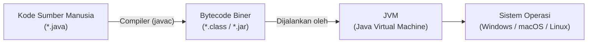
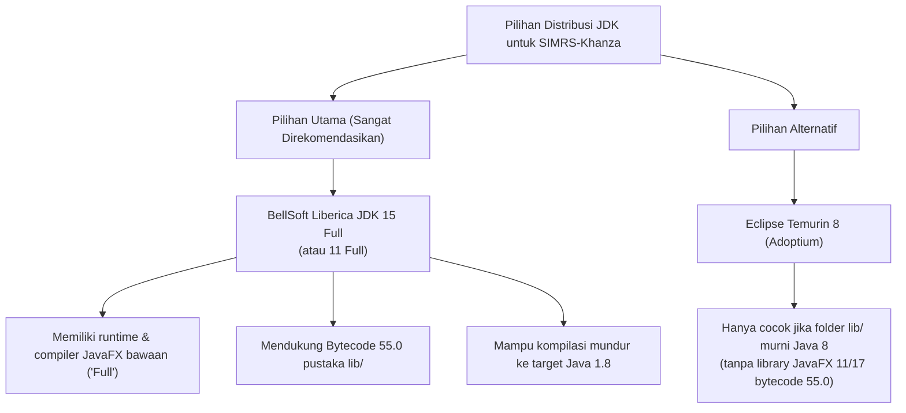
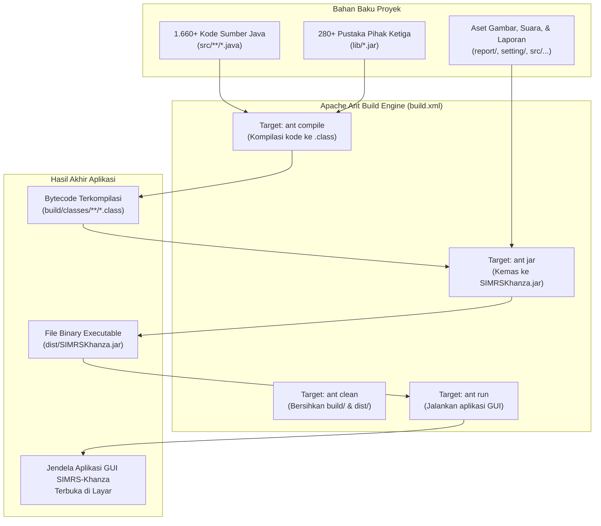
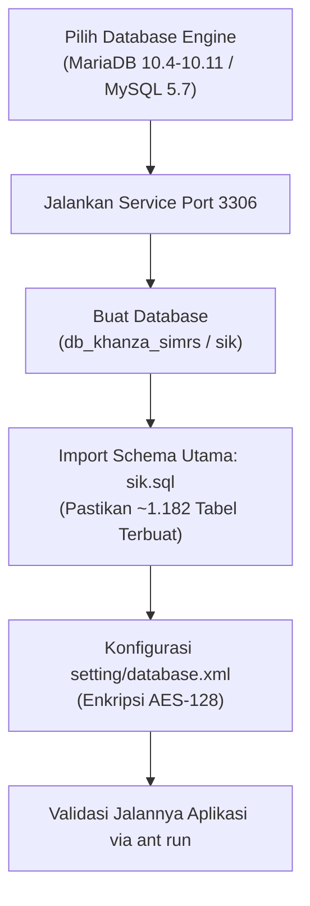
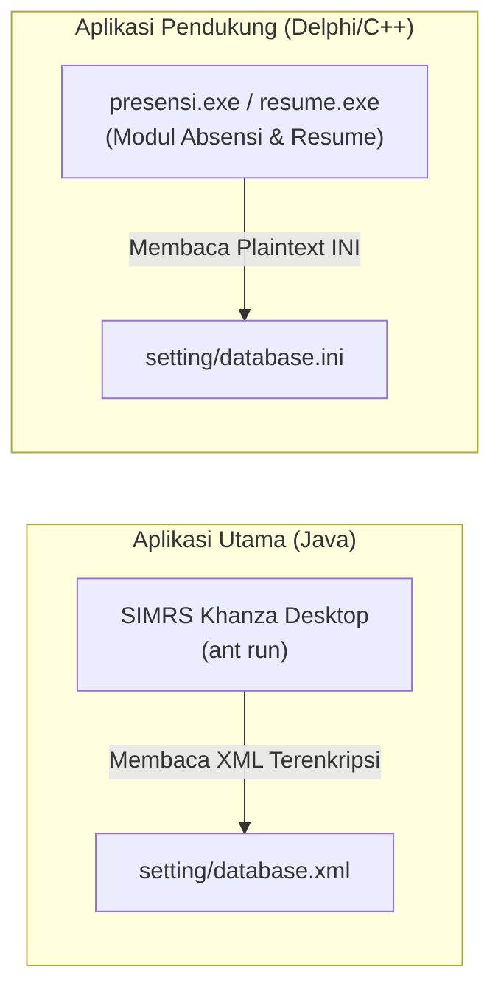
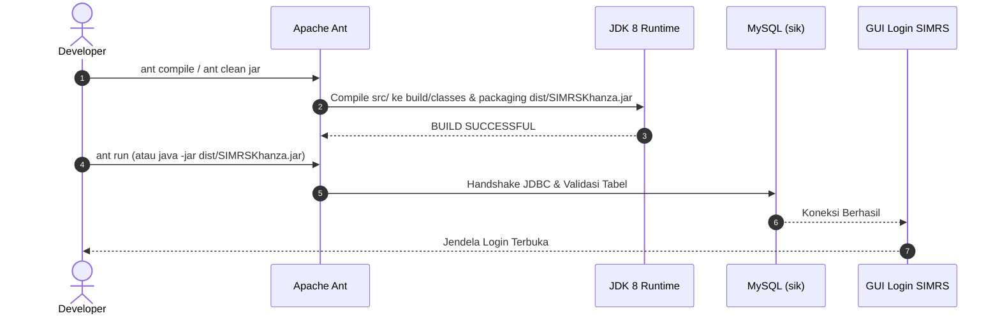

[Daftar Isi (README.md)](README.md) | [Selanjutnya: Konsep Laravel ke Java (02-laravel-to-java-guide.md) →](02-laravel-to-java-guide.md)

---

# Modul 1: Setup Environment dari Nol — Non-NetBeans (VS Code & CLI)

Selamat datang di modul pertama panduan pengembangan **SIMRS-Khanza**. Dokumen ini dirancang khusus bagi pengembang yang bekerja **di luar lingkungan NetBeans IDE** (menggunakan **Visual Studio Code**, editor teks modern, serta **Apache Ant via CLI/Terminal**) untuk menyiapkan lingkungan kerja (*development environment*) dari kondisi kosong (*bare-metal*) hingga aplikasi SIMRS-Khanza berhasil dikompilasi dan dijalankan pada komputer lokal Anda (macOS & Windows).

Modul ini mencakup instalasi JDK, Apache Ant, penanganan memori compiler, konfigurasi pustaka fisik (`lib/`), konfigurasi Visual Studio Code teroptimasi, serta eksekusi perdana.

---

## 📋 Daftar Isi Modul

- [1. Ringkasan Prasyarat Sistem](#1-ringkasan-prasyarat-sistem)
  - [Kebutuhan Perangkat Keras (Hardware)](#kebutuhan-perangkat-keras-hardware)
  - [Kompatibilitas Sistem Operasi](#kompatibilitas-sistem-operasi)
- [2. Mengenal & Mengonfigurasi Java Development Kit (JDK)](#2-mengenal--mengonfigurasi-java-development-kit-jdk)
  - [2.1 Konsep Dasar: Apa itu JVM, JRE, dan JDK?](#21-konsep-dasar-apa-itu-jvm-jre-dan-jdk)
  - [2.2 JDK Apa yang HARUS Digunakan untuk SIMRS-Khanza? (Dan Mengapa?)](#22-jdk-apa-yang-harus-digunakan-untuk-simrs-khanza-dan-mengapa)
  - [2.3 Panduan Unduh & Instalasi JDK](#23-panduan-unduh--instalasi-jdk)
  - [2.4 Konfigurasi Variabel Lingkungan (`JAVA_HOME` & `Path`)](#24-konfigurasi-variabel-lingkungan-java_home--path)
- [3. Mengenal & Mengonfigurasi Apache Ant (Build Tool)](#3-mengenal--mengonfigurasi-apache-ant-build-tool)
  - [3.1 Konsep Dasar: Apa itu Sistem Build & Apa itu Apache Ant?](#31-konsep-dasar-apa-itu-sistem-build--apa-itu-apache-ant)
  - [3.2 Kenapa SIMRS-Khanza Menggunakan Apache Ant? (Kenapa Bukan Maven atau Gradle?)](#32-kenapa-simrs-khanza-menggunakan-apache-ant-kenapa-bukan-maven-atau-gradle)
  - [3.3 Target Perintah Ant yang Wajib Diketahui Pengembang](#33-target-perintah-ant-yang-wajib-diketahui-pengembang)
  - [3.4 Panduan Instalasi Apache Ant](#34-panduan-instalasi-apache-ant)
  - [3.5 Konfigurasi Memori Ant (`ANT_OPTS`) — Wajib untuk SIMRS-Khanza](#35-konfigurasi-memori-ant-ant_opts--wajib-untuk-simrs-khanza)
  - [💡 Skrip Cepat Setup Seluruh Environment Variable di Windows (PowerShell)](#-skrip-cepat-setup-seluruh-environment-variable-di-windows-powershell)
- [4. Setup Database MySQL / MariaDB](#4-setup-database-mysql--mariadb)
  - [4.1 Pemilihan Engine Database: MariaDB vs MySQL 8.x (KRUSIAL!)](#41-pemilihan-engine-database-mariadb-vs-mysql-8x-krusial)
  - [4.2 Menjalankan Service Database (Laragon & Layanan Mandiri)](#42-menjalankan-service-database-laragon--layanan-mandiri)
  - [4.3 Membuat Database & Mengimpor Skema (`sik.sql`)](#43-membuat-database--mengimpor-skema-siksql)
  - [4.4 Konfigurasi Kredensial: `setting/database.xml` vs `setting/database.ini`](#44-konfigurasi-kredensial-settingdatabasexml-vs-settingdatabaseini)
  - [4.5 Troubleshooting: Error `Table doesn't exist` (`setting`, `user`, `set_tni_polri`)](#45-troubleshooting-error-table-doesnt-exist-setting-user-set_tni_polri)
- [5. Penanganan Dependensi Fisik (Misteri Folder `lib/`)](#5-penanganan-dependensi-fisik-misteri-folder-lib)
  - [Mengapa Folder `lib/` Masuk `.gitignore`?](#mengapa-folder-lib-masuk-gitignore)
  - [Sumber Unduh Resmi Folder `lib/`](#sumber-unduh-resmi-folder-lib)
  - [Cara Pemasangan & Verifikasi](#cara-pemasangan--verifikasi)
  - [Memahami Perbedaan `lib` (Windows) vs `lib` (macOS) dan `lib32`](#memahami-perbedaan-lib-windows-vs-lib-macos-dan-lib32)
- [6. Konfigurasi Visual Studio Code](#6-konfigurasi-visual-studio-code)
  - [1. Pasang Ekstensi Wajib](#1-pasang-ekstensi-wajib)
  - [2. File Konfigurasi `.vscode/settings.json`](#2-file-konfigurasi-vscodesettingsjson)
  - [3. File Konfigurasi `.vscode/tasks.json`](#3-file-konfigurasi-vscodetasksjson)
- [7. Verifikasi Akhir Build & Eksekusi Pertama](#7-verifikasi-akhir-build--eksekusi-pertama)
  - [Langkah 1: Kompilasi Proyek](#langkah-1-kompilasi-proyek)
  - [Langkah 2: Build Binary JAR Lengkap](#langkah-2-build-binary-jar-lengkap)
  - [Langkah 3: Menjalankan Aplikasi](#langkah-3-menjalankan-aplikasi)
  - [Kredensial Login Default](#kredensial-login-default)

---

## 1. Ringkasan Prasyarat Sistem

SIMRS-Khanza adalah aplikasi desktop berbasis **Java Swing** yang dibangun di atas sistem *build* **Apache Ant**. Sebelum memulai instalasi, pastikan sistem operasi dan perangkat keras Anda memenuhi spesifikasi berikut:

### Kebutuhan Perangkat Keras (Hardware)
| Komponen | Spesifikasi Minimum | Spesifikasi Rekomendasi |
| :--- | :--- | :--- |
| **Processor (CPU)** | Dual-Core 2.0 GHz (Intel/AMD/Apple Silicon) | Quad-Core 2.5 GHz+ (Apple M Series / Intel Core i5/i7/i9 / AMD Ryzen) |
| **Memori (RAM)** | 4 GB | 8 GB – 16 GB (Java Language Server & Compiler membutuhkan RAM cukup) |
| **Penyimpanan (Storage)** | 5 GB ruang kosong (SSD sangat disarankan) | 10 GB+ ruang kosong pada SSD |
| **Resolusi Layar** | 1366 x 768 piksel | 1920 x 1080 (Full HD) atau lebih tinggi |

### Kompatibilitas Sistem Operasi
- **macOS**: macOS Monterey (12), Ventura (13), Sonoma (14), Sequoia (15) — Mendukung Apple Silicon (M1/M2/M3/M4) dan Intel x86_64.
- **Linux**: Ubuntu 20.04/22.04/24.04 LTS, Debian 11/12, Fedora, Arch Linux, dan distro turunan lainnya.
- **Windows**: Windows 10 / Windows 11 (64-bit).

---

## 2. Mengenal & Mengonfigurasi Java Development Kit (JDK)

Bagi pengembang yang berlatar belakang bahasa *scripting* atau web (*PHP / Laravel, JavaScript / Node.js, Python*), ekosistem Java memiliki konsep runtime dan kompilasi yang berbeda. Sub-bab ini menjelaskan konsep dasar Java, perbedaan JRE vs JDK, serta alasan pemilihan distribusi JDK yang tepat untuk SIMRS-Khanza.

---

### 2.1 Konsep Dasar: Apa itu JVM, JRE, dan JDK?

Pada bahasa pemrograman seperti PHP atau Python, kode program yang Anda tulis dalam bentuk teks langsung dibaca dan dijalankan baris demi baris oleh mesin *interpreter* (`php index.php` atau `python app.py`).

**Java adalah bahasa yang dikompilasi (*Compiled Language*) ke format Bytecode:**
1. Anda menulis kode program dalam file teks berekstensi `.java` (contoh: `src/simrskhanza/frmUtama.java`).
2. Komputer atau sistem operasi (Windows/Mac/Linux) **tidak dapat membaca** file `.java` tersebut secara langsung.
3. Kode teks `.java` harus diterjemahkan terlebih dahulu oleh program **Compiler** (`javac`) menjadi bahasa biner mesin virtual yang disebut **Bytecode** (menghasilkan file berekstensi `.class`).
4. File `.class` tersebut kemudian dieksekusi oleh mesin virtual khusus yang bernama **JVM (Java Virtual Machine)**.



Di dalam ekosistem Java, terdapat 3 istilah utama yang wajib dipahami:

| Istilah | Kepanjangan | Fungsi & Peran | Siapa Penggunanya? |
| :--- | :--- | :--- | :--- |
| **JVM** | *Java Virtual Machine* | Mesin virtual yang membaca dan mengeksekusi *Bytecode* (`.class`) agar dapat berinteraksi dengan prosesor dan OS lokal. Inilah fondasi moto Java: *"Write Once, Run Anywhere"*. | Bagian internal dari JRE dan JDK. |
| **JRE** | *Java Runtime Environment* | Paket berisi JVM ditambah pustaka standar Java. JRE **hanya bisa menjalankan** program Java yang sudah jadi (`.jar`), dan **TIDAK memiliki compiler (`javac`)**. | **Pengguna Akhir / End-User** (staf pendaftaran, kasir, perawat di rumah sakit yang hanya menjalankan aplikasi). |
| **JDK** | *Java Development Kit* | Paket perkakas lengkap untuk pengembang software. Berisi seluruh isi JRE **ditambah** program Compiler (`javac`), Archiver (`jar`), Debugger (`jdb`), dan header API pengembangan. | **Software Engineer / Developer** (Anda yang mengedit kode, mengompilasi, dan membangun SIMRS-Khanza). |

> [!IMPORTANT]
> **Sebagai Developer, Anda WAJIB Menginstal JDK, Bukan JRE!**  
> Jika Anda hanya menginstal JRE, Anda tidak akan memiliki perintah `javac` dan proses kompilasi SIMRS-Khanza akan gagal dengan pesan error *`javac not found`*.

#### Mengapa Ada Banyak Nama Vendor JDK? (Oracle, Temurin, Liberica, Corretto)
Dahulu Java dikelola secara tertutup oleh Sun Microsystems lalu Oracle. Saat ini, spesifikasi inti Java bersifat *open-source* dengan nama **OpenJDK**. Berbagai perusahaan dan konsorsium global merilis paket instalasi OpenJDK yang telah lulus sertifikasi resmi TCK (*Technology Compatibility Kit*):
- **Eclipse Temurin** (dikelola oleh *Adoptium Foundation / Eclipse*): Distribusi standar komunitas open-source global.
- **BellSoft Liberica JDK**: Sangat populer di kalangan aplikasi desktop karena menyediakan varian **"Full"** yang sudah membundel pustaka antarmuka grafis **JavaFX**.
- **Amazon Corretto**, **Microsoft OpenJDK**, **Azul Zulu**: Distribusi yang dioptimalkan untuk cloud dan server.

Semua vendor di atas menjalankan spesifikasi bahasa Java yang identik. Perbedaannya hanya terletak pada fitur bundling (seperti JavaFX) dan dukungan jangka panjang (*LTS*).

---

### 2.2 JDK Apa yang HARUS Digunakan untuk SIMRS-Khanza? (Dan Mengapa?)

Memilih JDK untuk SIMRS-Khanza sering membingungkan pengembang baru karena adanya **perbedaan generasi teknologi antara kode sumber dan pustaka dependensinya**:

1. **Target Kode Sumber Asli: Java 8 (JavaSE-1.8)**  
   SIMRS-Khanza dirancang sejak belasan tahun lalu. Seluruh form antarmuka GUI Matisse, cetakan dokumen JasperReports klasik (`jasperreports-3.7.x` s/d `4.x`), dan ratusan logika database dikompilasi dengan target spesifikasi **Java 1.8** (`javac.source=1.8` dan `javac.target=1.8`).
2. **Kenyataan Pustaka di Folder `lib/`: Mengandung JavaFX Modern (Bytecode 55.0)**  
   Pada distribusi SIMRS-Khanza versi saat ini, folder `lib/` memuat pustaka modern JavaFX (`javafx.base.jar`, `javafx.controls.jar`, dll.) versi 11/17 yang dikompilasi dengan spesifikasi **Class Bytecode 55.0** (standar Java 11 ke atas).

#### Apa yang Terjadi Jika Salah Memilih Versi JDK?
- **Jika Menggunakan JDK 8 Biasa (misal Eclipse Temurin 8):**  
  Proses kompilasi akan **GAGAL** dengan pesan error:
  ```text
  Fatal Error: Unable to find method ... class file has wrong version 55.0, should be 52.0
  ```
  *(Artinya: Compiler Java 8 menolak membaca library JavaFX di folder `lib/` karena library tersebut dibuat menggunakan Java yang lebih baru daripada Java 8).*
- **Jika Menggunakan JDK 17 atau JDK 21 Biasa:**  
  Kompilasi sering gagal karena Oracle dan OpenJDK telah menghapus modul JavaFX dari inti JDK sejak Java 11, serta memperketat pembatasan modul internal yang masih dipakai oleh kode warisan Khanza.

#### 🏆 Rekomendasi Resmi: BellSoft Liberica JDK 15 Full (atau Liberica JDK 11 Full)

Untuk memastikan SIMRS-Khanza dapat dikompilasi dan dijalankan 100% tanpa error, gunakan distribusi berikut:



- **Mengapa Harus BellSoft Liberica Varian "Full"?**  
  Kata **"Full"** menandakan bahwa JDK ini telah menyertakan seluruh modul **JavaFX** secara *built-in*. Anda tidak perlu mengunduh JavaFX SDK terpisah atau menambahkan parameter VM `--module-path` yang rumit.
- **Mengapa Versi 15 (atau 11)?**  
  Compiler Java 15 mampu membaca pustaka ber-bytecode 55.0 yang ada di folder `lib/`, namun memiliki kompatibilitas sempurna untuk mengompilasi mundur (*cross-compile*) seluruh kode SIMRS-Khanza ke target **Java 1.8**.

---

### 2.3 Panduan Unduh & Instalasi JDK

Pilihlah salah satu opsi di bawah ini sesuai sistem operasi Anda:

#### Opsi 1: BellSoft Liberica JDK 15 Full (Pilihan Utama — Bebas Masalah Bytecode 55.0)
- **Windows (10/11 64-bit):**
  - Unduh file installer `.msi` resmi: [BellSoft Liberica JDK 15.0.2 Full MSI (Windows x86_64)](https://download.bell-sw.com/java/15.0.2+10/bellsoft-jdk15.0.2+10-windows-amd64-full.msi).
  - Jalankan file `.msi`, pastikan opsi **"Add to PATH"** dan **"Set JAVA_HOME variable"** aktif saat instalasi.
  - Lokasi default instalasi: `C:\Program Files\BellSoft\LibericaJDK-15-Full`.
- **macOS (Apple Silicon M1/M2/M3/M4 & Intel):**
  - Unduh paket `.pkg` resmi: [BellSoft Liberica Releases](https://bell-sw.com/pages/downloads/#/java-15-current) (pilih *macOS*, *ARM* atau *x86*, paket *Full JDK*).
  - Atau pasang versi 11 Full via Homebrew:
    ```bash
    brew tap bell-sw/liberica
    brew install --cask liberica-jdk11-full-mac
    ```
- **Linux (Ubuntu / Debian):**
  - Unduh paket `.deb`:
    ```bash
    wget https://download.bell-sw.com/java/15.0.2+10/bellsoft-jdk15.0.2+10-linux-amd64-full.deb
    sudo apt install ./bellsoft-jdk15.0.2+10-linux-amd64-full.deb
    ```

#### Opsi 2: Eclipse Temurin 8 (Alternatif — Khusus Bundle `lib/` Murni Java 8)
- **Windows:** Unduh MSI dari [Adoptium Eclipse Temurin 8](https://adoptium.net/temurin/releases/?version=8) atau jalankan `winget install EclipseAdoptium.Temurin.8.JDK`.
- **macOS:** Jalankan `brew install --cask temurin@8`.
- **Linux:** Jalankan `sudo apt install -y openjdk-8-jdk`.

---

### 2.4 Konfigurasi Variabel Lingkungan (`JAVA_HOME` & `Path`)

Agar sistem operasi dan terminal mengenali perintah `java` dan `javac`, daftarkan lokasi instalasi JDK ke dalam sistem:

#### A. macOS (`~/.zshrc`)
Buka file shell profile:
```bash
nano ~/.zshrc
```
Tambahkan di baris paling bawah (sesuaikan dengan JDK yang Anda instal):
```bash
# Jika menggunakan Liberica Full:
export JAVA_HOME=$(/usr/libexec/java_home -v 15 2>/dev/null || /usr/libexec/java_home -v 11 2>/dev/null || /usr/libexec/java_home -v 1.8)
export PATH=$JAVA_HOME/bin:$PATH
```
Simpan file (`Ctrl+O`, `Enter`, lalu `Ctrl+X`), kemudian muat ulang:
```bash
source ~/.zshrc
```

#### B. Linux (`~/.bashrc` atau `~/.zshrc`)
```bash
echo 'export JAVA_HOME=/usr/lib/jvm/bellsoft-java15-full-amd64' >> ~/.bashrc
echo 'export PATH=$JAVA_HOME/bin:$PATH' >> ~/.bashrc
source ~/.bashrc
```

#### C. Windows (10/11) via Terminal (Run as Administrator)
Buka **PowerShell sebagai Administrator** dan jalankan:
```powershell
# 1. Daftarkan JAVA_HOME ke System Environment Variables:
[System.Environment]::SetEnvironmentVariable('JAVA_HOME', 'C:\Program Files\BellSoft\LibericaJDK-15-Full', 'Machine')
# Catatan: Jika menggunakan Temurin 8, ubah path ke 'C:\Program Files\Eclipse Adoptium\jdk-8.0.xxx-hotspot'

# 2. Tambahkan %JAVA_HOME%\bin ke System Path jika belum ada:
$currentPath = [System.Environment]::GetEnvironmentVariable('Path', 'Machine')
if ($currentPath -notlike "*%JAVA_HOME%\bin*" -and $currentPath -notlike "*C:\Program Files\BellSoft\LibericaJDK-15-Full\bin*") {
    [System.Environment]::SetEnvironmentVariable('Path', "$currentPath;%JAVA_HOME%\bin", 'Machine')
}
```
*(Atau via **Command Prompt** Administrator: `setx /M JAVA_HOME "C:\Program Files\BellSoft\LibericaJDK-15-Full"` lalu `setx /M PATH "%PATH%;%JAVA_HOME%\bin"`).*

#### Verifikasi Instalasi Java
Tutup terminal dan buka terminal baru, lalu jalankan:
```bash
java -version
javac -version
```
Jika terminal menampilkan informasi versi Java dan versi compiler `javac`, instalasi JDK Anda telah berhasil sempurna!

---

## 3. Mengenal & Mengonfigurasi Apache Ant (Build Tool)

Bagi pengembang yang terbiasa dengan web framework modern (*Laravel Composer, Node.js NPM/Vite/Webpack, Python Pip*), istilah **Apache Ant** dan **Sistem Build** mungkin terdengar asing. Sub-bab ini menguraikan apa itu Ant, peran fungsionalnya, serta alasan kuat mengapa SIMRS-Khanza menggunakan Apache Ant.

---

### 3.1 Konsep Dasar: Apa itu Sistem Build & Apa itu Apache Ant?

Bayangkan Anda sedang membangun sebuah gedung pencakar langit. Anda memiliki ribuan batu bata, semen, kaca, dan pipa ledeng. Anda tidak bisa begitu saja melempar bahan-bahan tersebut ke tanah dan mengharapkan gedung berdiri sendiri. Anda membutuhkan tim kontraktor yang mengikuti cetak biru (*blueprint*) langkah demi langkah: menggali fondasi, menyusun bata, memasang atap, dan mengecat dinding.

Di dunia rekayasa perangkat lunak Java:
- **Bahan Mentah**: SIMRS-Khanza memiliki **lebih dari 1.660 file kode Java (`src/**/*.java`)**, **lebih dari 280 file pustaka luar (`lib/*.jar`)**, ratusan file desain cetakan laporan JasperReports (`.jrxml` / `.jasper`), ribuan file aset gambar logo rumah sakit, ikon UI, dan file konfigurasi XML.
- **Tantangan**: Komputer tidak bisa menjalankan aplikasi hanya dari tumpukan file mentah tersebut. Sebelum aplikasi bisa dibuka, serangkaian pekerjaan berat harus dilakukan:
  1. Membersihkan sisa file kompilasi usang dari folder `build/`.
  2. Mengompilasi 1.660+ file `.java` menjadi ribuan file biner `.class` menggunakan perintah `javac`.
  3. Menghubungkan (*linking*) seluruh 280+ file `.jar` pustaka eksternal agar compiler mengenali class pihak ketiga (driver database, bridging BPJS, modul printer, dll.).
  4. Menyalin file aset statis (gambar, file properti, XML, template laporan) ke folder target.
  5. Mengemas (*packaging*) seluruh file `.class` dan seluruh aset menjadi satu file aplikasi mandiri berekstensi `.jar` (yaitu **`dist/SIMRSKhanza.jar`**).

Jika seorang developer harus mengetikkan perintah `javac` secara manual di terminal untuk 1.660 file dan menyertakan 280 nama pustaka JAR satu per satu setiap kali ingin menguji aplikasi, proses tersebut akan membutuhkan waktu berjam-jam dan rentan kesalahan manusia (*human error*).

**Di sinilah peran Sistem Build (*Build Automation Tool*):**
> **Apache Ant** adalah alat otomatisasi proses kompilasi dan perakitan software (*Build Tool*) berbasis Java. Ant membaca skrip petunjuk instruksi berbentuk file XML (`build.xml`) dan menjalankan seluruh rangkaian tugas di atas secara otomatis dalam hitungan detik hanya dengan satu perintah singkat di terminal.



---

### 3.2 Kenapa SIMRS-Khanza Menggunakan Apache Ant? (Kenapa Bukan Maven atau Gradle?)

Di dunia modern, Java memiliki tiga generasi build tool utama:
1. **Apache Ant (Generasi 1 - Rilis Tahun 2000)**: Build tool berbasis task (tugas) yang diatur lewat XML (`build.xml`). Sangat fleksibel layaknya `make` di C/C++, namun mengharuskan pengembang mengelola file library `.jar` secara fisik di dalam folder lokal proyek (`lib/`).
2. **Apache Maven (Generasi 2 - Rilis Tahun 2004)**: Memperkenalkan standarisasi struktur folder dan manajemen dependensi otomatis via internet (`pom.xml`). Library diunduh secara otomatis dari repository global (*Maven Central*).
3. **Gradle (Generasi 3 - Rilis Tahun 2012)**: Menggunakan bahasa scripting Groovy/Kotlin, sangat cepat dan menjadi standar resmi pengembangan aplikasi Android serta Spring Boot modern.

**Mengapa SIMRS-Khanza tetap setia menggunakan Apache Ant?** Ada tiga alasan arsitektural dan praktis yang sangat kuat:

#### 1. Basis Proyek NetBeans IDE Tradisional
SIMRS-Khanza pertama kali dibangun dan dibesarkan menggunakan **NetBeans IDE**. Format proyek bawaan NetBeans secara *native* menggunakan Apache Ant sebagai mesin intinya. Generator antarmuka grafis visual Matisse (`.form`), skrip `nbproject/project.properties`, dan `nbproject/build-impl.xml` dirancang menyatu erat dengan ekosistem Ant.

#### 2. Kemandirian Jaringan Rumah Sakit (100% Offline / Air-Gapped Ready)
- Banyak fasilitas kesehatan (RSUD pedalaman, Puskesmas di pulau terluar, RS Militer) menerapkan kebijakan keamanan jaringan tertutup (*air-gapped*) yang sama sekali **tidak memiliki koneksi internet publik** demi menjamin kerahasiaan data rekam medis pasien.
- Jika SIMRS-Khanza menggunakan Maven atau Gradle, proses *build* pertama kali akan mewajibkan komputer mengunduh ratusan dependensi dari server internet global. Jika jaringan internet lambat, terputus, atau diblokir firewall rumah sakit, kompilasi akan **gagal total**.
- Dengan Apache Ant, seluruh **280+ file pustaka JAR (~300 MB)** sudah disediakan lengkap dan permanen langsung di dalam folder lokal `lib/`. Pengembang, teknisi RS, atau tim IT instalasi dapat mengompilasi, memodifikasi, dan menguji aplikasi di mana saja secara offline tanpa butuh setetes pun koneksi internet!

#### 3. Stabilitas Ratusan Pustaka Kustom (*Proprietary & Modified Drivers*)
SIMRS-Khanza menggunakan banyak sekali pustaka khusus yang telah dimodifikasi oleh komunitas pengembang Khanza (misalnya driver sensor sidik jari DigitalPersona, library komunikasi serial RS-232 timbangan obat dan mesin antrean, generator JasperReports klasik, dan client bridging BPJS khusus). Pustaka-pustaka ini tidak pernah dipublikasikan ke Maven Central publik. Menggunakan Ant memastikan proyek selalu menggunakan biner JAR lokal yang stabil dan teruji tanpa risiko dependensi berubah versi.

---

### 3.3 Target Perintah Ant yang Wajib Diketahui Pengembang

Di dalam terminal atau Command Prompt, Anda hanya perlu menjalankan beberapa perintah Ant inti berikut untuk mengontrol siklus hidup proyek:

| Perintah Ant | Apa yang Dilakukannya di Balik Layar? | Kapan Harus Digunakan? |
| :--- | :--- | :--- |
| **`ant compile`** | Membaca file `.java` di `src/`, memeriksa file mana saja yang berubah, lalu mengompilasinya menjadi file `.class` di folder `build/classes/`. | Saat Anda baru saja mengubah kode Java dan ingin memastikan tidak ada *syntax error* tanpa perlu membuka aplikasi. |
| **`ant jar`** | Mengompilasi kode, menyalin seluruh resource aset (gambar, suara, konfigurasi), lalu membungkusnya menjadi file **`dist/SIMRSKhanza.jar`**. | Saat Anda ingin menghasilkan file binary aplikasi final yang siap disebarkan (*deploy*) ke komputer staf rumah sakit. |
| **`ant run`** | Melakukan kompilasi, membuat JAR, lalu langsung meluncurkan jendela antarmuka GUI SIMRS-Khanza di layar monitor Anda. | Saat Anda ingin menguji jalannya aplikasi secara visual selama proses pengembangan. |
| **`ant clean`** | Menghapus seluruh folder sementara `build/` dan `dist/`. | Saat Anda ingin membersihkan sisa-sisa kompilasi lama yang mungkin rusak (*corrupted cache*). |
| **`ant clean compile`** | Menghapus build lama lalu mengompilasi ulang seluruh 1.660+ file sumber dari nol (*fresh build*). | Sangat disarankan saat pertama kali clone repo atau setelah melakukan merge branch besar dari Git. |

---

### 3.4 Panduan Instalasi Apache Ant

- **macOS (via Homebrew):**
  ```bash
  brew install ant
  ```
- **Linux (Ubuntu / Debian):**
  ```bash
  sudo apt update && sudo apt install -y ant
  ```
- **Windows (10/11):**
  - Unduh biner ZIP resmi Apache Ant dari [ant.apache.org](https://ant.apache.org/bindownload.cgi) (pilih format `.zip`).
  - Ekstrak isi ZIP tersebut ke direktori tetap, misalnya `C:\apache-ant`.
  - Daftarkan `ANT_HOME` dan tambahkan `C:\apache-ant\bin` ke System `Path` (lihat skrip otomatis di bawah).
  - Atau via package manager Chocolately / Scoop:
    ```powershell
    choco install ant
    ```

#### Verifikasi Apache Ant
Buka terminal baru dan jalankan:
```bash
ant -version
```
**Hasil yang Diharapkan:**
```text
Apache Ant(TM) version 1.10.x compiled on ...
```

---

### 3.5 Konfigurasi Memori Ant (`ANT_OPTS`) — Wajib untuk SIMRS-Khanza

SIMRS-Khanza memiliki ukuran form antarmuka GUI yang sangat masif. File seperti `frmUtama.java` memiliki lebih dari **51.000 baris kode**, dan `RMRiwayatPerawatan.java` memiliki lebih dari **37.000 baris kode**.

Ketika compiler Java (`javac`) membaca file sebesar itu, struktur pohon sintaksisnya (*Abstract Syntax Tree*) sangat dalam sehingga compiler kehabisan memori tumpukan (*thread stack memory*) bawaan yang standarnya hanya 1 MB. Hal ini menyebabkan kompilasi berhenti tiba-tiba dengan pesan error:
```text
[javac] java.lang.StackOverflowError
[javac]     at com.sun.tools.javac.comp.Attr.visitSelect(...)
```

**Solusinya adalah memperbesar alokasi memori Ant via variabel lingkungan `ANT_OPTS`:**
- `-Xss64m`: Memperbesar ukuran stack thread compiler dari 1 MB menjadi **64 MB** (menghilangkan error `StackOverflowError`).
- `-Xmx2048m`: Memperbesar batas memori heap maksimum menjadi **2048 MB (2 GB)** agar proses kompilasi 1.660+ file berjalan cepat dan mulus.

#### Pengaturan `ANT_OPTS`:
- **macOS / Linux (`~/.zshrc` atau `~/.bashrc`):**
  ```bash
  echo 'export ANT_OPTS="-Xss64m -Xmx2048m"' >> ~/.zshrc
  source ~/.zshrc
  ```
- **Windows (PowerShell Administrator):**
  ```powershell
  [System.Environment]::SetEnvironmentVariable('ANT_OPTS', '-Xss64m -Xmx2048m', 'Machine')
  ```
- **Windows (Command Prompt Administrator):**
  ```cmd
  setx /M ANT_OPTS "-Xss64m -Xmx2048m"
  ```

---

### 💡 Skrip Cepat Setup Seluruh Environment Variable di Windows (PowerShell)

Jika Anda baru melakukan setup awal di PC Windows, Anda dapat membuka **PowerShell sebagai Administrator** (*Run as Administrator*), lalu menyalin blok perintah berikut sekaligus untuk menyelesaikan konfigurasi Java dan Ant dalam satu kali klik:

```powershell
# 1. Daftarkan JAVA_HOME (sesuaikan jika path folder JDK Anda berbeda)
[System.Environment]::SetEnvironmentVariable('JAVA_HOME', 'C:\Program Files\BellSoft\LibericaJDK-15-Full', 'Machine')

# 2. Daftarkan ANT_HOME
[System.Environment]::SetEnvironmentVariable('ANT_HOME', 'C:\apache-ant', 'Machine')

# 3. Daftarkan ANT_OPTS (wajib untuk mencegah StackOverflowError saat kompilasi file besar)
[System.Environment]::SetEnvironmentVariable('ANT_OPTS', '-Xss64m -Xmx2048m', 'Machine')

# 4. Tambahkan folder bin ke System Path (jika belum ada)
$systemPath = [System.Environment]::GetEnvironmentVariable('Path', 'Machine')
$additions = @('%JAVA_HOME%\bin', '%ANT_HOME%\bin')
foreach ($entry in $additions) {
    if ($systemPath -notlike "*$entry*") {
        $systemPath = "$systemPath;$entry"
    }
}
[System.Environment]::SetEnvironmentVariable('Path', $systemPath, 'Machine')

Write-Host "Konfigurasi System Environment Variables berhasil disimpan! Silakan buka terminal baru." -ForegroundColor Green
```

Untuk memverifikasi variabel lingkungan yang telah terdaftar di PowerShell:
```powershell
[System.Environment]::GetEnvironmentVariable('JAVA_HOME', 'Machine')
[System.Environment]::GetEnvironmentVariable('ANT_HOME', 'Machine')
[System.Environment]::GetEnvironmentVariable('ANT_OPTS', 'Machine')
```

---

## 4. Setup Database MySQL / MariaDB

SIMRS-Khanza membutuhkan basis data relasional MySQL atau MariaDB. Seluruh data transaksi pasien, master obat, tarif tindakan, rekam medis elektronik (RME), dan log sistem disimpan di dalam skema database (`db_khanza_simrs` atau `sik`).



### 4.1 Pemilihan Engine Database: MariaDB vs MySQL 8.x (KRUSIAL!)

> [!WARNING]
> **SANGAT PENTING: Gunakan MariaDB (10.4 s/d 10.11) atau MySQL 5.7. HINDARI MySQL 8.0+ / 8.4 LTS!**

Banyak pengembang baru mengalami kegagalan saat menjalankan SIMRS-Khanza karena menggunakan instalasi MySQL modern (MySQL 8.0 atau MySQL 8.4 LTS). Berikut alasan teknisnya:

1. **Aturan Foreign Key Constraint MySQL 8.0+ / 8.4 LTS Terlalu Ketat:**
   - MySQL 8.4 mewajibkan setiap kolom yang menjadi target referensi *Foreign Key* harus berstatus **`PRIMARY KEY`** atau **`UNIQUE KEY`**.
   - Skema basis data bawaan SIMRS-Khanza ([`sik.sql`](file:///C:/Users/PC-IT/Projects/SIMRS-Khanza/sik.sql)) diekspor dari lingkungan MariaDB, di mana beberapa tabel mereferensikan kolom dengan *regular index* non-unique (contoh: tabel `inacbg_data_terkirim_internal` memiliki foreign key ke kolom `no_sep` pada tabel `bridging_sep_internal` yang bukan primary/unique key).
   - Akibatnya, pada MySQL 8.4 eksekusi import [`sik.sql`](file:///C:/Users/PC-IT/Projects/SIMRS-Khanza/sik.sql) akan **terhenti di tengah jalan** dengan pesan:
     ```text
     ERROR 6125 (HY000): Failed to add the foreign key constraint. Missing unique key for constraint 'inacbg_data_terkirim_internal_ibfk_1' in the referenced table 'bridging_sep_internal'
     ```
   - Dampak fatalnya: Dari total **1.182+ tabel**, proses import berhenti di huruf `i` dan hanya menghasilkan ~316 tabel. Tabel-tabel inti seperti `setting`, `user`, dan `set_tni_polri` **tidak pernah terbuat**, sehingga saat aplikasi dijalankan via `ant run` akan muncul pesan error:
     ```text
     Table 'db_khanza_simrs.set_tni_polri' doesn't exist
     Table 'db_khanza_simrs.setting' doesn't exist
     Table 'db_khanza_simrs.user' doesn't exist
     ```
2. **Kompatibilitas Driver JDBC:**
   - Folder [`lib/`](file:///C:/Users/PC-IT/Projects/SIMRS-Khanza/lib) Khanza membundel driver JDBC MySQL Connector/J 5.1.x (`com.mysql.jdbc.Driver`). Driver ini berjalan sangat stabil pada MariaDB 10.x dan MySQL 5.7, tetapi memiliki banyak *incompatibility* terhadap otentikasi dan konfigurasi sistem MySQL 8.x.

---

### 4.2 Menjalankan Service Database (Laragon & Layanan Mandiri)

#### A. Khusus Pengguna Laragon (Windows)
Jika Anda menggunakan **Laragon**, perhatikan bahwa Laragon sering menyertakan beberapa versi engine database di dalam direktori `C:\laragon\bin\mysql\`.
Pastikan Laragon menjalankan **MariaDB 10.11**, bukan MySQL 8.4:

1. Buka jendela aplikasi **Laragon**.
2. Klik tombol **Stop** (atau Stop All).
3. Klik kanan di area jendela Laragon (atau klik menu **Menu**).
4. Arahkan ke **MySQL** → **Version** → pilih **`mariadb-10.11.19-winx64`** (pastikan tanda centang aktif di MariaDB).
5. Klik **Start All**.

> [!TIP]
> Anda juga dapat memastikan Laragon selalu menjalankan MariaDB secara default dengan memeriksa file [`C:\laragon\usr\laragon.ini`](file:///C:/laragon/usr/laragon.ini):
> ```ini
> [mysql]
> Use=-1
> Version=mariadb-10.11.19-winx64
> ```

#### B. Pengguna macOS & Linux
Pastikan service MariaDB aktif di port default `3306`:
```bash
# macOS (Homebrew MariaDB)
brew services start mariadb

# Linux (systemd)
sudo systemctl start mariadb
sudo systemctl status mariadb
```

---

### 4.3 Membuat Database & Mengimpor Skema (`sik.sql`)

#### 1. Buat Database
SIMRS-Khanza umumnya menggunakan nama database **`db_khanza_simrs`** atau **`sik`**. Jalankan query pembuatan database:

```sql
CREATE DATABASE db_khanza_simrs CHARACTER SET utf8mb4 COLLATE utf8mb4_unicode_ci;
-- ATAU jika ingin menggunakan nama 'sik':
CREATE DATABASE sik CHARACTER SET utf8mb4 COLLATE utf8mb4_unicode_ci;
```

> [!TIP]
> Penggunaan charset `utf8mb4` menjamin kompatibilitas penuh terhadap karakter khusus, simbol medis, dan format teks modern tanpa pemotongan teks (*truncation*).

#### 2. Import File Skema (`sik.sql`)
File skema basis data utama ([`sik.sql`](file:///C:/Users/PC-IT/Projects/SIMRS-Khanza/sik.sql)) berada di root direktori project. Eksekusi import melalui terminal:

```bash
# Jika database Anda bernama db_khanza_simrs:
mysql -u root -p db_khanza_simrs < sik.sql

# Atau jika database Anda bernama sik:
mysql -u root -p sik < sik.sql
```

*(Opsional)* Jika Anda mengembangkan modul laboratorium atau radiologi bridging, impor juga file pendukung:
```bash
mysql -u root -p db_khanza_simrs < sik_bridging_lab.sql
mysql -u root -p db_khanza_simrs < sik_bridging_radiologi.sql
```

#### 3. Verifikasi Jumlah Tabel
Setelah proses import selesai, pastikan seluruh tabel telah dibuat dengan lengkap (**minimal 1.182 tabel**):
```sql
SELECT COUNT(*) FROM information_schema.tables WHERE table_schema = 'db_khanza_simrs';
```
Jika hasilnya hanya berkisar **300-an tabel**, proses import Anda gagal/terputus. Pastikan Anda mengimpor ke **MariaDB**, bukan MySQL 8.x!

---

### 4.4 Konfigurasi Kredensial: `setting/database.xml` vs `setting/database.ini`

Banyak pengembang keliru mengedit file konfigurasi database. SIMRS-Khanza memiliki **dua file konfigurasi berbeda dengan peruntukan yang berbeda**:



1. **[`setting/database.xml`](file:///C:/Users/PC-IT/Projects/SIMRS-Khanza/setting/database.xml) (Wajib untuk `ant run`)**:
   - Dibaca oleh class [`src/fungsi/koneksiDB.java`](file:///C:/Users/PC-IT/Projects/SIMRS-Khanza/src/fungsi/koneksiDB.java#L78-L87) pada aplikasi Java utama.
   - Formatnya adalah XML Java Properties yang **seluruh nilainya dienkripsi menggunakan AES 128-bit**.
2. **[`setting/database.ini`](file:///C:/Users/PC-IT/Projects/SIMRS-Khanza/setting/database.ini) (Khusus Delphi/Native)**:
   - Hanya digunakan oleh aplikasi pendukung bawaan seperti modul absensi fingerprint ([`presensi/presensi.exe`](file:///C:/Users/PC-IT/Projects/SIMRS-Khanza/presensi/presensi.exe)) dan resume medis ([`resumepasien/resume.exe`](file:///C:/Users/PC-IT/Projects/SIMRS-Khanza/resumepasien/resume.exe)).
   - **Mengubah file ini TIDAK BERPENGARUH pada aplikasi utama Java!**

#### Struktur File [`setting/database.xml`](file:///C:/Users/PC-IT/Projects/SIMRS-Khanza/setting/database.xml):
```xml
<?xml version="1.0" encoding="UTF-8" standalone="no"?>
<!DOCTYPE properties SYSTEM "http://java.sun.com/dtd/properties.dtd">
<properties>
    <comment>KhanzaHMS</comment> 
    <entry key="HOST">5k7+C7EnUw9nUv2Nix+DBA==</entry>
    <entry key="DATABASE">/EmAfBFOYC9C1OXVqPOX8g==</entry>
    <entry key="PORT">nioxtijcpDaKSUiUiP5FAg==</entry>
    <entry key="USER">kMR3WfAwUK6MbhCyydxa0g==</entry>
    <entry key="PAS">l4nh5eVYrLAER/I2A4b3Tw==</entry>
    <!-- Konfigurasi bridging lainnya... -->
</properties>
```

#### Spesifikasi Algoritma Enkripsi AES Khanza:
- **Kunci Rahasia (*Secret Key*)**: `Bar12345Bar12345` (128-bit)
- **Vektor Inisialisasi (*IV*)**: `sayangsamakhanza` (16 bytes)
- **Cipher**: `AES/CBC/PKCS5Padding` di-encode ke Base64 (dikelola oleh class `AESsecurity.EnkripsiAES`).

#### Tabel Nilai Enkripsi AES Standar Khanza:
| Parameter | Nilai Plaintext Asli | Nilai Terenkripsi (AES Base64) | Keterangan |
| :--- | :--- | :--- | :--- |
| **HOST** | `localhost` | `5k7+C7EnUw9nUv2Nix+DBA==` | Alamat host server database |
| **PORT** | `3306` | `nioxtijcpDaKSUiUiP5FAg==` | Port default MySQL/MariaDB |
| **DATABASE** | `db_khanza_simrs` | `/EmAfBFOYC9C1OXVqPOX8g==` | Nama database bawaan repositori |
| **DATABASE** | `sik` | `AZHNccBwSmSho84f+X8GyQ==` | Nama database alternatif jika Anda memakai `sik` |
| **USER** | `root` | `kMR3WfAwUK6MbhCyydxa0g==` | Username akun database |
| **PAS (Kosong)** | *(string kosong)* | `l4nh5eVYrLAER/I2A4b3Tw==` | Password kosong (default) |

> [!TIP]
> **Cara Melakukan Enkripsi / Dekripsi Sendiri via PowerShell:**  
> Jika Anda menggunakan nama database atau password MySQL yang berbeda, Anda dapat membuat nilai terenkripsi langsung melalui PowerShell tanpa perlu membuka form GUI:
> ```powershell
> # Enkripsi teks ke AES Base64 Khanza:
> $plain = "nama_database_anda"
> $key = [System.Text.Encoding]::UTF8.GetBytes("Bar12345Bar12345")
> $iv  = [System.Text.Encoding]::UTF8.GetBytes("sayangsamakhanza")
> $aes = [System.Security.Cryptography.Aes]::Create()
> $aes.Key = $key; $aes.IV = $iv; $aes.Mode = [System.Security.Cryptography.CipherMode]::CBC; $aes.Padding = [System.Security.Cryptography.PaddingMode]::PKCS7
> $bytes = [System.Text.Encoding]::UTF8.GetBytes($plain)
> [Convert]::ToBase64String($aes.CreateEncryptor().TransformFinalBlock($bytes, 0, $bytes.Length))
> ```
> *(Atau gunakan sub-project GUI yang tersedia di [`KhanzaPengenkripsiTeks`](file:///C:/Users/PC-IT/Projects/SIMRS-Khanza/KhanzaPengenkripsiTeks)).*

---

### 4.5 Troubleshooting: Error `Table doesn't exist` (`setting`, `user`, `set_tni_polri`)

Jika saat menjalankan `ant run` Anda menemui error di terminal seperti berikut:
```text
Notifikasi : com.mysql.jdbc.exceptions.jdbc4.MySQLSyntaxErrorException: Table 'db_khanza_simrs.set_tni_polri' doesn't exist
     [java] com.mysql.jdbc.exceptions.jdbc4.MySQLSyntaxErrorException: Table 'db_khanza_simrs.setting' doesn't exist
     [java] Notifikasi : com.mysql.jdbc.exceptions.jdbc4.MySQLSyntaxErrorException: Table 'db_khanza_simrs.user' doesn't exist
```

Ikuti **Checklist Diagnosis 3 Langkah** berikut:

1. **Periksa Engine yang Sedang Berjalan di Port 3306:**
   Pastikan port 3306 dipegang oleh MariaDB, bukan MySQL 8.x:
   ```powershell
   Get-Process -Name mysqld | Select-Object Id, Path
   ```
   Jika path mengarah ke `mysql-8.x`, matikan service tersebut dan beralihlah ke MariaDB 10.x.
2. **Periksa Jumlah Tabel di Database:**
   Hitung jumlah tabel pada database yang Anda tuju:
   ```sql
   SELECT COUNT(*) FROM information_schema.tables WHERE table_schema = 'db_khanza_simrs';
   ```
   - Jika jumlahnya hanya **~316 tabel**, artinya proses import Anda terpotong (sering terjadi karena sebelumnya diimpor di MySQL 8.4). Import ulang [`sik.sql`](file:///C:/Users/PC-IT/Projects/SIMRS-Khanza/sik.sql) ke dalam MariaDB.
   - Database yang lengkap harus memiliki **1.182 s/d 1.184 tabel**.
3. **Periksa Kesesuaian Nama Database di [`setting/database.xml`](file:///C:/Users/PC-IT/Projects/SIMRS-Khanza/setting/database.xml):**
   - Jika Anda mengimpor data ke database bernama **`db_khanza_simrs`**, pastikan key `DATABASE` berisi `/EmAfBFOYC9C1OXVqPOX8g==`.
   - Jika Anda mengimpor data ke database bernama **`sik`**, pastikan key `DATABASE` berisi `AZHNccBwSmSho84f+X8GyQ==`.

---

## 5. Penanganan Dependensi Fisik (Misteri Folder `lib/`)

Saat pertama kali mengkloning repository SIMRS-Khanza dari Git, Anda akan menemukan bahwa folder `lib/` **tidak disertakan secara utuh** atau kosong.

```text
SIMRS-Khanza/
├── build.xml
├── nbproject/
├── setting/
├── src/
└── lib/             <-- WAJIB DIISI DENGAN JAR DEPENDENSI
    ├── RXTXcomm.jar
    ├── UsuLibrary.jar
    ├── mysql-connector-java-*.jar
    ├── jasperreports-*.jar
    └── (total ~318 file .jar lainnya)
```

### Mengapa Folder `lib/` Masuk `.gitignore`?
1. **Ukuran File Sangat Besar**: Folder `lib/` memuat sekitar **~318 berkas binary JAR** dengan total ukuran berkisar **~300 MB**.
2. **Kinerja Repository**: Menyimpan binary di Git akan membuat proses `clone`, `fetch`, dan `push` menjadi sangat lambat serta melanggar batas rekomendasi ukuran objek GitHub.

### Sumber Unduh Resmi Folder `lib/`
Anda wajib mengunduh paket pustaka lengkap dari salah satu sumber resmi berikut:

1. **Google Drive Resmi Komunitas Khanza:**  
   🔗 [Google Drive Official Khanza Software](https://drive.google.com/drive/folders/0ByL--Jg6bdF7RG1NSlVTT2ZPODg)  
   *(Unduh arsip rilis zip/tar Khanza terbaru yang memuat direktori `lib/`).*
2. **Bundle Instalasi Resmi Rumah Sakit / KhanzaHMS:**  
   Salin direktori `lib/` dari folder instalasi SIMRS Khanza yang sedang beroperasi di server atau komputer klien Anda.

### Cara Pemasangan & Verifikasi
1. Ekstrak seluruh file `.jar` dan letakkan langsung di dalam folder `lib/` pada root direktori project `SIMRS-Khanza`.
2. Lakukan verifikasi jumlah file melalui terminal:
   ```bash
   ls lib | grep -i "\.jar$" | wc -l
   ```
   **Hasil yang Diharapkan:** Menampilkan angka sekitar **300 s/d 320 file `.jar`**.

---

### Memahami Perbedaan `lib` (Windows) vs `lib` (macOS) dan `lib32`

Di Google Drive resmi SIMRS Khanza, Anda mungkin memperhatikan bahwa untuk pengguna Windows terdapat folder **`lib`** dan **`lib32`**, sedangkan untuk macOS hanya ada satu folder **`lib`**. Berikut penjelasan teknisnya:

#### 1. Mengapa di Windows Ada `lib` dan `lib32`?
Folder library Khanza tidak hanya memuat berkas `.jar` (Java bytecode), tetapi juga menyertakan puluhan pustaka native Windows berkas **`.dll`** (*Dynamic Link Library*), antara lain:
- **Driver Serial Hardware**: `rxtxSerial.dll` (untuk komunikasi port RS-232 / USB ke timbangan digital, antrian loket/poli, display LED, dan modem SMS).
- **Driver Fingerprint Scanner**: `dpfp.dll` / FlexCode (DigitalPersona / U.are.U untuk absensi dan verifikasi sidik jari pasien/dokter).
- **Runtime JavaFX & C++**: `glass.dll`, `prism_d3d.dll` (DirectX), `jfxwebkit.dll`, `vcruntime140.dll`, `msvcp140.dll`.

Java Native Interface (JNI) memiliki aturan ketat pada sistem operasi:
- **JVM 64-bit (`x64`)** hanya dapat memuat DLL 64-bit.
- **JVM 32-bit (`x86`)** hanya dapat memuat DLL 32-bit. Jika arsitekturnya tidak cocok, Java akan melempar error:  
  `java.lang.UnsatisfiedLinkError: ... is not a valid Win32 application`.

Di banyak rumah sakit dan puskesmas di Indonesia, komputer klien di loket kasir atau apotek masih menggunakan PC berarsitektur **Windows 32-bit**, atau terhubung ke alat laboratorium (seperti Sysmex, Mindray, EKG) yang SDK/driver pabrikannya hanya tersedia dalam bentuk 32-bit. Oleh karena itu:
- **`lib/`**: Digunakan untuk Windows 64-bit (memuat JAR + DLL 64-bit).
- **`lib32/`**: Digunakan untuk Windows 32-bit (memuat JAR + DLL 32-bit).

#### 2. Mengapa di macOS Hanya Ada Satu Folder `lib`?
- **macOS Menghapus Dukungan 32-bit Sepenuhnya**: Sejak rilis **macOS Catalina 10.15 (2019)**, Apple telah menghentikan seluruh dukungan biner 32-bit. macOS modern berjalan 100% pada arsitektur 64-bit (`x86_64` untuk Intel dan `arm64` untuk Apple Silicon M1/M2/M3/M4).
- **Tidak Ada Runtime JDK 32-bit di macOS**: Vendor OpenJDK (Adoptium, Liberica, Zulu) tidak lagi menyediakan JDK 32-bit untuk macOS.
- **Peruntukan Penggunaan**: macOS di lingkungan SIMRS Khanza digunakan oleh developer, dokter dengan laptop pribadi, atau jajaran manajemen, bukan sebagai terminal kasir yang terhubung ke alat lab RS-232 lawas.
- Karena sistem 32-bit tidak ada dan tidak dapat dieksekusi di macOS, maka untuk Mac **cukup satu folder `lib` (64-bit)**.

#### 3. Apakah Folder `lib` di Mac dan Windows Itu Sama?

| Aspek | Status | Penjelasan Teknis |
| :--- | :---: | :--- |
| **Berkas JAR (`*.jar`)** | **100% SAMA** | Seluruh pustaka Java (`mysql-connector-java`, `jasperreports`, `spring-core`, `UsuLibrary`, `poi`, dll.) berisi bytecode `.class` yang bersifat *platform-independent* ("Write Once, Run Anywhere"). |
| **Berkas Native (`.dll` vs `.dylib`)** | **BERBEDA** | Di Windows memuat file `.dll`, sedangkan macOS menggunakan pustaka native Unix (`.dylib` / `.jnilib`) yang sudah terintegrasi langsung di dalam bundle JDK macOS (misal: JavaFX engine di BellSoft Liberica Full). |
| **Kebutuhan Kompilasi (`ant compile`)** | **SAMA** | Untuk tahap kompilasi (*build*), Anda dapat memakai berkas `.jar` yang sama persis di Mac maupun Windows. |
| **Kompatibilitas Runtime Silang** | **PORTABLE** | Jika folder `lib` Windows disalin ke Mac, aplikasi tetap berjalan lancar karena macOS otomatis mengabaikan file `.dll`. Namun jika `lib` Mac disalin ke Windows, fitur hardware khusus (timbangan serial/fingerprint) akan membutuhkan file `.dll` terkait. |

---

## 6. Konfigurasi Visual Studio Code

Untuk mendapatkan pengalaman pengembangan terbaik di VS Code tanpa *memory leak* atau *indexing lag*, workspace SIMRS-Khanza telah dioptimasi dengan setelan khusus.

### 1. Pasang Ekstensi Wajib
Buka menu Extensions di VS Code (`Cmd+Shift+X` di macOS atau `Ctrl+Shift+X` di Windows/Linux), lalu instal:
- **Extension Pack for Java** (diterbitkan oleh *Microsoft*) — ID: `vscjava.vscode-java-pack`

### 2. File Konfigurasi `.vscode/settings.json`
Pastikan file `.vscode/settings.json` Anda memiliki konfigurasi berikut (khususnya alokasi RAM Java Language Server dan mapping target JDK 8):

```json
{
  "java.import.gradle.enabled": false,
  "java.import.maven.enabled": false,
  "gradle.autoDetect": "off",
  "gradle.nestedProjects": false,
  "java.project.sourcePaths": [
    "src"
  ],
  "java.project.referencedLibraries": [
    "lib/**/*.jar"
  ],
  "java.configuration.runtimes": [
    {
      "name": "JavaSE-1.8",
      "path": "/Library/Java/JavaVirtualMachines/temurin-8.jdk/Contents/Home"
    },
    {
      "name": "JavaSE-1.8",
      "path": "C:/Program Files/BellSoft/LibericaJDK-15-Full"
    },
    {
      "name": "JavaSE-1.8",
      "path": "C:/Program Files/Eclipse Adoptium/jdk-8.0.504.1-hotspot"
    }
  ],
  "java.compile.nullAnalysis.mode": "disabled",
  "java.autobuild.enabled": false,
  "java.jdt.ls.vmargs": "-XX:+UseG1GC -XX:+UseStringDeduplication -Xms1G -Xmx4G -Dsun.zip.disableMemoryMapping=true -Xlog:disable",
  "java.import.exclusions": [
    "**/Khanza*/**",
    "**/api-*/**",
    "**/wearable/**",
    "**/.gradle/**",
    "**/report/**",
    "**/webapps/**",
    "**/cache/**",
    "**/build/**",
    "**/dist/**"
  ],
  "java.completion.matchCase": "off",
  "java.referencesCodeLens.enabled": false,
  "java.implementationsCodeLens.enabled": false,
  "java.inlayHints.parameterNames.enabled": "none",
  "editor.formatOnSave": false,
  "search.exclude": {
    "**/build/**": true,
    "**/dist/**": true,
    "**/cache/**": true,
    "**/wearable/**": true,
    "**/.gradle/**": true,
    "**/.git/**": true,
    "**/nbproject/private/**": true
  },
  "files.watcherExclude": {
    "**/.git/objects/**": true,
    "**/.git/subtree-cache/**": true,
    "**/build/**": true,
    "**/dist/**": true,
    "**/wearable/**": true,
    "**/.gradle/**": true,
    "**/report/**": true,
    "**/cache/**": true,
    "**/webapps/**": true,
    "**/resumepasien/**": true,
    "**/edokter/**": true,
    "**/epasien/**": true,
    "**/eeksekutif/**": true,
    "**/emcu/**": true,
    "**/alarm/**": true,
    "**/gambar/**": true,
    "**/gambarradiologi/**": true,
    "**/driverFlexCode/**": true,
    "**/suara/**": true,
    "**/setting/**": true,
    "**/presensi/**": true,
    "**/mandiri/**": true,
    "**/bank*/**": true,
    "**/bjb/**": true,
    "**/*.sql": true,
    "**/*.pdf": true,
    "**/*.html": true,
    "**/*.csv": true,
    "**/*.wps": true
  },
  "files.exclude": {
    "**/.git": true,
    "**/.svn": true,
    "**/.hg": true,
    "**/CVS": true,
    "**/.DS_Store": true,
    "**/Thumbs.db": true,
    "**/build/**": true,
    "**/dist/**": true,
    "**/cache/**": true,
    "**/.gradle/**": true,
    "**/nbproject/private/**": true
  }
}
```

> [!NOTE]
> Sesuaikan nilai `"path"` di bagian `"java.configuration.runtimes"` dengan lokasi instalasi JDK 8 di sistem operasi Anda:
> - **macOS**: `/Library/Java/JavaVirtualMachines/temurin-8.jdk/Contents/Home`
> - **Linux**: `/usr/lib/jvm/java-8-openjdk-amd64` (atau `/usr/lib/jvm/temurin-8-jdk-amd64`)
> - **Windows**: `C:\\Program Files\\Eclipse Adoptium\\jdk-8.x.x-hotspot`

### 3. File Konfigurasi `.vscode/tasks.json`
Konfigurasi ini memungkinkan Anda mengeksekusi perintah build Ant langsung dari shortcut VS Code:

```json
{
  "version": "2.0.0",
  "osx": {
    "options": {
      "env": {
        "JAVA_HOME": "/Library/Java/JavaVirtualMachines/temurin-8.jdk/Contents/Home",
        "ANT_OPTS": "-Xss64m -Xmx2048m"
      }
    }
  },
  "windows": {
    "options": {
      "env": {
        "ANT_OPTS": "-Xss64m -Xmx2048m"
      }
    }
  },
  "linux": {
    "options": {
      "env": {
        "ANT_OPTS": "-Xss64m -Xmx2048m"
      }
    }
  },
  "tasks": [
    {
      "label": "Ant: Clean & Build JAR",
      "type": "shell",
      "command": "ant clean jar",
      "group": {
        "kind": "build",
        "isDefault": true
      },
      "problemMatcher": ["$javac"]
    },
    {
      "label": "Ant: Compile",
      "type": "shell",
      "command": "ant compile",
      "group": "none",
      "problemMatcher": ["$javac"]
    },
    {
      "label": "Ant: Run",
      "type": "shell",
      "command": "ant run",
      "group": "none",
      "problemMatcher": ["$javac"]
    }
  ]
}
```

---

## 7. Verifikasi Akhir Build & Eksekusi Pertama

Setelah seluruh langkah di atas selesai, saatnya melakukan kompilasi dan menjalankan aplikasi untuk pertama kalinya.



### Langkah 1: Kompilasi Proyek
Buka terminal terintegrasi di root project SIMRS-Khanza dan jalankan:
```bash
ant compile
```
Jika berhasil, terminal akan menampilkan output:
```text
BUILD SUCCESSFUL
Total time: ... seconds
```

### Langkah 2: Build Binary JAR Lengkap
Jalankan target `clean jar` untuk membuat binary executable mandiri di dalam folder `dist/`:
```bash
ant clean jar
```
Hasil kompilasi akan menghasilkan berkas biner:
- **`dist/SIMRSKhanza.jar`** (Aplikasi biner utama)
- **`dist/lib/`** (Kumpulan dependensi pustaka JAR yang disalin otomatis)

> [!TIP]
> **Khusus Pengguna Windows:**
> Anda juga dapat menggunakan script pembantu `compile.bat` di direktori utama yang secara otomatis menyetel variabel environment dan parameter memori yang dibutuhkan:
> ```powershell
> .\compile.bat          # menjalankan ant clean compile
> .\compile.bat jar      # menjalankan ant jar
> ```

### Langkah 3: Menjalankan Aplikasi
Anda dapat menjalankan aplikasi menggunakan salah satu dari cara berikut:

1. **Via Ant Run:**
   ```bash
   ant run
   ```
2. **Via Java CLI Langsung:**
   ```bash
   java -jar dist/SIMRSKhanza.jar
   ```
3. **Via Shortcut VS Code:**
   - Tekan `Cmd + Shift + B` (macOS) atau `Ctrl + Shift + B` (Windows/Linux) untuk *Build*.
   - Buka menu *Terminal* → *Run Task...* → pilih **Ant: Run**.

### Kredensial Login Default
Ketika jendela GUI login SIMRS-Khanza muncul, Anda dapat masuk menggunakan kredensial standar administrator:
- **User ID / NIP:** `spv` atau `admin`
- **Password:** `server` atau `akusayangwindi` (atau `spv`)

> [!TIP]
> Jika jendela form login berhasil muncul dan Anda dapat masuk ke Menu Utama, maka setup environment lokal Anda telah **100% tervalidasi dan siap untuk tahap pengembangan**!

---

[Daftar Isi (README.md)](README.md) | [Selanjutnya: Konsep Laravel ke Java (02-laravel-to-java-guide.md) →](02-laravel-to-java-guide.md)
