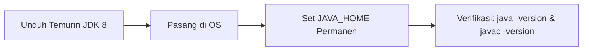
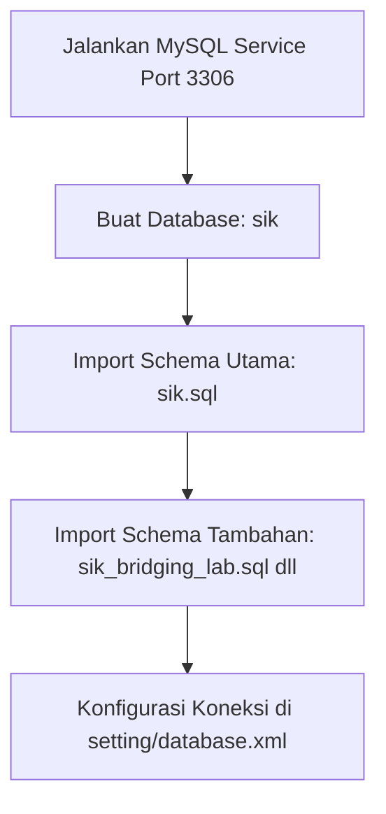
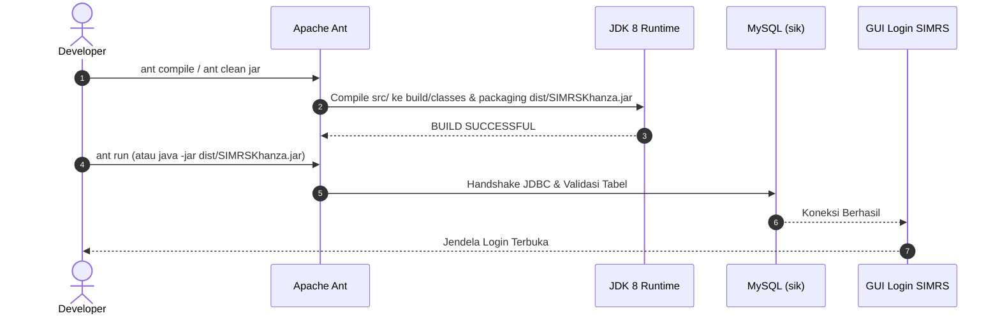

[Daftar Isi (README.md)](README.md) | [Selanjutnya: Konsep Laravel ke Java (02-laravel-to-java-guide.md) →](02-laravel-to-java-guide.md)

---

# Modul 1: Setup Environment dari Nol (*Getting Started*)

Selamat datang di modul pertama panduan pengembangan **SIMRS-Khanza**. Dokumen ini dirancang sebagai panduan langkah demi langkah (*step-by-step*) untuk menyiapkan lingkungan kerja (*development environment*) dari kondisi kosong (*bare-metal*) hingga aplikasi SIMRS-Khanza berhasil dikompilasi dan dijalankan pada komputer lokal Anda.

Modul ini mencakup instalasi JDK 8, Apache Ant, MySQL/MariaDB, penanganan pustaka fisik (`lib/`), konfigurasi Visual Studio Code teroptimasi, serta eksekusi perdana.

---

## 1. Ringkasan Prasyarat Sistem

SIMRS-Khanza adalah aplikasi desktop berbasis **Java Swing** yang dibangun di atas sistem *build* **Apache Ant**. Sebelum memulai instalasi, pastikan sistem operasi dan perangkat keras Anda memenuhi spesifikasi berikut:

### Kebutuhan Perangkat Keras (Hardware)
| Komponen | Spesifikasi Minimum | Spesifikasi Rekomendasi |
| :--- | :--- | :--- |
| **Processor (CPU)** | Dual-Core 2.0 GHz (Intel/AMD/Apple Silicon) | Quad-Core 2.5 GHz+ (Apple M Series / Intel Core i5/i7/i9 / AMD Ryzen) |
| **Memori (RAM)** | 4 GB | 8 GB – 16 GB (Java Language Server & Compiler membutuhkan RAM cukup) |
| **Penyimpanan (Storage)** | 5 GB ruang kosong (SSD sangat disarankan) | 10 GB+ ruang kosong pada SSD |
| **Resolusi Layar** | 1366 x 768 piksel | 1920 x 1080 (Full HD) atau lebih tinggi |

### Kompatibilitas Sistem Operasi
- **macOS**: macOS Monterey (12), Ventura (13), Sonoma (14), Sequoia (15) — Mendukung Apple Silicon (M1/M2/M3/M4) dan Intel x86_64.
- **Linux**: Ubuntu 20.04/22.04/24.04 LTS, Debian 11/12, Fedora, Arch Linux, dan distro turunan lainnya.
- **Windows**: Windows 10 / Windows 11 (64-bit).

---

## 2. Instalasi & Konfigurasi Java Development Kit (JDK 8)

> [!IMPORTANT]
> **Mengapa Wajib JDK 8 (JavaSE-1.8)?**  
> Seluruh arsitektur kode sumber SIMRS-Khanza, komponen GUI Swing (NetBeans Matisse), pustaka bridging, hingga generator JasperReports lawas (`jasperreports-3.7.x` s/d `4.x`) dikompilasi dengan target **Java 1.8**. Menggunakan versi Java yang lebih baru (JDK 11, 17, atau 21) sebagai target build akan memicu *incompatible bytecode error*, masalah *classloader*, atau *reflective access violation* pada pustaka legacy.

Distribusi JDK yang sangat direkomendasikan adalah **Eclipse Temurin 8** (Adoptium OpenJDK) karena stabilitas jangka panjang dan kompatibilitas native lintas arsitektur (termasuk ARM64 macOS).



### Opsi A: macOS (Apple Silicon & Intel)

1. **Instalasi via Homebrew (Rekomendasi):**
   ```bash
   brew install --cask temurin@8
   ```

2. **Konfigurasi Variabel Lingkungan (`~/.zshrc`):**
   Buka file konfigurasi shell:
   ```bash
   nano ~/.zshrc
   ```
   Tambahkan baris berikut di baris paling bawah:
   ```bash
   # Eclipse Temurin JDK 8 Setup
   export JAVA_HOME=$(/usr/libexec/java_home -v 1.8)
   export PATH=$JAVA_HOME/bin:$PATH
   ```
   Simpan file (`Ctrl+O` lalu `Enter`, keluar dengan `Ctrl+X`), kemudian muat ulang shell:
   ```bash
   source ~/.zshrc
   ```

### Opsi B: Linux (Ubuntu / Debian)

1. **Instalasi Paket Temurin / OpenJDK 8:**
   ```bash
   # Opsi 1: OpenJDK 8 bawaan distro
   sudo apt update
   sudo apt install -y openjdk-8-jdk

   # Opsi 2: Eclipse Temurin 8 via Adoptium Repository (Alternatif Resmi)
   # sudo apt install -y temurin-8-jdk
   ```

2. **Konfigurasi Variabel Lingkungan (`~/.bashrc` atau `~/.zshrc`):**
   ```bash
   echo 'export JAVA_HOME=/usr/lib/jvm/java-8-openjdk-amd64' >> ~/.bashrc
   echo 'export PATH=$JAVA_HOME/bin:$PATH' >> ~/.bashrc
   source ~/.bashrc
   ```
   *(Sesuaikan path `/usr/lib/jvm/...` dengan lokasi instalasi di distro Anda, gunakan `update-java-alternatives -l` untuk memeriksa).*

### Opsi C: Windows (10/11 64-bit)

1. **Instalasi Installer Resmi:**
   - Unduh installer `.msi` dari situs resmi Adoptium: [Adoptium Eclipse Temurin 8 (LTS)](https://adoptium.net/temurin/releases/?version=8).
   - Jalankan installer, pastikan mencentang opsi **"Set JAVA_HOME variable"** dan **"Add to PATH"**.
   - Atau via terminal Windows Package Manager:
     ```powershell
     winget install EclipseAdoptium.Temurin.8.JDK
     ```

2. **Verifikasi Variabel Lingkungan (System Environment Variables):**
   - Pastikan `JAVA_HOME` mengarah ke path instalasi (contoh: `C:\Program Files\Eclipse Adoptium\jdk-8.0.xxx-hotspot\`).
   - Pastikan `%JAVA_HOME%\bin` terdaftar di dalam variabel `Path`.

### Verifikasi Instalasi Java
Buka terminal baru di sistem Anda dan jalankan:
```bash
java -version
javac -version
```

**Hasil yang Diharapkan:**
```text
openjdk version "1.8.0_xxx"
OpenJDK Runtime Environment (Temurin)(build 1.8.0_xxx-bxx)
OpenJDK 64-Bit Server VM (Temurin)(build 25.xxx-bxx, mixed mode)

javac 1.8.0_xxx
```

---

## 3. Instalasi Apache Ant

SIMRS-Khanza tidak menggunakan build tool modern seperti Maven atau Gradle untuk aplikasi desktop utamanya, melainkan menggunakan **Apache Ant** yang dikontrol melalui file `build.xml` dan `nbproject/build-impl.xml`.

### Panduan Instalasi Ant

- **macOS (via Homebrew):**
  ```bash
  brew install ant
  ```
- **Linux (Ubuntu/Debian):**
  ```bash
  sudo apt update && sudo apt install -y ant
  ```
- **Windows:**
  - Unduh biner ZIP Apache Ant dari [ant.apache.org](https://ant.apache.org/bindownload.cgi).
  - Ekstrak ke folder `C:\apache-ant`.
  - Daftarkan variabel `ANT_HOME` = `C:\apache-ant` dan tambahkan `C:\apache-ant\bin` ke `Path`.
  - Atau via Chocolatey / Scoop:
    ```powershell
    choco install ant
    ```

### Verifikasi Apache Ant
```bash
ant -version
```
**Hasil yang Diharapkan:**
```text
Apache Ant(TM) version 1.10.x compiled on ...
```

---

## 4. Setup Database MySQL / MariaDB

SIMRS-Khanza membutuhkan basis data relasional MySQL atau MariaDB. Seluruh data transaksi pasien, master obat, tarif tindakan, rekam medis elektronik (RME), dan log sistem disimpan di dalam skema bernama `sik`.



### 1. Menjalankan Service Database
Pastikan database server Anda aktif di port default `3306`:
```bash
# macOS (Homebrew MySQL)
brew services start mysql

# Linux (systemd)
sudo systemctl start mysql   # atau mariadb
sudo systemctl status mysql
```

### 2. Membuat Database `sik`
Buka terminal MySQL client atau Database Manager:
```sql
CREATE DATABASE sik CHARACTER SET utf8mb4 COLLATE utf8mb4_unicode_ci;
```

> [!TIP]
> Penggunaan charset `utf8mb4` menjamin kompatibilitas penuh terhadap karakter khusus, simbol medis, dan format teks modern tanpa memotong teks (*truncation*).

### 3. Mengimpor Skema Data (`sik.sql`)
File skema database sudah tersedia di root direktori project. Jalankan perintah import melalui terminal:

```bash
# Dari root folder project SIMRS-Khanza:
mysql -u root -p sik < sik.sql
```

*(Opsional)* Jika Anda akan mengembangkan atau menguji integrasi modul laboratorium dan radiologi, import juga skema pelengkap:
```bash
mysql -u root -p sik < sik_bridging_lab.sql
mysql -u root -p sik < sik_bridging_radiologi.sql
```

### 4. Konfigurasi Kredensial Koneksi (`setting/database.xml`)
SIMRS-Khanza membaca kredensial database dari file `setting/database.xml` dan `setting/database.ini`. Nilai parameter dienkripsi menggunakan algoritma **AES-128**.

Struktur file `setting/database.xml` default:
```xml
<?xml version="1.0" encoding="UTF-8" standalone="no"?>
<!DOCTYPE properties SYSTEM "http://java.sun.com/dtd/properties.dtd">
<properties>
    <comment>KhanzaHMS</comment> 
    <entry key="HOST">5k7+C7EnUw9nUv2Nix+DBA==</entry>
    <entry key="DATABASE">/EmAfBFOYC9C1OXVqPOX8g==</entry>
    <entry key="PORT">nioxtijcpDaKSUiUiP5FAg==</entry>
    <entry key="USER">kMR3WfAwUK6MbhCyydxa0g==</entry>
    <entry key="PAS">l4nh5eVYrLAER/I2A4b3Tw==</entry>
</properties>
```

#### Tabel Nilai Default AES SIMRS-Khanza:
| Parameter | Plaintext Asli | Nilai Terenkripsi (AES Base64) | Keterangan |
| :--- | :--- | :--- | :--- |
| **HOST** | `localhost` | `5k7+C7EnUw9nUv2Nix+DBA==` | Alamat host database |
| **PORT** | `3306` | `nioxtijcpDaKSUiUiP5FAg==` | Port default MySQL |
| **DATABASE** | `sik` | `/EmAfBFOYC9C1OXVqPOX8g==` | Nama database |
| **USER** | `root` | `kMR3WfAwUK6MbhCyydxa0g==` | Username akses MySQL |
| **PAS (Kosong)** | *(tanpa password)* | `l4nh5eVYrLAER/I2A4b3Tw==` | Password kosong |

> [!NOTE]
> Jika server MySQL lokal Anda menggunakan password khusus (bukan password kosong), Anda dapat membuat string terenkripsi menggunakan sub-project **KhanzaPengenkripsiTeks** yang terdapat di root project:
> ```bash
> cd KhanzaPengenkripsiTeks
> ant run
> ```
> Masukkan password Anda pada form enkripsi, salin hasilnya, lalu masukkan ke dalam key `PAS` di file `setting/database.xml`.

---

## 5. Penanganan Dependensi Fisik (Misteri Folder `lib/`)

Saat pertama kali mengkloning repository SIMRS-Khanza dari Git, Anda akan menemukan bahwa folder `lib/` **tidak disertakan secara utuh** atau kosong.

```text
SIMRS-Khanza/
├── build.xml
├── nbproject/
├── setting/
├── src/
└── lib/             <-- WAJIB DIISI DENGAN JAR DEPENDENSI
    ├── RXTXcomm.jar
    ├── UsuLibrary.jar
    ├── mysql-connector-java-*.jar
    ├── jasperreports-*.jar
    └── (total ~318 file .jar lainnya)
```

### Mengapa Folder `lib/` Masuk `.gitignore`?
1. **Ukuran File Sangat Besar**: Folder `lib/` memuat sekitar **~318 berkas binary JAR** dengan total ukuran berkisar **~300 MB**.
2. **Kinerja Repository**: Menyimpan binary di Git akan membuat proses `clone`, `fetch`, dan `push` menjadi sangat lambat serta melanggar batas rekomendasi ukuran objek GitHub.

### Sumber Unduh Resmi Folder `lib/`
Anda wajib mengunduh paket pustaka lengkap dari salah satu sumber resmi berikut:

1. **Google Drive Resmi Komunitas Khanza:**  
   🔗 [Google Drive Official Khanza Software](https://drive.google.com/drive/folders/0ByL--Jg6bdF7RG1NSlVTT2ZPODg)  
   *(Unduh arsip rilis zip/tar Khanza terbaru yang memuat direktori `lib/`).*
2. **Bundle Instalasi Resmi Rumah Sakit / KhanzaHMS:**  
   Salin direktori `lib/` dari folder instalasi SIMRS Khanza yang sedang beroperasi di server atau komputer klien Anda.

### Cara Pemasangan & Verifikasi
1. Ekstrak seluruh file `.jar` dan letakkan langsung di dalam folder `lib/` pada root direktori project `SIMRS-Khanza`.
2. Lakukan verifikasi jumlah file melalui terminal:
   ```bash
   ls lib | grep -i "\.jar$" | wc -l
   ```
   **Hasil yang Diharapkan:** Menampilkan angka sekitar **300 s/d 320 file `.jar`**.

---

## 6. Konfigurasi Visual Studio Code

Untuk mendapatkan pengalaman pengembangan terbaik di VS Code tanpa *memory leak* atau *indexing lag*, workspace SIMRS-Khanza telah dioptimasi dengan setelan khusus.

### 1. Pasang Ekstensi Wajib
Buka menu Extensions di VS Code (`Cmd+Shift+X` di macOS atau `Ctrl+Shift+X` di Windows/Linux), lalu instal:
- **Extension Pack for Java** (diterbitkan oleh *Microsoft*) — ID: `vscjava.vscode-java-pack`

### 2. File Konfigurasi `.vscode/settings.json`
Pastikan file `.vscode/settings.json` Anda memiliki konfigurasi berikut (khususnya alokasi RAM Java Language Server dan mapping target JDK 8):

```json
{
  "java.import.gradle.enabled": false,
  "java.import.maven.enabled": false,
  "gradle.autoDetect": "off",
  "gradle.nestedProjects": false,
  "java.project.sourcePaths": [
    "src"
  ],
  "java.project.referencedLibraries": [
    "lib/**/*.jar"
  ],
  "java.configuration.runtimes": [
    {
      "name": "JavaSE-1.8",
      "path": "/Library/Java/JavaVirtualMachines/temurin-8.jdk/Contents/Home",
      "default": true
    }
  ],
  "java.compile.nullAnalysis.mode": "disabled",
  "java.autobuild.enabled": false,
  "java.jdt.ls.vmargs": "-XX:+UseG1GC -XX:+UseStringDeduplication -Xms1G -Xmx4G -Dsun.zip.disableMemoryMapping=true -Xlog:disable",
  "java.import.exclusions": [
    "**/Khanza*/**",
    "**/api-*/**",
    "**/wearable/**",
    "**/.gradle/**",
    "**/report/**",
    "**/webapps/**",
    "**/cache/**",
    "**/build/**",
    "**/dist/**"
  ],
  "java.completion.matchCase": "off",
  "java.referencesCodeLens.enabled": false,
  "java.implementationsCodeLens.enabled": false,
  "java.inlayHints.parameterNames.enabled": "none",
  "editor.formatOnSave": false,
  "search.exclude": {
    "**/build/**": true,
    "**/dist/**": true,
    "**/cache/**": true,
    "**/wearable/**": true,
    "**/.gradle/**": true,
    "**/.git/**": true,
    "**/nbproject/private/**": true
  },
  "files.watcherExclude": {
    "**/.git/objects/**": true,
    "**/.git/subtree-cache/**": true,
    "**/build/**": true,
    "**/dist/**": true,
    "**/wearable/**": true,
    "**/.gradle/**": true,
    "**/report/**": true,
    "**/cache/**": true,
    "**/webapps/**": true,
    "**/resumepasien/**": true,
    "**/edokter/**": true,
    "**/epasien/**": true,
    "**/eeksekutif/**": true,
    "**/emcu/**": true,
    "**/alarm/**": true,
    "**/gambar/**": true,
    "**/gambarradiologi/**": true,
    "**/driverFlexCode/**": true,
    "**/suara/**": true,
    "**/setting/**": true,
    "**/presensi/**": true,
    "**/mandiri/**": true,
    "**/bank*/**": true,
    "**/bjb/**": true,
    "**/*.sql": true,
    "**/*.pdf": true,
    "**/*.html": true,
    "**/*.csv": true,
    "**/*.wps": true
  },
  "files.exclude": {
    "**/.git": true,
    "**/.svn": true,
    "**/.hg": true,
    "**/CVS": true,
    "**/.DS_Store": true,
    "**/Thumbs.db": true,
    "**/build/**": true,
    "**/dist/**": true,
    "**/cache/**": true,
    "**/.gradle/**": true,
    "**/nbproject/private/**": true
  }
}
```

> [!NOTE]
> Sesuaikan nilai `"path"` di bagian `"java.configuration.runtimes"` dengan lokasi instalasi JDK 8 di sistem operasi Anda:
> - **macOS**: `/Library/Java/JavaVirtualMachines/temurin-8.jdk/Contents/Home`
> - **Linux**: `/usr/lib/jvm/java-8-openjdk-amd64` (atau `/usr/lib/jvm/temurin-8-jdk-amd64`)
> - **Windows**: `C:\\Program Files\\Eclipse Adoptium\\jdk-8.x.x-hotspot`

### 3. File Konfigurasi `.vscode/tasks.json`
Konfigurasi ini memungkinkan Anda mengeksekusi perintah build Ant langsung dari shortcut VS Code:

```json
{
  "version": "2.0.0",
  "options": {
    "env": {
      "JAVA_HOME": "/Library/Java/JavaVirtualMachines/temurin-8.jdk/Contents/Home"
    }
  },
  "tasks": [
    {
      "label": "Ant: Clean & Build JAR",
      "type": "shell",
      "command": "ant clean jar",
      "group": {
        "kind": "build",
        "isDefault": true
      },
      "problemMatcher": ["$javac"]
    },
    {
      "label": "Ant: Compile",
      "type": "shell",
      "command": "ant compile",
      "group": "none",
      "problemMatcher": ["$javac"]
    },
    {
      "label": "Ant: Run",
      "type": "shell",
      "command": "ant run",
      "group": "none",
      "problemMatcher": ["$javac"]
    }
  ]
}
```

---

## 7. Verifikasi Akhir Build & Eksekusi Pertama

Setelah seluruh langkah di atas selesai, saatnya melakukan kompilasi dan menjalankan aplikasi untuk pertama kalinya.



### Langkah 1: Kompilasi Proyek
Buka terminal terintegrasi di root project SIMRS-Khanza dan jalankan:
```bash
ant compile
```
Jika berhasil, terminal akan menampilkan output:
```text
BUILD SUCCESSFUL
Total time: ... seconds
```

### Langkah 2: Build Binary JAR Lengkap
Jalankan target `clean jar` untuk membuat binary executable mandiri di dalam folder `dist/`:
```bash
ant clean jar
```
Hasil kompilasi akan menghasilkan berkas biner:
- **`dist/SIMRSKhanza.jar`** (Aplikasi biner utama)
- **`dist/lib/`** (Kumpulan dependensi pustaka JAR yang disalin otomatis)

### Langkah 3: Menjalankan Aplikasi
Anda dapat menjalankan aplikasi menggunakan salah satu dari cara berikut:

1. **Via Ant Run:**
   ```bash
   ant run
   ```
2. **Via Java CLI Langsung:**
   ```bash
   java -jar dist/SIMRSKhanza.jar
   ```
3. **Via Shortcut VS Code:**
   - Tekan `Cmd + Shift + B` (macOS) atau `Ctrl + Shift + B` (Windows/Linux) untuk *Build*.
   - Buka menu *Terminal* $\rightarrow$ *Run Task...* $\rightarrow$ pilih **Ant: Run**.

### Kredensial Login Default
Ketika jendela GUI login SIMRS-Khanza muncul, Anda dapat masuk menggunakan kredensial standar administrator:
- **User ID / NIP:** `spv` atau `admin`
- **Password:** `server` atau `akusayangwindi` (atau `spv`)

> [!TIP]
> Jika jendela form login berhasil muncul dan Anda dapat masuk ke Menu Utama, maka setup environment lokal Anda telah **100% tervalidasi dan siap untuk tahap pengembangan**!

---

[Daftar Isi (README.md)](README.md) | [Selanjutnya: Konsep Laravel ke Java (02-laravel-to-java-guide.md) →](02-laravel-to-java-guide.md)
