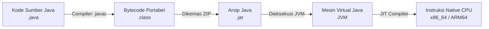
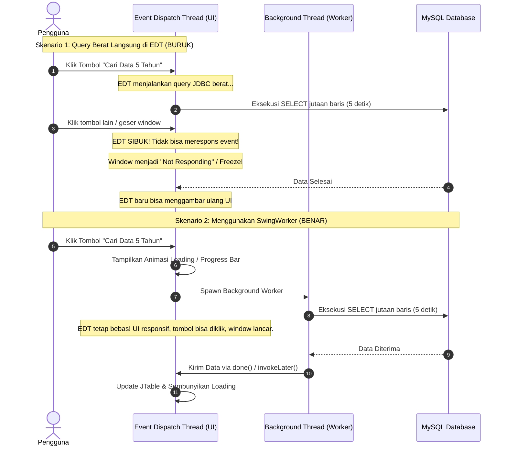

[← Sebelumnya: Setup Environment (Non-NetBeans / VS Code)](01-getting-started-non-netbeans-vscode.md) | [Daftar Isi](README.md) | [Selanjutnya: Arsitektur & Kode Sumber →](03-architecture-and-codebase.md)

---

# Modul 2: Jembatan Konsep Laravel vs Java Swing (Glosarium & Mental Model)

Selamat datang di modul kedua dokumentasi **SIMRS-Khanza**. Jika Anda memiliki latar belakang sebagai pengembang web modern (khususnya ekosistem **PHP / Laravel**), Anda mungkin merasa bahwa ekosistem aplikasi desktop Java seperti SIMRS-Khanza memiliki alur kerja yang sangat asing pada pandangan pertama.

Dokumen ini disusun khusus sebagai **jembatan konseptual** (*mental model bridge*) untuk memetakan pengetahuan web development yang sudah Anda miliki ke dalam paradigma pemrograman desktop Java Swing, raw JDBC, dan arsitektur SIMRS-Khanza.

---

## 1. Pergeseran Mental Model: Web (Stateless) vs Desktop GUI (Stateful)

Perbedaan paling mendasar antara pengembangan web modern (Laravel) dan desktop GUI (Java Swing) terletak pada **siklus hidup proses (*lifecycle*)** dan **pengelolaan status (*state management*)**.

```mermaid
flowchart TD
    subgraph Web["Siklus Web (Laravel - Stateless HTTP)"]
        W1[Browser User] -->|HTTP Request| W2[Web Server / PHP-FPM]
        W2 --> W3[Boot Framework & Service Container]
        W3 --> W4[Routing & Controller Execution]
        W4 --> W5[Query Database via Eloquent/PDO]
        W5 --> W6[Render HTML/Blade atau Return JSON]
        W6 -->|HTTP Response| W1
        W6 -.->|Proses Mati / Memory Teardown| W7[Selesai]
    end

    subgraph Desktop["Siklus Desktop (Java Swing - Stateful Event-Driven)"]
        D1[JVM Start / Load main method] --> D2[Inisialisasi Frame Utama & Koneksi DB]
        D2 --> D3[Event Dispatch Thread / EDT Berjalan]
        D3 --> D4[Aplikasi Standby di Memori / Event Loop]
        D4 -->|User Klik / Ketik / Event| D5[Event Listener Handler]
        D5 -->|Direct JDBC| D6[Eksekusi Query SQL]
        D6 -->|Update Komponen UI| D7[Mutasi State JTable / JTextField]
        D7 --> D4
        D4 -.->|User Tutup Aplikasi| D8[JVM Shutdown / Exit]
    end
```



### Karakteristik Utama Web (Laravel):
1. **Stateless HTTP Request-Response:** Setiap kali pengguna mengklik tombol atau membuka URL, sebuah HTTP request dikirim. PHP menjalankan proses baru (atau mengambil worker dari FPM pool), memuat framework, mengeksekusi query, mengirimkan HTML/JSON, lalu **seluruh memori dan variabel dihancurkan (*teardown*)**.
2. **Koneksi Database Singkat:** Koneksi dibuat atau diambil dari pool saat request masuk, dan segera ditutup/dikembalikan setelah response dikirim.
3. **Pemisahan Klien-Server:** Logika tampilan berjalan di browser (HTML/CSS/JS), sedangkan logika bisnis dan database berjalan di server backend terpisah.

### Karakteristik Utama Desktop (Java Swing Khanza):
1. **Stateful Long-Running Process:** Aplikasi berjalan sebagai satu proses Java Virtual Machine (JVM) di komputer lokal klien. Sekali aplikasi dibuka, proses tetap hidup di RAM selama berjam-jam hingga pengguna menutup aplikasi.
2. **In-Memory UI State:** Semua form dialog (`JDialog`), tabel data (`JTable`), dan input field tersimpan sebagai objek aktif di memori (*heap*). Form tidak "me-reload halaman", melainkan mengubah status visualnya (`setVisible(true)` atau `setVisible(false)`).
3. **Koneksi Database Terus Aktif (*Persistent Connection*):** Aplikasi mempertahankan koneksi JDBC langsung ke database MySQL. Jika koneksi jaringan terputus di tengah jalan, aplikasi harus memiliki logika pemulihan (*reconnect*).
4. **Event-Driven Signal & Slot:** Kode dieksekusi bukan berdasarkan URL routing, melainkan sebagai respons langsung terhadap aksi perangkat keras pengguna (klik mouse, ketukan tombol keyboard, perubahan fokus komponen).

---

## 2. Tabel Analogi Komprehensif (8 Pilar Arsitektur)

Berikut adalah perbandingan langsung antara konsep-konsep di ekosistem **Laravel** dengan padanannya di **SIMRS-Khanza (Java Swing)**:

| No | Aspek / Pilar | Di Laravel (PHP) | Di SIMRS-Khanza (Java Swing) | Penjelasan Perbedaan |
| :-: | :--- | :--- | :--- | :--- |
| **1** | **Siklus Eksekusi (*Execution Lifecycle*)** | **Stateless HTTP:** Request masuk → Router → Controller → Response HTML/JSON → Memory Destroyed. | **Stateful Event-Driven:** JVM Process hidup terus-menerus di memori client. Standby di Event Loop menunggu interaksi pengguna. | Laravel membuat & menghancurkan context per-request, sedangkan Khanza menjaga objek form & variabel tetap aktif di RAM. |
| **2** | **Tampilan Antarmuka (*View / UI*)** | Template Blade (`.blade.php`) dirender ke HTML/CSS via browser DOM. | Komponen Java Swing (`Dlg*.java`) didesain visual via metadata XML NetBeans Matisse (`.form`). | Di Laravel UI dipisahkan oleh browser, di Khanza UI adalah kanvas native OS yang digambar oleh engine Java 2D / Swing. |
| **3** | **Alur Kendali (*Routing & Controller*)** | File `routes/web.php` mengarahkan URL + Method HTTP ke Controller (`PostController@store`). | Event Listener terpasang langsung pada komponen UI (`BtnSimpanActionPerformed`, `tbPasienMouseClicked`). | Tidak ada URL atau HTTP routing. Aksi tombol langsung memicu method Java yang terdaftar pada komponen tersebut. |
| **4** | **Akses Data & Persistensi** | Eloquent ORM (`Model::create()`) atau Query Builder (`DB::table()`). | Raw JDBC via helper engine `fungsi.sekuel` (`Sequel.menyimpan()`, `Sequel.mengedit()`, `Sequel.cariIsi()`). | Khanza tidak menggunakan ORM (seperti Hibernate/JPA), melainkan menulis query SQL murni melalui helper fungsi SQL bawaan. |
| **5** | **Konfigurasi Lingkungan** | File teks `.env` (`DB_HOST`, `DB_PORT`, `DB_PASSWORD`). | Berkas XML terenkripsi `setting/database.xml` (menggunakan enkripsi AES-128). | Kredensial database di Khanza dienkripsi demi keamanan deployment desktop di komputer kasir/klinis. |
| **6** | **Manajemen Dependensi Paket** | Composer (`composer.json` mengunduh paket ke folder `vendor/`). | Kumpulan pustaka fisik biner JAR di folder `lib/` dikelola oleh **Apache Ant** (`build.xml`). | Khanza menggunakan pustaka fisik JAR yang dirangkai manual di classpath, bukan package registry berbasis cloud seperti Packagist. |
| **7** | **Laporan & Cetak Dokumen** | Blade View di-convert ke PDF via DomPDF / Snappy PDF / Browsershot. | Template XML **JasperReports** (`.jrxml`) dikompilasi menjadi biner `.jasper` lalu di-fill dengan JDBC. | JasperReports adalah reporting engine tingkat enterprise dengan layout berbasis koordinat absolut (*pixel-perfect*). |
| **8** | **Hak Akses & Otorisasi** | Middleware / Spatie Laravel-Permission (`auth:sanctum`, `$user->can()`). | Class `fungsi.akses` (static boolean fields) dicocokkan dengan tabel database `hak_akses`. | Status perizinan fitur di-load ke static variables saat login dan dicek langsung sebelum membuka form dialog. |

---

## 3. Bedah Komparasi Kode: Laravel vs Java Khanza

Untuk membantu Anda memahami cara kerja kode di SIMRS-Khanza, mari kita bandingkan implementasi kasus umum secara berdampingan.

### A. View & Event Handler (Menyimpan Data Form)

#### Di Laravel (`PatientController.php` & Blade):
```html
<!-- resources/views/patient/create.blade.php -->
<form action="/patient" method="POST">
    @csrf
    <input type="text" name="no_rkm_medis" placeholder="No. RM">
    <input type="text" name="nm_pasien" placeholder="Nama Pasien">
    <button type="submit">Simpan</button>
</form>
```
```php
// app/Http/Controllers/PatientController.php
public function store(Request $request) {
    $validated = $request->validate([
        'no_rkm_medis' => 'required|max:10',
        'nm_pasien'    => 'required|max:40',
    ]);
    
    Patient::create($validated);
    return redirect()->back()->with('success', 'Data berhasil disimpan');
}
```

#### Di SIMRS-Khanza (`DlgPasien.java`):
```java
// Method Event Handler Tombol Simpan pada DlgPasien.java
private void BtnSimpanActionPerformed(java.awt.event.ActionEvent evt) {
    // 1. Validasi Input Komponen UI
    if (TNoRM.getText().trim().isEmpty()) {
        Valid.textKosong(TNoRM, "No. Rekam Medis");
    } else if (TNmPasien.getText().trim().isEmpty()) {
        Valid.textKosong(TNmPasien, "Nama Pasien");
    } else {
        // 2. Eksekusi Query Simpan via Helper Sequel
        Sequel.menyimpan("pasien", 
            "'" + TNoRM.getText() + "'," +
            "'" + TNmPasien.getText() + "'," +
            "'" + CmbJk.getSelectedItem() + "'," +
            "'" + Valid.SetTgl(DTPLahir.getSelectedItem() + "") + "'",
            "No. Rekam Medis"
        );
        
        // 3. Refresh Grid UI & Kosongkan Form
        tampil();
        emptTeks();
    }
}
```

> [!NOTE]
> Perhatikan bahwa di Java Swing, kode validasi, pemanggilan query database, serta pembaruan tampilan grid (`tampil()`) dipanggil secara berurutan dalam satu method event handler yang sama.

---

### B. Akses Database & Query Data

#### Di Laravel (Eloquent / Query Builder):
```php
// Mengambil satu nilai kolom spesifik
$nama = DB::table('pasien')->where('no_rkm_medis', '000001')->value('nm_pasien');

// Mengambil list koleksi data
$pasienList = DB::table('pasien')
    ->where('nm_pasien', 'like', '%Budi%')
    ->orderBy('no_rkm_medis', 'desc')
    ->get();
```

#### Di SIMRS-Khanza (Helper `sekuel.java` & Raw JDBC):
```java
// 1. Mengambil satu nilai kolom spesifik via helper Sequel
String nama = Sequel.cariIsi("select nm_pasien from pasien where no_rkm_medis = ?", "000001");

// 2. Mengambil kumpulan data menggunakan PreparedStatement & ResultSet JDBC murni
try {
    PreparedStatement ps = koneksiDB.condb().prepareStatement(
        "select no_rkm_medis, nm_pasien, jk, tgl_lahir from pasien where nm_pasien like ? order by no_rkm_medis desc"
    );
    ps.setString(1, "%" + TCari.getText().trim() + "%");
    ResultSet rs = ps.executeQuery();
    
    // Bersihkan model tabel GUI
    tabMode.setRowCount(0);
    
    // Iterasi baris hasil query ke dalam JTable
    while (rs.next()) {
        tabMode.addRow(new Object[]{
            rs.getString("no_rkm_medis"),
            rs.getString("nm_pasien"),
            rs.getString("jk"),
            rs.getString("tgl_lahir")
        });
    }
} catch (Exception ex) {
    System.out.println("Notifikasi Error: " + ex);
}
```

---

### C. Otorisasi & Hak Akses

#### Di Laravel (Middleware & Gate/Policy):
```php
// routes/web.php
Route::get('/rekam-medis', [RmeController::class, 'index'])
    ->middleware('can:akses_rekam_medis');

// Atau di Controller
if (auth()->user()->cannot('akses_rekam_medis')) {
    abort(403, 'Akses Ditolak');
}
```

#### Di SIMRS-Khanza (`fungsi.akses` & `frmUtama.java`):
```java
// Class fungsi.akses menyimpan static boolean privileges yang dimuat saat login
if (akses.getrekam_medis() == true) {
    // Tampilkan tombol menu atau izinkan form dibuka
    MnRekamMedis.setEnabled(true);
} else {
    MnRekamMedis.setEnabled(false);
}

// Saat aksi klik menu dipicu:
private void MnRekamMedisActionPerformed(java.awt.event.ActionEvent evt) {
    if (akses.getrekam_medis() == true) {
        DlgRME formRME = new DlgRME(null, false);
        formRME.isCek();
        formRME.setSize(internalFrame1.getWidth() - 20, internalFrame1.getHeight() - 20);
        formRME.setLocationRelativeTo(internalFrame1);
        formRME.setVisible(true);
    } else {
        JOptionPane.showMessageDialog(null, "Akses ditolak! Anda tidak memiliki izin untuk fitur ini.");
    }
}
```

---

## 4. Glosarium Istilah & Konsep Java Mendalam

Bagi developer yang terbiasa dengan ekosistem interpreted / dynamically-typed seperti PHP, berikut kamus istilah komprehensif yang wajib dipahami saat membedah kode SIMRS-Khanza:

### A. Ekosistem Eksekusi & Kompilasi



* **JDK (Java Development Kit):** Perangkat lunak lengkap untuk pengembang, berisi compiler (`javac`), pembuat arsip (`jar`), debugger, dan runtime (`java`). Pada SIMRS-Khanza, kode dikompilasi dengan target **Java 1.8**, dengan rekomendasi instalasi **BellSoft Liberica JDK 15 Full** (atau **11 Full**) agar mendukung pustaka JavaFX modern pada folder `lib/` (baca panduan lengkap di [Modul 01](01-getting-started-non-netbeans-vscode.md#2-mengenal--mengonfigurasi-java-development-kit-jdk)).
* **JRE (Java Runtime Environment):** Paket minimal hanya untuk menjalankan aplikasi Java (berisi JVM dan pustaka standar Java), tanpa compiler `javac`.
* **JVM (Java Virtual Machine):** Mesin virtual yang bertugas membaca instruksi *bytecode* dan menerjemahkannya menjadi instruksi biner native prosesor secara *Just-In-Time* (JIT). Inilah alasan slogan Java *"Write Once, Run Anywhere"* terwujud.
* **Bytecode (`.class`):** File biner hasil kompilasi dari kode sumber `.java`. Berbeda dengan file binary C/C++ yang terikat OS tertentu, bytecode Java dapat dijalankan di OS manapun asalkan memiliki JVM yang sesuai.
* **JAR (Java Archive - `.jar`):** Format file arsip (berbasis kompresi ZIP) yang mengemas ratusan file `.class`, gambar aset, file konfigurasi, dan file metadata `META-INF/MANIFEST.MF`.
  * Output build SIMRS-Khanza adalah berkas tunggal **`dist/SIMRSKhanza.jar`**.
* **Classpath (`-cp` atau `-classpath`):** Parameter jalur direktori atau daftar file `.jar` yang diberitahukan kepada JVM agar runtime dapat menemukan class-class yang dipanggil oleh kode program. Jika file library tidak didaftarkan di classpath, akan muncul error `ClassNotFoundException` atau `NoClassDefFoundError`.

---

### B. Database & Komunikasi Data (JDBC)

* **JDBC (Java Database Connectivity):** Standar API resmi di Java untuk berkomunikasi dengan database relasional (RDBMS). Padanan JDBC di PHP adalah ekstensi **PDO (PHP Data Objects)**.
* **JDBC Driver (`mysql-connector-java.jar`):** Library pihak ketiga yang menerjemahkan panggilan API JDBC standar Java menjadi protokol TCP/IP native database MySQL/MariaDB.
* **`Connection` (`java.sql.Connection`):** Objek yang merepresentasikan sesi koneksi aktif antara aplikasi dengan database. Di Khanza dikelola secara terpusat oleh `fungsi.koneksiDB.condb()`.
* **`Statement` vs `PreparedStatement`:**
  * `Statement`: Mengeksekusi string query SQL langsung tanpa parameter. Berisiko tinggi terkena **SQL Injection** jika string digabungkan secara manual dengan input teks pengguna.
  * `PreparedStatement`: Query SQL terparameterisasi dengan placeholder tanda tanya (`?`). JVM dan database engine melakukan sanitasi otomatis terhadap nilai parameter, mencegah injeksi SQL, dan mempercepat eksekusi berulang.
* **`ResultSet` (`java.sql.ResultSet`):** Objek kursor penampung tabel data yang dihasilkan dari eksekusi perintah SQL `SELECT`. Data dibaca baris demi baris menggunakan perulangan:
  ```java
  while (rs.next()) {
      String id = rs.getString("id");
      double total = rs.getDouble("total");
  }
  ```

> [!WARNING]
> **Pencegahan SQL Injection di Khanza:**  
> Di masa lalu, sebagian helper lama di `sekuel.java` menggunakan penggabungan string (`"'" + TNoRM.getText() + "'"`). Untuk pengembangan modul baru atau perbaikan kode keamanan, selalu prioritaskan penggunaan **`PreparedStatement`** dengan parameter binding (`ps.setString(1, nilai)`).

---

### C. Build Automation Tool (Apache Ant)

* **Apache Ant (`build.xml`):** Alat otomatisasi build berbasis XML. Jika di dunia web modern Anda mengenal Webpack, Vite, Gulp, atau Composer Scripts, maka di dunia Java tradisional Apache Ant adalah standar build runner otomatisasi kompilasi. Pelajari konsep dan alasan penggunaannya di [Modul 01: Setup Non-NetBeans (VS Code & CLI)](01-getting-started-non-netbeans-vscode.md#3-mengenal--mengonfigurasi-apache-ant-build-tool).
* **Targets di `build.xml`:**
  * `ant compile`: Mengompilasi semua file `.java` di folder `src/` menjadi `.class` di folder `build/classes/`.
  * `ant run`: Mengompilasi dan langsung mengeksekusi aplikasi dari terminal.
  * `ant clean`: Menghapus folder `build/` dan `dist/` untuk memastikan build bersih dari sisa file lama.
  * `ant clean jar`: Membersihkan build lama, mengompilasi ulang seluruh source code, menyalin pustaka dependensi ke `dist/lib/`, dan merangkai biner final **`dist/SIMRSKhanza.jar`**.

---

### D. Desktop GUI (Java Swing & NetBeans Matisse)

* **AWT (Abstract Window Toolkit):** Pustaka GUI generasi pertama Java yang memanggil komponen native OS (*heavyweight*).
* **Java Swing:** Pustaka GUI modern bawaan Java yang bersifat *lightweight* (komponen digambar langsung oleh Java 2D), menghasilkan tampilan yang 100% konsisten di Windows, Linux, dan macOS.
* **Komponen Dasar Swing:**
  * `JFrame`: Jendela utama aplikasi tingkat atas (*top-level window*), contoh: `frmUtama.java`.
  * `JDialog`: Jendela dialog turunan/modal popup untuk form transaksi atau input data, contoh: `DlgPasien.java`, `DlgReg.java`.
  * `JPanel`: Wadah penampung komponen UI lainnya untuk mengatur tata letak (*layout*).
  * `JTable`: Komponen tabel grid untuk menampilkan data tabular.
  * `DefaultTableModel` (`tabMode`): Objek model data yang mengatur struktur kolom dan baris di dalam `JTable`.
  * `JTextField` / `JComboBox` / `JButton`: Komponen input teks, dropdown pilihan, dan tombol aksi.
* **File Desain NetBeans Matisse (`.form`):**
  * File berformat XML yang dibuat otomatis saat Anda mendesain form secara visual (*drag-and-drop*) di NetBeans IDE.
  * File `.form` berpasangan langsung dengan file `.java` (misal: `DlgPasien.form` dan `DlgPasien.java`).
  * NetBeans secara otomatis menghasilkan kode inisialisasi komponen di dalam blok khusus:
    ```java
    // <editor-fold defaultstate="collapsed" desc="Generated Code">
    private void initComponents() {
        // Kode inisialisasi visual otomatis NetBeans
    }
    // </editor-fold>
    ```

> [!IMPORTANT]
> **Aturan Sakral NetBeans Generated Code:**  
> Jangan pernah mengubah atau menghapus komentar penanda `<editor-fold desc="Generated Code">` secara manual dengan text editor biasa jika Anda masih ingin membuka dan mengedit form tersebut menggunakan NetBeans GUI Builder. Merusak format blok ini akan menyebabkan NetBeans gagal membaca file `.form` pasangan form tersebut.

---

### E. Mesin Pelaporan (JasperReports)

* **JasperReports:** Pustaka pelaporan Java yang digunakan untuk mendesain dan mencetak struk kasir, nota resep, surat rujukan, gelang pasien, bukti pendaftaran, hingga dokumen rekam medis lengkap.
* **Alur Berkas Laporan:**
  ```mermaid
  flowchart LR
      A[Desain Template Visual\nJaspersoft Studio] -->|Menghasilkan Source XML| B[File .jrxml\nFolder report/]
      B -->|Dikompilasi| C[File Biner .jasper\nFolder report/]
      C -->|Diisi Data JDBC via JasperFillManager| D[JasperPrint Object]
      D -->|Print Direct| E[Thermal / Laser Printer]
      D -->|Export| F[File PDF / Excel / Image]
  ```
* **`.jrxml` vs `.jasper`:**
  * File `.jrxml` (*JasperReports XML*): Kode sumber desain laporan berbasis tag XML (dibuat via aplikasi Jaspersoft Studio).
  * File `.jasper`: Hasil kompilasi biner dari `.jrxml`. SIMRS-Khanza memanggil file `.jasper` di folder `report/` saat runtime agar proses mencetak berlangsung instan tanpa membebani CPU untuk mengompilasi XML berulang-ulang.

---

### F. Konsep Objek & Kesalahan Umum (POJO & NPE)

* **POJO (Plain Old Java Object):** Kelas Java murni yang sederhana, berisi atribut privat dengan method getter dan setter, tanpa mewarisi (*extends*) framework khusus. Di Laravel, konsep ini mirip dengan DTO (*Data Transfer Object*) atau Resource class.
* **NullPointerException (NPE):** Runtime exception paling umum di Java. Terjadi ketika program mencoba memanggil method atau mengakses properti dari variabel objek yang bernilai `null` (belum diinisialisasi).
  * Di PHP: Mirip dengan fatal error *"Call to a member function on null"* atau *"Attempt to read property on null"*.
  * **Strategi Mitigasi NPE di Java 8:**
    1. Selalu lakukan null-check sebelum memproses objek:
       ```java
       if (dataPasien != null) {
           dataPasien.proses();
       }
       ```
    2. Saat membandingkan String konstan, letakkan literal di sisi kiri (*Yoda Condition*):
       ```java
       // Aman dari NPE jika variabel status bernilai null:
       if ("Aktif".equals(status)) { ... }
       
       // Berbahaya (Bisa memicu NPE jika status == null):
       if (status.equals("Aktif")) { ... }
       ```
    3. Untuk membersihkan input teks dari `JTextField`:
       ```java
       if (TNoRM.getText() != null && !TNoRM.getText().trim().isEmpty()) { ... }
       ```

---

## 5. Paradigma Pemrograman & Threading (Event Dispatch Thread & UI Freeze)

Salah satu kejutan terbesar bagi pengembang web saat beralih ke Java Swing adalah masalah **antarmuka macet (*UI Freeze*)**.

### A. Mengapa UI Bisa "Freeze"? (Konsep EDT)

Java Swing dirancang dengan model **Single-Threaded Subsystem**. Seluruh aktivitas antarmuka pengguna—mulai dari mendengarkan klik mouse, mendeteksi ketikan keyboard, hingga menggambar ulang (*repainting*) piksel jendela—dijalankan oleh satu thread khusus bernama **Event Dispatch Thread (EDT)**.



### B. Perbedaan dengan Web (Laravel):
* **Di Laravel (Web):** Jika query database memakan waktu 10 detik, hanya tab browser tersebut yang menampilkan indikator loading (*spinner*). Tab lain, jendela browser, dan sistem operasi tetap berjalan lancar.
* **Di Java Swing (Desktop):** Jika query 10 detik dieksekusi langsung di dalam `BtnCariActionPerformed` (yang berjalan di atas EDT), maka **seluruh aplikasi Khanza akan membeku (*hang / Not Responding*)**, kursor mouse berubah menjadi roda berputar, dan pengguna tidak bisa mengklik tombol apapun hingga query selesai.

---

### C. Solusi: Menggunakan `SwingWorker` atau Background Thread

Untuk operasi I/O berat (seperti query laporan bulanan, pencarian data medis ribuan baris, atau memanggil web service REST API Bridging BPJS/SatuSehat), proses harus dipindahkan ke **Background Thread** menggunakan `javax.swing.SwingWorker`.

#### Pola Standar `SwingWorker` di Java:

```java
private void BtnCariActionPerformed(java.awt.event.ActionEvent evt) {
    // 1. Tampilkan status loading pada UI (Berjalan di EDT)
    BtnCari.setEnabled(false);
    LblStatus.setText("Sedang memuat data dari server...");

    // 2. Eksekusi proses berat di Background Thread
    SwingWorker<List<Object[]>, Void> worker = new SwingWorker<List<Object[]>, Void>() {
        @Override
        protected List<Object[]> doInBackground() throws Exception {
            // Kode di dalam method ini berjalan di background thread terpisah
            // Aman untuk query lambat atau pemanggilan API eksternal
            List<Object[]> hasil = new ArrayList<>();
            PreparedStatement ps = koneksiDB.condb().prepareStatement(
                "select no_rkm_medis, nm_pasien, alamat from pasien where alamat like ?"
            );
            ps.setString(1, "%" + TCari.getText() + "%");
            ResultSet rs = ps.executeQuery();
            while (rs.next()) {
                hasil.add(new Object[]{
                    rs.getString(1), 
                    rs.getString(2), 
                    rs.getString(3)
                });
            }
            return hasil;
        }

        @Override
        protected void done() {
            // Method ini otomatis dipanggil kembali di EDT setelah doInBackground selesai
            try {
                List<Object[]> data = get();
                tabMode.setRowCount(0);
                for (Object[] row : data) {
                    tabMode.addRow(row);
                }
                LblStatus.setText("Selesai memuat " + data.size() + " data.");
            } catch (Exception e) {
                LblStatus.setText("Gagal memuat data: " + e.getMessage());
            } finally {
                BtnCari.setEnabled(true);
            }
        }
    };

    // Jalankan worker
    worker.execute();
}
```

> [!TIP]
> **Aturan Emas Swing Threading:**
> 1. **Semua manipulasi komponen UI** (`setText()`, `addRow()`, `setVisible()`, `setEnabled()`) **WAJIB** dieksekusi di Event Dispatch Thread (EDT).
> 2. **Semua operasi pemrosesan lambat** (query database berukuran besar, I/O disk, koneksi HTTP bridging REST API) **WAJIB** dieksekusi di luar EDT (*background thread*).
> 3. Gunakan `SwingUtilities.invokeLater(Runnable)` jika Anda perlu memperbarui UI dari thread sembarang.

---

## 6. Ringkasan & Langkah Selanjutnya

Dengan memahami pergeseran mental model dari web ke desktop, tabel 8 pilar analogi, glosarium ekosistem Java, serta penanganan *Event Dispatch Thread*, Anda kini memiliki pondasi yang kuat untuk membedah arsitektur kode sumber SIMRS-Khanza secara langsung.

Lanjutkan pembelajaran Anda ke **Modul 3** untuk mempelajari anatomi folder `src/`, pembagian modul, bedah class core engine di `src/fungsi/`, sistem database, enkripsi keamanan, serta arsitektur bridging web service.

---

[← Sebelumnya: Setup Environment (Non-NetBeans / VS Code)](01-getting-started-non-netbeans-vscode.md) | [Daftar Isi](README.md) | [Selanjutnya: Arsitektur & Kode Sumber →](03-architecture-and-codebase.md)
