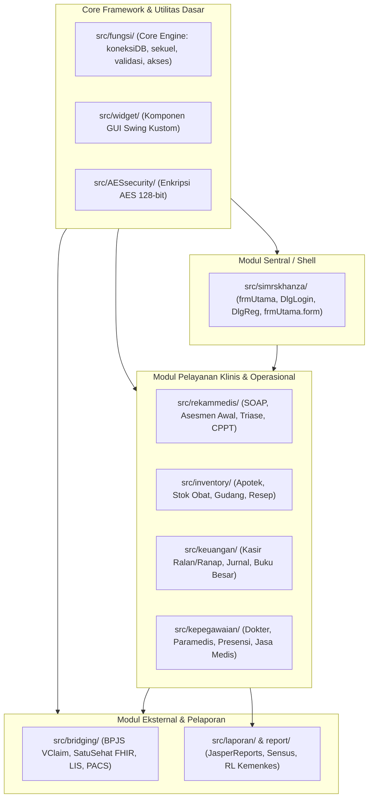
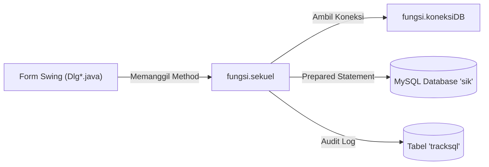
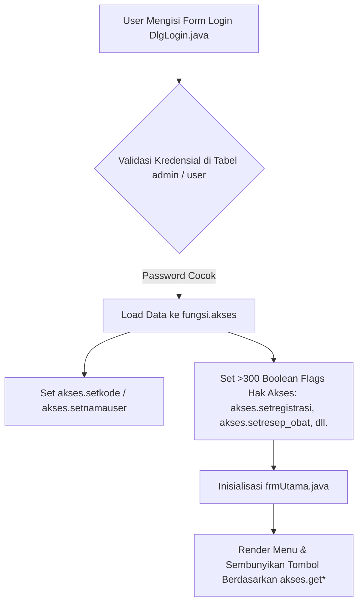
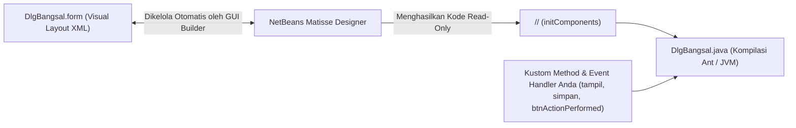
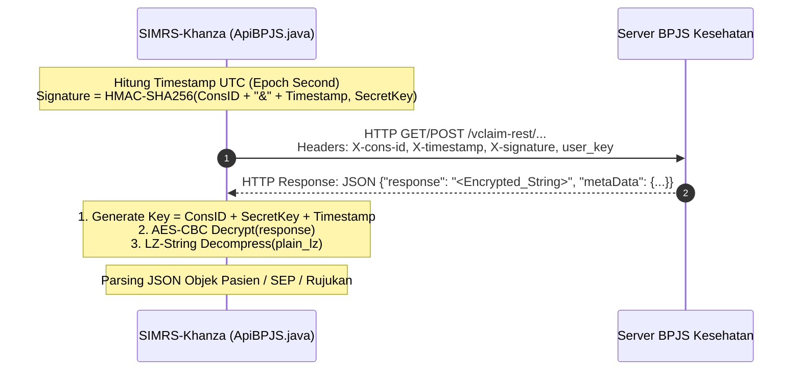
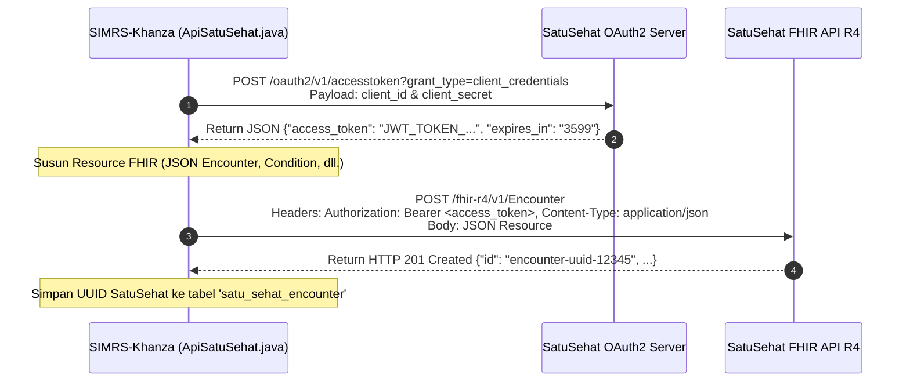
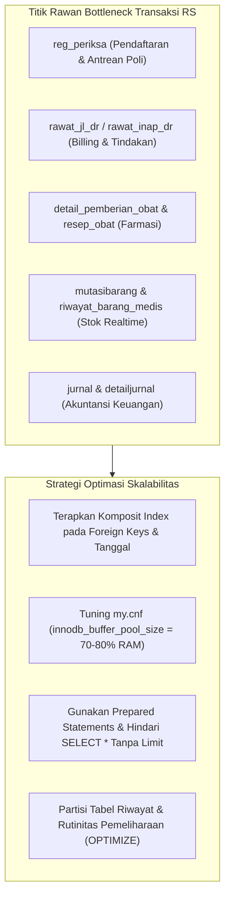

[← Sebelumnya: Konsep Laravel ke Java](02-laravel-to-java-guide.md) | [Daftar Isi](README.md) | [Selanjutnya: Alur Kerja & Troubleshooting →](04-development-workflow.md)

---

# Modul 3: Arsitektur & Anatomi Kode Sumber (*Codebase Anatomy & Architecture*)

Selamat datang di modul ketiga dokumentasi **SIMRS-Khanza**. Modul ini menyajikan panduan mendalam (*deep-dive*) mengenai arsitektur sistem, struktur pohon repositori, anatomi kode sumber Java Swing, mekanisme kerja *core engine* di paket `fungsi`, sistem keamanan konfigurasi database, arsitektur integrasi *web service bridging*, serta strategi optimasi database `sik` untuk lingkungan produksi rumah sakit.

---

## 1. Pohon Struktur Direktori Proyek & Organisasi Package

Repositori SIMRS-Khanza memiliki struktur proyek monolitik berbasis **Apache Ant** dengan pembagian direktori tingkat atas (*root level*) dan pengelompokan paket modular di dalam `src/`.

### Struktur Pohon Direktori Utama

```
SIMRS-Khanza/
├── src/                          # Kode sumber utama aplikasi Java (.java & .form)
│   ├── AESsecurity/              # Pustaka enkripsi AES-128 bit bawaan
│   ├── bridging/                 # Modul integrasi REST API (BPJS, SatuSehat, LIS, PACS, dll.)
│   ├── fungsi/                   # Core engine & helper global (koneksiDB, sekuel, validasi, akses)
│   ├── inventory/                # Modul farmasi, gudang obat, stok logistik, & mutasi barang
│   ├── kepegawaian/              # Modul SDM, data dokter/petugas, presensi, & remunerasi
│   ├── keuangan/                 # Modul akuntansi, kasir billing, buku besar, & jurnal keuangan
│   ├── laporan/                  # Dialog & handler cetak pelaporan statistik (RL, sensus, dll.)
│   ├── rekammedis/               # Modul Rekam Medis Elektronik (RME), SOAP, asesmen, & triase
│   ├── simrskhanza/              # Modul sentral: frame utama (frmUtama), pendaftaran, login
│   ├── widget/                   # Kustom komponen GUI Swing (TextBox, Button, Table, Panel, dll.)
│   └── ...                       # Modul pendukung lainnya (surat, tagihan, sms, parkir, dll.)
├── report/                       # Template laporan JasperReports (*.jrxml & *.jasper)
├── setting/                      # File konfigurasi XML aplikasi runtime (database.xml)
├── lib/                          # Pustaka binary fisik eksternal (*.jar) ~318 berkas (di-ignore Git)
├── nbproject/                    # Metadata proyek & konfigurasi build Apache Ant NetBeans
├── webapps/                      # Aplikasi web pendukung (PHP/HTML) untuk fitur hybrid/antrian
├── dist/                         # Output hasil kompilasi Ant (SIMRSKhanza.jar & dist/lib/)
├── build/                        # Output intermediate file .class hasil kompilasi
├── KhanzaSecurity16bit/          # Sub-project helper modul enkripsi AES-128 (Bar12345...)
├── KhanzaPengenkripsiTeks/       # Sub-project aplikasi GUI enkripsi/dekripsi kredensial database
├── build.xml                     # Script otomatisasi build Apache Ant
└── manifest.mf                   # File manifest Java JAR (entry-point simrskhanza.SIMRSKhanza)
```

---

### Penjelasan Direktori Tingkat Atas (*Root Directories*)

| Direktori / File | Fungsi & Deskripsi Teknis |
| :--- | :--- |
| **`src/`** | Berisi seluruh kode sumber aplikasi Java, terbagi ke dalam berbagai package modular sesuai domain layanan rumah sakit. |
| **`report/`** | Menyimpan seluruh berkas desain cetak laporan JasperReports. Template dikompilasi dari ekstensi `.jrxml` (XML source) menjadi `.jasper` (compiled binary) sebelum dijalankan oleh Java. |
| **`setting/`** | Menyimpan konfigurasi aplikasi desktop saat berjalan, terutama berkas `setting/database.xml` yang memuat URL koneksi database MySQL terenkripsi dan kredensial *bridging*. |
| **`lib/`** | Direktori penyimpanan pustaka Java eksternal (*third-party JARs*) seperti MySQL JDBC Driver, Spring Web, Jackson JSON, JasperReports Engine, dan Apache Commons. Berkas-berkas di direktori ini diabaikan oleh Git karena ukurannya yang besar (>300 MB). |
| **`nbproject/`** | Menyimpan definisi target build Apache Ant (`build-impl.xml`), pemetaan classpath IDE (`project.properties`), dan metadata proyek NetBeans. |
| **`webapps/`** | Modul web hybrid (PHP/JavaScript) yang digunakan untuk integrasi antrean layar TV (loket/apotek), display ketersediaan tempat tidur, dan bridging pihak ketiga. |
| **`dist/`** | Direktori tujuan hasil *packaging* target `ant clean jar`. Berisi file eksekusi utama `dist/SIMRSKhanza.jar` dan subfolder `dist/lib/` yang berisi seluruh pustaka runtime. |
| **`KhanzaPengenkripsiTeks/`** | Sub-project terpisah yang menyediakan aplikasi GUI utilitas untuk mengenkripsi teks konfigurasi (*plain-text* host, user, password) menjadi format terenkripsi AES-128 untuk disimpan di `database.xml`. |

---

### Pembagian Modul-Modul Domain di `src/`



1. **`simrskhanza`**: Merupakan gerbang utama aplikasi. Memuat `SIMRSKhanza.java` (main class), `frmUtama.java` (jendela MDI/desktop utama dengan ratusan tombol menu), `DlgLogin.java` (dialog autentikasi pengguna), dan `DlgReg.java` (alur pendaftaran pasien rawat jalan & rawat inap).
2. **`rekammedis`**: Mengelola seluruh siklus Rekam Medis Elektronik (RME). Berisi form asesmen medis awal, catatan perkembangan pasien terintegrasi (CPPT/SOAP), triase gawat darurat, resume medis, riwayat pemeriksaan fisik, dan grafik tanda vital.
3. **`inventory`**: Mengatur logistik farmasi dan barang non-medis. Mencakup pengelolaan master obat/alkes, stok opname, sirkulasi gudang, surat pesanan (SP), penerimaan faktur, retur supplier, pemberian resep, dan penetapan margin harga obat.
4. **`keuangan`**: Menangani penagihan dan akuntansi rumah sakit. Mencakup billing kasir rawat jalan/rawat inap, deposit pasien, piutang tindakan, rincian pembayaran parsial, jurnal umum otomatis, buku besar, dan laporan laba-rugi operasional.
5. **`kepegawaian`**: Menangani manajemen sumber daya manusia (SDM) rumah sakit. Mengatur master data dokter dan pegawai, jadwal dinas/shift, rekap presensi mesin sidik jari (*fingerprint*), hingga kalkulasi jasa medis / remunerasi per tindakan.
6. **`bridging`**: Modul integrasi web service dengan sistem nasional dan perangkat penunjang medis. Mencakup BPJS Kesehatan (VClaim, Mobile JKN, PCare, Aplicare), SatuSehat Kemenkes (FHIR API R4), LIS Laboratorium (Sysmex, LICA, Mindray), PACS Radiologi (Orthanc, Carestream), Sisrute, Siranap, dan Dukcapil.
7. **`widget`**: Pustaka komponen visual Swing yang di-inherit langsung dari komponen standar Java AWT/Swing dengan penambahan styling dan perilaku bawaan Khanza (misalnya `widget.TextBox`, `widget.Button`, `widget.Table`, `widget.panelisi`, `widget.InternalFrame`, dan `widget.Tanggal`).

---

## 2. Bedah *Core Engine* di `src/fungsi/`

Paket `fungsi` adalah jantung dari seluruh operasional SIMRS-Khanza. Seluruh komunikasi database, eksekusi query, manipulasi data tabel, validasi input pengguna, dan pengelolaan izin hak akses dikendalikan oleh empat berkas inti:

```
src/fungsi/
├── koneksiDB.java   # Manajemen koneksi JDBC & DataSource pooling
├── sekuel.java      # Helper eksekusi CRUD SQL (Create, Read, Update, Delete)
├── validasi.java    # Validasi masukan pengguna, formatting, & manipulasi tabel UI
└── akses.java       # Pengelolaan session aktif, konteks user, & matriks hak akses
```

---

### A. `koneksiDB.java` — Manajemen Koneksi JDBC & Auto-Reconnect

Class [`fungsi.koneksiDB`](file:///Users/adijaya/MyFiles/Projects/SIMRS-Khanza/src/fungsi/koneksiDB.java#L24-L150) bertanggung jawab membuka, mengonfigurasi, menguji, dan mempertahankan koneksi fisik ke server database MySQL.

#### Arsitektur Koneksi & Inisialisasi DataSource
`koneksiDB` menggunakan pola *Thread-Safe Singleton with Double-Checked Locking* untuk memastikan hanya ada satu objek `Connection` aktif yang dibagikan ke seluruh form aplikasi:

```java
public class koneksiDB {
    private static volatile Connection connection;
    private static final MysqlDataSource dataSource = new MysqlDataSource();
    private static final Properties prop = new Properties();
    private static final AtomicBoolean initialized = new AtomicBoolean(false);
    private static final Object LOCK = new Object();
    private static volatile long lastCheck = 0;
    private static final long CHECK_INTERVAL = 40000; // 40 detik
    
    // Dipanggil oleh seluruh form di Khanza: koneksiDB.condb()
    public static Connection condb() {
        try {
            if (!initialized.get()) {
                synchronized (LOCK) {
                    if (!initialized.get()) {
                        initDataSource();
                        reconnect();
                        initialized.set(true);
                    }
                }
            }

            // Health-check koneksi periodik setiap 40 detik
            long now = System.currentTimeMillis();
            if (now - lastCheck > CHECK_INTERVAL) {
                lastCheck = now;
                if (!isConnectionAlive()) {
                    synchronized (LOCK) {
                        if (!isConnectionAlive()) {
                            reconnect();
                        }
                    }
                }
            }
            
            // Reconnect jika koneksi terputus/tertutup
            if (connection == null || connection.isClosed()) {
                synchronized (LOCK) {
                    if (connection == null || connection.isClosed()) {
                        reconnect();
                    }
                }
            }
        } catch (Exception e) {
            Logger.getLogger(koneksiDB.class.getName()).log(Level.SEVERE, null, e);
        }
        return connection;
    }
}
```

#### Parameter URL JDBC Khusus
Saat `initDataSource()` dieksekusi, properti koneksi didekripsi dari `setting/database.xml` menggunakan `EnkripsiAES.decrypt()` dan disusun dengan parameter JDBC performa tinggi:

```java
dataSource.setURL("jdbc:mysql://" 
    + EnkripsiAES.decrypt(prop.getProperty("HOST")) + ":" 
    + EnkripsiAES.decrypt(prop.getProperty("PORT")) + "/" 
    + EnkripsiAES.decrypt(prop.getProperty("DATABASE")) 
    + "?zeroDateTimeBehavior=convertToNull"
    + "&tcpKeepAlive=true"
    + "&connectTimeout=100000"
    + "&socketTimeout=600000"
    + "&maintainTimeStats=false"
    + "&autoReconnect=true");
dataSource.setUser(EnkripsiAES.decrypt(prop.getProperty("USER")));
dataSource.setPassword(EnkripsiAES.decrypt(prop.getProperty("PAS")));
dataSource.setCachePreparedStatements(true);
dataSource.setUseCompression(true);
```

*Penjelasan Parameter Kunci:*
- `zeroDateTimeBehavior=convertToNull`: Mengubah tanggal MySQL invalid (`0000-00-00 00:00:00`) menjadi nilai `null` di Java untuk mencegah `SQLException`.
- `tcpKeepAlive=true`: Menjaga paket TCP tetap hidup agar router/firewall jaringan RS tidak memutuskan koneksi idle.
- `useCompression=true`: Mengaktifkan kompresi zlib pada lalu lintas data antara klien dan server MySQL, mempercepat transfer query besar pada jaringan LAN rumah sakit yang padat.
- `cachePreparedStatements=true`: Menginstruksikan JDBC driver untuk menyimpan cache query berulang guna mereduksi *parsing overhead* di server MySQL.

#### Validasi Koneksi & Mekanisme *Auto-Reconnect*
Untuk mendeteksi koneksi jaringan yang mati (*half-open socket*), `koneksiDB` melakukan validasi aktif menggunakan perintah `SELECT 1`:

```java
private static boolean isConnectionAlive() {
    try {
        if (connection == null || connection.isClosed()) return false;
        if (!connection.isValid(3)) return false;
        try (Statement st = connection.createStatement()) {
            st.executeQuery("SELECT 1");
        }
        return true;
    } catch (Exception e) {
        return false;
    }
}
```

Jika koneksi terputus, method `reconnect()` akan mencoba menyambung kembali hingga 5 kali percobaan berturut-turut dengan jeda 2000 ms (2 detik). Jika seluruh percobaan gagal, dialog peringatan ditampilkan kepada pengguna sebelum melemparkan `SQLException`.

---

### B. `sekuel.java` — Helper Eksekusi Query CRUD SQL

Class [`fungsi.sekuel`](file:///Users/adijaya/MyFiles/Projects/SIMRS-Khanza/src/fungsi/sekuel.java) menyediakan ratusan *overloaded methods* yang bertindak sebagai antarmuka eksekusi database utama bagi pengembang.



#### Method CRUD Inti:

1. **Penyimpanan Data (`menyimpan`, `menyimpan2`, `menyimpantf`):**
   ```java
   // Contoh implementasi di sekuel.java
   public void menyimpan(String table, String value, String deskripsiDuplikat) {
       try {
           ps = connect.prepareStatement("insert into " + table + " values(" + value + ")");
           try {                  
               ps.executeUpdate();
           } catch (Exception e) {
               System.out.println("Notifikasi : " + e);            
               JOptionPane.showMessageDialog(null, 
                   "Maaf, gagal menyimpan data. Kemungkinan ada " + deskripsiDuplikat + " yang sama dimasukkan sebelumnya...!");
           } finally {
               if (ps != null) ps.close();
           }
           SimpanTrack("insert into " + table + " values(" + value + ")");
       } catch (Exception e) {
           System.out.println("Notifikasi : " + e); 
       }            
   }
   ```
   - `menyimpan()`: Menampilkan dialog peringatan otomatis jika terjadi error (misalnya duplikasi *primary key*).
   - `menyimpantf()`: Mengembalikan nilai boolean (`true` jika berhasil, `false` jika gagal), sangat cocok untuk operasi bertahap yang membutuhkan verifikasi sebelum melanjutkan logika berikutnya.

2. **Perubahan Data (`mengedit`, `mengedit2`, `mengedit3`, `mengedit4`):**
   ```java
   // Mengubah data dengan acuan kolom kunci
   public void mengedit(String table, String acuanField, String setField) {
       try {
           ps = connect.prepareStatement("update " + table + " set " + setField + " where " + acuanField);
           try {
               ps.executeUpdate();
           } catch (Exception e) {
               System.out.println("Notifikasi : " + e);
               JOptionPane.showMessageDialog(null, "Maaf, Gagal Mengedit...!");
           } finally {
               if (ps != null) ps.close();
           }
           SimpanTrack("update " + table + " set " + setField + " where " + acuanField);
       } catch (Exception e) {
           System.out.println("Notifikasi : " + e);
       }
   }
   ```

3. **Penghapusan Data (`meghapus`, `meghapustf`):**
   > [!NOTE]
   > Perhatikan ejaan penamaan method bawaan pada codebase Khanza adalah **`meghapus`** (mengandung huruf 'g').
   ```java
   public void meghapus(String table, String field, String nilaiField) {
       try {
           ps = connect.prepareStatement("delete from " + table + " where " + field + " = ?");
           ps.setString(1, nilaiField);
           try {
               ps.executeUpdate();
           } catch (Exception e) {
               JOptionPane.showMessageDialog(null, 
                   "Maaf, data gagal dihapus. Kemungkinan data tersebut masih dipakai di table lain...!!!!");
           } finally {
               if (ps != null) ps.close();
           }
           SimpanTrack("delete from " + table + " where " + field + " = '" + nilaiField + "'");
       } catch (Exception e) {
           System.out.println("Notifikasi : " + e);
       }
   }
   ```

4. **Pencarian Skalar (`cariIsi`, `cariIsiAngka`, `cariIsi2`):**
   Method untuk mengambil satu nilai secara cepat tanpa perlu menulis blok `PreparedStatement`, `ResultSet.next()`, dan `try-catch` berulang:
   ```java
   // Mengambil 1 nilai string dari query
   String namaDokter = Sequel.cariIsi("select nm_dokter from dokter where kd_dokter = ?", kdDokter);

   // Mengambil 1 nilai double/angka
   double totalTagihan = Sequel.cariIsiAngka("select sum(totalbiaya) from billing where no_rawat = ?", noRawat);

   // Mengisi teks langsung ke komponen JTextField UI
   Sequel.cariIsi("select no_tlp from pasien where no_rkm_medis = ?", txtTelepon, noRekamMedis);
   ```

5. **Sistem Audit Trail (`SimpanTrack`):**
   Jika parameter `AKTIFKANTRACKSQL` diatur ke status aktif di `database.xml`, setiap query insert, update, dan delete akan otomatis dicatat ke dalam tabel log `tracksql` beserta timestamp dan user yang melakukan aksi.

---

### C. `validasi.java` — Validasi Masukan & Utilitas UI Swing

Class [`fungsi.validasi`](file:///Users/adijaya/MyFiles/Projects/SIMRS-Khanza/src/fungsi/validasi.java) bertindak sebagai *toolkit* interaksi pengguna untuk menangani navigasi tombol, pembuatan nomor urut otomatis, pemformatan tanggal, manipulasi `JTable`, dan integrasi laporan JasperReports.

#### 1. Auto-Numbering Generator (`autoNomer`, `autoNomer2` s/d `autoNomer7`)
Digunakan untuk membuat nomor kode berurutan otomatis dengan format *padding zero*:
```java
// Menghasilkan nomor registrasi: 000001, 000002, dst.
// Parameter: DefaultTableModel, String Prefix, Integer Panjang Karakter, JTextField Target
Valid.autoNomer(tabMode, "", 6, TNoReg);

// Menghasilkan nomor rawat berformat tanggal: 2026/08/27/000001
Valid.autoNomer2("select ifnull(max(convert(right(no_rawat,6),signed)),0) from reg_periksa where tgl_registrasi='" + tgl + "'",
    tgl + "/", 6, TNoRawat);
```

#### 2. Navigasi Keyboard Antar-Komponen (`pindah`, `pindah2`)
Membantu staf rumah sakit melakukan input data berkecepatan tinggi hanya dengan menekan tombol **Enter** atau tombol panah keyboard tanpa harus menggunakan mouse:
```java
// Pada event KeyPressed JTextField1: Pindah fokus ke JTextField2 saat tombol Enter ditekan
private void TxtField1KeyPressed(java.awt.event.KeyEvent evt) {
    Valid.pindah(evt, TxtField1, TxtField2);
}
```

#### 3. Pemanggilan Laporan JasperReports (`MyReport`, `MyReportPDF`, `MyReportqry`)
Menghubungkan aplikasi Swing dengan template cetak JasperReports di direktori `report/`:
```java
// Membuka jendela preview JasperViewer
Map<String, Object> param = new HashMap<>();
param.put("namars", akses.getnamars());
param.put("alamatrs", akses.getalamatrs());
param.put("logo", Sequel.cariGambar("select logo from setting"));

Valid.MyReport("rptPasien.jrxml", "report", "::[ Data Rekam Medis Pasien ]::", param);
```

---

### D. `akses.java` — Manajemen Sesi Login & Matriks Izin Pengguna

Class [`fungsi.akses`](file:///Users/adijaya/MyFiles/Projects/SIMRS-Khanza/src/fungsi/akses.java) adalah *in-memory session container* berbasis variabel statis (`static fields`) yang menyimpan informasi akun staf yang sedang login dan status hak akses fitur.



#### Komponen Kunci `akses.java`:

1. **Variabel Konteks Staf & Rumah Sakit:**
   ```java
   private static String kode = "";       // NIP/NIK user aktif
   private static String namauser = "";   // Nama lengkap user
   private static String kdbangsal = "";  // Depo / Poli / Kamar default user
   private static String namars = "";     // Nama faskes dari database
   private static String kode_ppk = "";   // Kode Faskes BPJS
   ```

2. **Matriks Izin Pengguna (>300 Boolean Flags):**
   Setiap modul atau form di Khanza memiliki variabel boolean yang merepresentasikan hak akses di tabel database `hak_akses`:
   ```java
   private static boolean registrasi = false;
   private static boolean tindakan_ralan = false;
   private static boolean resep_obat = false;
   private static boolean kasir_ralan = false;
   private static boolean bpjs_sep = false;
   private static boolean satusehat_encounter = false;
   // ... ratusan flag fitur lainnya
   ```

3. **Pemeriksaan Otorisasi di Form Transaksi:**
   Setiap kali menu atau dialog dibuka, sistem melakukan verifikasi hak akses sebelum menampilkan konten:
   ```java
   if (!akses.getregistrasi()) {
       JOptionPane.showMessageDialog(null, "Maaf, Anda tidak memiliki izin untuk membuka menu Registrasi Pasien!");
       this.dispose();
   }
   ```

---

## 3. Sistem Konfigurasi & Keamanan (AES-128)

SIMRS-Khanza menyimpan seluruh parameter konfigurasi koneksi database dan kredensial integrasi web service di berkas XML runtime: `setting/database.xml`.

### Format Berkas `setting/database.xml`

File ini menggunakan format standar Java XML Properties (`http://java.sun.com/dtd/properties.dtd`):

```xml
<?xml version="1.0" encoding="UTF-8" standalone="no"?>
<!DOCTYPE properties SYSTEM "http://java.sun.com/dtd/properties.dtd">
<properties>
    <comment>KhanzaHMS</comment> 
    <!-- Kredensial Database MySQL Terenkripsi AES -->
    <entry key="HOST">5k7+C7EnUw9nUv2Nix+DBA==</entry>
    <entry key="DATABASE">/EmAfBFOYC9C1OXVqPOX8g==</entry>
    <entry key="PORT">nioxtijcpDaKSUiUiP5FAg==</entry>
    <entry key="USER">kMR3WfAwUK6MbhCyydxa0g==</entry>
    <entry key="PAS">l4nh5eVYrLAER/I2A4b3Tw==</entry>
    
    <!-- Parameter Konfigurasi Fitur Aplikasi -->
    <entry key="CARICEPAT">aktif</entry>
    <entry key="ALARMAPOTEK">yes</entry>
    <entry key="PEMBULATANHARGAOBAT">no</entry>
    
    <!-- Kredensial Integrasi BPJS Kesehatan -->
    <entry key="URLAPIBPJS">https://apijkn.bpjs-kesehatan.go.id/vclaim-rest</entry>
    <entry key="SECRETKEYAPIBPJS">l4nh5eVYrLAER/I2A4b3Tw==</entry>
    <entry key="CONSIDAPIBPJS">l4nh5eVYrLAER/I2A4b3Tw==</entry>
    <entry key="USERKEYAPIBPJS">l4nh5eVYrLAER/I2A4b3Tw==</entry>
    
    <!-- Kredensial Integrasi SatuSehat Kemenkes -->
    <entry key="CLIENTIDSATUSEHAT">84gc+gN5BhcCxLoJxHODBleZUdYHZiR2pYAb9T...</entry>
    <entry key="SECRETKEYSATUSEHAT">ukhrihQzC2cCqQ+DQy7T+wkKxe2YFfvnv1vQr/e...</entry>
    <entry key="URLAUTHSATUSEHAT">https://api-satusehat-dev.dto.kemkes.go.id/oauth2/v1</entry> 
    <entry key="URLFHIRSATUSEHAT">https://api-satusehat-dev.dto.kemkes.go.id/fhir-r4/v1</entry>
    <entry key="IDSATUSEHAT">Z64Bi97zYtxq3TuJDUb/ng==</entry>
</properties>
```

---

### Algoritma Enkripsi AES-128 Bawaan Khanza

Mekanisme kriptografi diimplementasikan dalam berkas [`KhanzaSecurity16bit/src/AESsecurity/EnkripsiAES.java`](file:///Users/adijaya/MyFiles/Projects/SIMRS-Khanza/KhanzaSecurity16bit/src/AESsecurity/EnkripsiAES.java):

```java
package AESsecurity;

import javax.crypto.Cipher;
import javax.crypto.spec.IvParameterSpec;
import javax.crypto.spec.SecretKeySpec;
import org.apache.commons.codec.binary.Base64;

public class EnkripsiAES {
    private static String key = "Bar12345Bar12345";        // 128-bit Secret Key (16 Karakter)
    private static String initVector = "sayangsamakhanza"; // 16-byte Initialization Vector (IV)
        
    public static String decrypt(String encrypted) {
        try {
            IvParameterSpec iv = new IvParameterSpec(initVector.getBytes("UTF-8"));
            SecretKeySpec skeySpec = new SecretKeySpec(key.getBytes("UTF-8"), "AES");

            Cipher cipher = Cipher.getInstance("AES/CBC/PKCS5PADDING");
            cipher.init(Cipher.DECRYPT_MODE, skeySpec, iv);

            byte[] original = cipher.doFinal(Base64.decodeBase64(encrypted));
            return new String(original);
        } catch (Exception ex) {
            System.out.println("Gagal Dekripsi: " + ex);
        }
        return null;
    }
    
    public static String encrypt(String value) {
        try {
            IvParameterSpec iv = new IvParameterSpec(initVector.getBytes("UTF-8"));
            SecretKeySpec skeySpec = new SecretKeySpec(key.getBytes("UTF-8"), "AES");

            Cipher cipher = Cipher.getInstance("AES/CBC/PKCS5PADDING");
            cipher.init(Cipher.ENCRYPT_MODE, skeySpec, iv);

            byte[] encrypted = cipher.doFinal(value.getBytes());
            return Base64.encodeBase64String(encrypted);
        } catch (Exception ex) {
            System.out.println("Gagal Enkripsi: " + ex);
        }
        return null;
    }
}
```

*Spesifikasi Kriptografi:*
- **Algoritma**: AES (*Advanced Encryption Standard*)
- **Mode Operasi**: CBC (*Cipher Block Chaining*)
- **Padding Scheme**: PKCS5Padding
- **Secret Key (128-bit)**: `Bar12345Bar12345`
- **Initialization Vector (IV)**: `sayangsamakhanza`
- **Encoding Output**: Base64

---

### Penggunaan Sub-Project `KhanzaPengenkripsiTeks`

Untuk mengubah IP host, user, dan password database baru ke dalam bentuk terenkripsi, gunakan utilitas sub-project `KhanzaPengenkripsiTeks`:

1. **Jalankan Aplikasi Pengenkripsi via CLI / IDE:**
   ```bash
   cd KhanzaPengenkripsiTeks
   ant compile
   ant run
   ```
2. **Atau Kompilasi Manual Menggunakan Java:**
   ```bash
   java -cp "build/classes:../lib/*" khanzapengenkripsiteks.KhanzaPengenkripsiTeks
   ```
3. Masukkan teks asli (*plain text*) pada kolom input (misal: password `rahasia123`), klik tombol **Enkripsi**, lalu salin string hash Base64 yang dihasilkan ke dalam tag `<entry key="...">` di file `setting/database.xml`.

> [!WARNING]
> Jangan pernah mengubah `key` ("Bar12345Bar12345") atau `initVector` ("sayangsamakhanza") pada class `EnkripsiAES` tanpa mengompilasi ulang seluruh aplikasi Khanza dan sub-project enkripsi, karena akan membuat seluruh file `database.xml` tidak dapat didekripsi (*fatal crash saat booting*).

---

## 4. Anatomi Form Java Swing & NetBeans Matisse GUI Builder

Setiap jendela dialog di Khanza umumnya diimplementasikan sebagai turunan dari `javax.swing.JDialog` dan terdiri dari **pasangan dua file**:

```
src/simrskhanza/
├── DlgBangsal.java   # File kode sumber Java murni (Logic, Events, & Handlers)
└── DlgBangsal.form   # File metadata XML tata letak visual NetBeans Matisse
```



---

### Aturan Emas (*The Golden Rule*) Blok `Generated Code`

Di dalam setiap file `Dlg*.java`, terdapat blok kode yang diawali dan diakhiri dengan tag komentar khusus:

```java
// <editor-fold defaultstate="collapsed" desc="Generated Code">//GEN-BEGIN:initComponents
private void initComponents() {
    // ... Seluruh instansiasi tombol, label, textfield, layout panel ...
    // ... DIBUAT DAN DIATUR OTOMATIS OLEH NETBEANS MATISSE ...
}
// </editor-fold>//GEN-END:initComponents
```

> [!CAUTION]
> **Dilarang Mengedit Blok `Generated Code` Secara Manual!**  
> Jika Anda mengedit teks di dalam blok `initComponents()` secara manual di teks editor biasa (seperti VS Code atau Vim), Anda berisiko mematahkan sinkronisasi antara file `.java` dan file `.form`. Akibatnya, form tersebut tidak akan bisa lagi dibuka menggunakan tampilan visual GUI Builder di NetBeans IDE (*Corrupted GUI Form Error*).

---

### Pola Penempatan Kode yang Benar

Untuk menambahkan logika kustom, inisialisasi tabel, atau event listener tambahan:

```java
public class DlgBangsal extends javax.swing.JDialog {
    // 1. Deklarasi Model Tabel & Helper Engine di tingkat Class
    private final DefaultTableModel tabMode;
    private final sekuel Sequel = new sekuel();
    private final validasi Valid = new validasi();

    public DlgBangsal(java.awt.Frame parent, boolean modal) {
        super(parent, modal);
        
        // 2. initComponents() WAJIB dipanggil pertama kali
        initComponents();
        
        // 3. Modifikasi UI Tambahan & Setup Model JTable di luar blok initComponents
        Object[] row = {"Kode Bangsal", "Nama Kamar / Bangsal"};
        tabMode = new DefaultTableModel(null, row) {
            @Override public boolean isCellEditable(int rowIndex, int colIndex) {
                return false; // Mengunci tabel agar tidak bisa diedit langsung
            }
        };
        tbBangsal.setModel(tabMode);
        tbBangsal.setPreferredScrollableViewportSize(new Dimension(500, 500));
        tbBangsal.setAutoResizeMode(JTable.AUTO_RESIZE_OFF);
        
        // Atur lebar kolom
        Valid.tabelKosong(tabMode);
        tampil(); // Load data awal saat dialog dibuka
    }

    // 4. Custom Method untuk Mengambil Data dari MySQL
    public void tampil() {
        Valid.tabelKosong(tabMode);
        try {
            ps = koneksiDB.condb().prepareStatement("select kd_bangsal, nm_bangsal from bangsal order by kd_bangsal");
            rs = ps.executeQuery();
            while (rs.next()) {
                tabMode.addRow(new Object[]{rs.getString(1), rs.getString(2)});
            }
        } catch (Exception e) {
            System.out.println("Notifikasi : " + e);
        }
    }

    // 5. Event Handler yang dipanggil oleh tombol GUI
    private void BtnSimpanActionPerformed(java.awt.event.ActionEvent evt) {
        if (TKdBangsal.getText().trim().equals("")) {
            Valid.textKosong(TKdBangsal, "Kode Bangsal");
        } else if (TNmBangsal.getText().trim().equals("")) {
            Valid.textKosong(TNmBangsal, "Nama Bangsal");
        } else {
            Sequel.menyimpan("bangsal", "'" + TKdBangsal.getText() + "','" + TNmBangsal.getText() + "'", "Kode Bangsal");
            tampil();
            emptTeks();
        }
    }
}
```

---

## 5. Arsitektur Integrasi Web Service Bridging (`src/bridging/`)

Modul di direktori `src/bridging/` menangani interoperabilitas antara SIMRS-Khanza dan sistem eksternal menggunakan protokol **HTTP/REST** dengan pustaka `org.springframework.web.client.RestTemplate` dan parser JSON `com.fasterxml.jackson.databind.ObjectMapper`.

---

### A. Integrasi BPJS Kesehatan (VClaim, Mobile JKN, PCare, Antrean)

BPJS Kesehatan menerapkan standar keamanan berbasis **HMAC-SHA256 Signature** pada header request dan **AES-CBC + LZ-String Compression** pada payload response.



#### 1. Pembentukan Signature Header di [`ApiBPJS.java`](file:///Users/adijaya/MyFiles/Projects/SIMRS-Khanza/src/bridging/ApiBPJS.java):
```java
public String generateHmacSHA256Signature(String data, String key) throws GeneralSecurityException {
    SecretKeySpec secretKey = new SecretKeySpec(key.getBytes("UTF-8"), "HmacSHA256");
    Mac mac = Mac.getInstance("HmacSHA256");
    mac.init(secretKey);
    byte[] hmacData = mac.doFinal(data.getBytes("UTF-8"));
    return new String(Base64.encode(hmacData), "UTF-8");
}
```

Header wajib pada setiap HTTP Request ke BPJS:
- `X-cons-id`: Consumer ID dari BPJS.
- `X-timestamp`: Waktu epoch second UTC (`System.currentTimeMillis() / 1000`).
- `X-signature`: Output fungsi `generateHmacSHA256Signature(ConsID + "&" + Timestamp, SecretKey)`.
- `user_key`: User Key unik layanan BPJS terkait.

#### 2. Dekripsi Payload Respons BPJS:
Respons data dari server BPJS dienkripsi dalam bentuk string terkompresi. Khanza mendekripsinya dalam dua tahap:
```java
public String Decrypt(String data, String utc) throws Exception {
    // Tahap 1: Dekripsi AES-CBC dengan kunci kombinasi
    ApiBPJSAesKeySpec mykey = ApiBPJSEnc.generateKey(Consid + Key + utc);
    data = ApiBPJSEnc.decrypt(data, mykey.getKey(), mykey.getIv());
    
    // Tahap 2: Dekompresi LZ-String
    data = ApiBPJSLZString.decompressFromEncodedURIComponent(data);
    return data;
}
```

---

### B. Integrasi SatuSehat Kemenkes (HL7 FHIR & OAuth2)

Integrasi SatuSehat Kemenkes menggunakan standar interoperabilitas data kesehatan global **HL7 FHIR (*Fast Healthcare Interoperability Resources*) R4** dan autentikasi token **OAuth2 Client Credentials**.



#### 1. Akuisisi Token OAuth2 di [`ApiSatuSehat.java`](file:///Users/adijaya/MyFiles/Projects/SIMRS-Khanza/src/bridging/ApiSatuSehat.java):
```java
public String TokenSatuSehat() {
    try {    
        HttpHeaders header = new HttpHeaders();
        header.setContentType(MediaType.APPLICATION_FORM_URLENCODED);
        HttpEntity requestEntity = new HttpEntity("client_id=" + clientid + "&client_secret=" + key, header);
        
        String url = urlauth + "/accesstoken?grant_type=client_credentials";
        JsonNode root = mapper.readTree(getRest().exchange(url, HttpMethod.POST, requestEntity, String.class).getBody());
        token = root.path("access_token").asText();
    } catch (Exception ex) {
        System.out.println("Gagal Ambil Token SatuSehat : " + ex);
    }
    return token;
}
```

#### 2. Pengiriman Resource FHIR (Contoh: `Encounter` di [`SatuSehatKirimEncounter.java`](file:///Users/adijaya/MyFiles/Projects/SIMRS-Khanza/src/bridging/SatuSehatKirimEncounter.java)):
```java
HttpHeaders headers = new HttpHeaders();
headers.setContentType(MediaType.APPLICATION_JSON);
headers.add("Authorization", "Bearer " + api.TokenSatuSehat());

String json = "{" +
    "\"resourceType\": \"Encounter\"," +
    "\"status\": \"finished\"," +
    "\"class\": {" +
        "\"system\": \"http://terminology.hl7.org/CodeSystem/v3-ActCode\"," +
        "\"code\": \"AMB\"," +
        "\"display\": \"ambulatory\"" +
    "}," +
    "\"subject\": {" +
        "\"reference\": \"Patient/" + idPasienIHS + "\"," +
        "\"display\": \"" + namaPasien + "\"" +
    "}," +
    "\"participant\": [{" +
        "\"type\": [{\"coding\": [{\"system\": \"http://terminology.hl7.org/CodeSystem/v3-ParticipationType\",\"code\": \"ATND\",\"display\": \"attender\"}]}]," +
        "\"individual\": {\"reference\": \"Practitioner/" + idDokterIHS + "\"}" +
    "}]," +
    "\"period\": {\"start\": \"" + tglMulaiISO + "\", \"end\": \"" + tglSelesaiISO + "\"}," +
    "\"serviceProvider\": {\"reference\": \"Organization/" + orgIdSatuSehat + "\"}" +
"}";

HttpEntity requestEntity = new HttpEntity(json, headers);
String result = api.getRest().exchange(link + "/Encounter", HttpMethod.POST, requestEntity, String.class).getBody();
```

---

## 6. Praktik Terbaik Skalabilitas Database `sik`

Database `sik` terdiri dari ratusan tabel relasional dengan intensitas transaksi *read/write* yang sangat tinggi sepanjang 24 jam. Pada rumah sakit tipe B atau C dengan ratusan pasien rawat jalan per hari, performa database dapat menurun secara drastis jika indexing dan optimasi query diabaikan.



---

### Daftar Kolom Relasi Kunci yang Wajib Diindeks

Pastikan tabel-tabel transaksi inti di bawah ini memiliki indeks pada kolom kunci pencarian:

| Tabel Database | Kolom Kunci / Relasi yang Wajib Diindeks | Tujuan Optimasi Query |
| :--- | :--- | :--- |
| **`reg_periksa`** | `no_rawat`, `no_rkm_medis`, `tgl_registrasi`, `kd_dokter`, `kd_poli`, `status_lanjut` | Mempercepat lookup pasien di poli, validasi kuota antrean, dan billing kasir. |
| **`pasien`** | `no_rkm_medis`, `no_ktp`, `no_peserta`, `nm_pasien` | Mempercepat pencarian pasien saat registrasi baru/lama dan integrasi BPJS NIK. |
| **`rawat_jl_dr` / `rawat_jl_pr`** | `no_rawat`, `kd_jenis_prw`, `tgl_perawatan`, `jam_rawat` | Mempercepat kalkulasi rincian tindakan dan penarikan total biaya billing rawat jalan. |
| **`detail_pemberian_obat`** | `no_rawat`, `kode_brng`, `tgl_perawatan`, `jam` | Mempercepat kalkulasi tagihan farmasi dan validasi retur obat. |
| **`databarang`** | `kode_brng`, `nama_brng`, `kategori`, `status` | Mempercepat pencarian obat pada form resep dokter dan e-katalog apotek. |
| **`mutasibarang`** | `(kode_brng, kd_bangsal, tanggal)` *(Composite Index)* | Mempercepat tracking mutasi dan kalkulasi stok opname per depo farmasi. |
| **`jurnal` & `detailjurnal`** | `no_jurnal`, `tgl_jurnal`, `kd_rek` | Mempercepat laporan buku besar dan posting jurnal penutup harian. |

---

### Rekomendasi Konfigurasi Server MySQL (`my.cnf`) untuk Produksi RS

Untuk server database rumah sakit dengan RAM 16 GB s/d 32 GB:

```ini
[mysqld]
# 1. Alokasi Memori Engine InnoDB (Gunakan 60% - 75% dari Total RAM Server)
innodb_buffer_pool_size         = 12G
innodb_buffer_pool_instances    = 8
innodb_log_file_size            = 1G
innodb_log_buffer_size          = 64M
innodb_flush_log_at_trx_commit  = 2     # Keseimbangan performa I/O & keamanan data
innodb_flush_method             = O_DIRECT

# 2. Pengelolaan Koneksi Klien
max_connections                 = 500   # Sesuaikan dengan jumlah workstation di RS
wait_timeout                    = 3600
interactive_timeout             = 3600
max_allowed_packet              = 256M

# 3. Buffer & Cache Per-Koneksi
join_buffer_size                = 4M
sort_buffer_size                = 4M
read_rnd_buffer_size            = 8M

# 4. Karakter & Collation (Kompatibel dengan Khanza)
character-set-server            = latin1
collation-server                = latin1_swedish_ci
```

---

## 7. Rangkuman & Pedoman Implementasi

1. **Struktur Modul Terisolasi**: Modul-modul klinis (`rekammedis`, `inventory`, `keuangan`) bergantung pada package `fungsi` sebagai *engine layer* dan package `widget` sebagai *component layer*.
2. **Koneksi Tunggal Terkendali**: Selalu gunakan `koneksiDB.condb()` daripada membuat objek `DriverManager.getConnection()` baru secara manual guna memanfaatkan *health check* dan *auto-reconnect*.
3. **Penyuntingan UI yang Aman**: Gunakan NetBeans GUI Builder untuk mengubah tata letak form dan jangan pernah menyentuh blok komentar `Generated Code` secara manual.
4. **Keamanan Konfigurasi**: Pastikan semua kredensial sensitif di `setting/database.xml` dienkripsi menggunakan AES-128 via `KhanzaPengenkripsiTeks`.
5. **Kepatuhan Protokol Bridging**: Selalu verifikasi header signature HMAC-SHA256 untuk BPJS dan token OAuth2 Bearer untuk SatuSehat Kemenkes.

---

[← Sebelumnya: Konsep Laravel ke Java](02-laravel-to-java-guide.md) | [Daftar Isi](README.md) | [Selanjutnya: Alur Kerja & Troubleshooting →](04-development-workflow.md)
