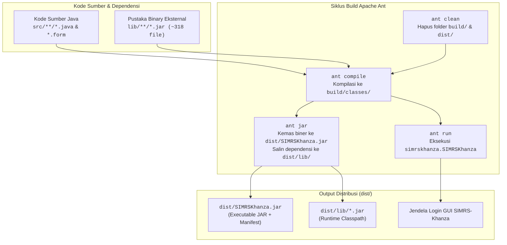
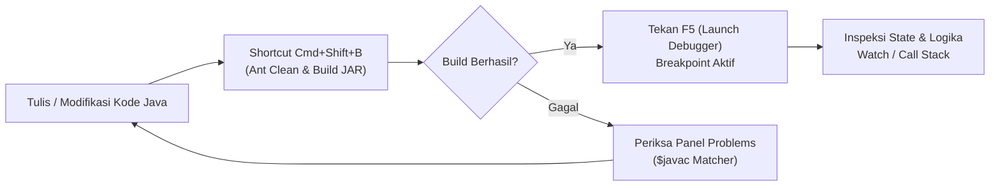
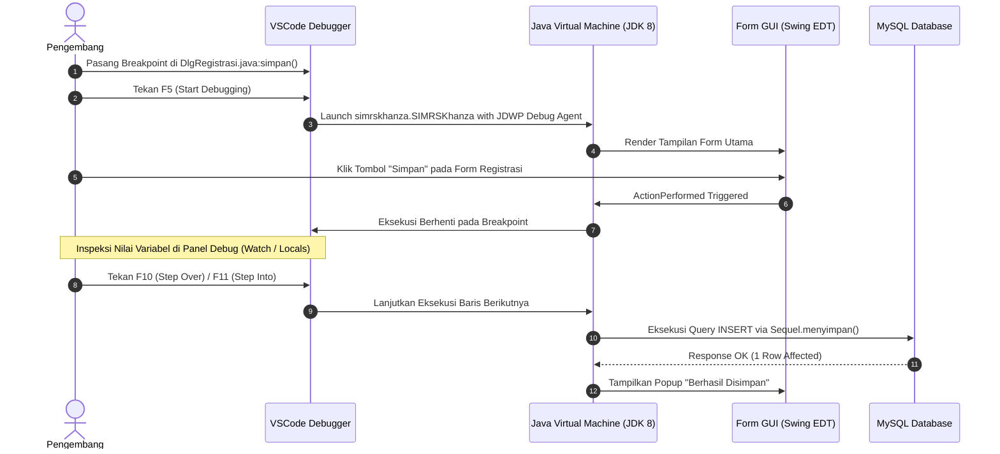
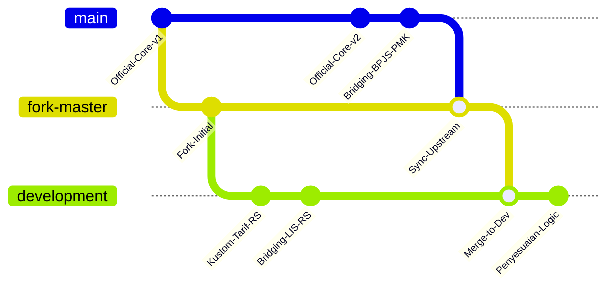
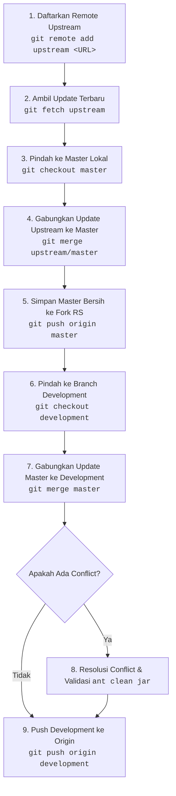
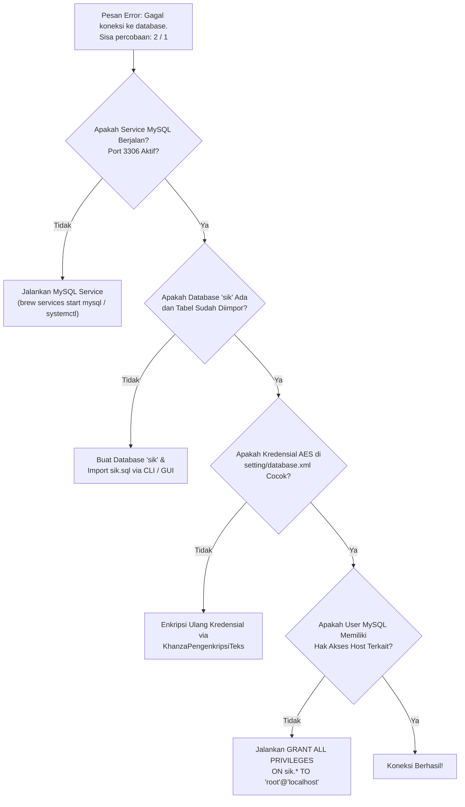
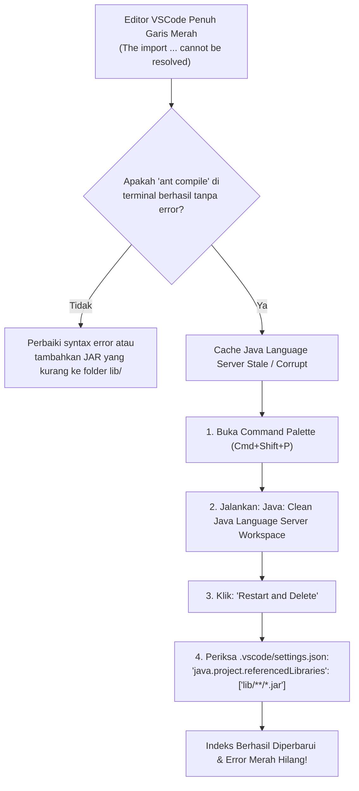
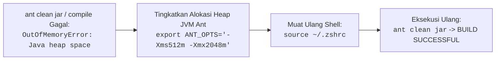
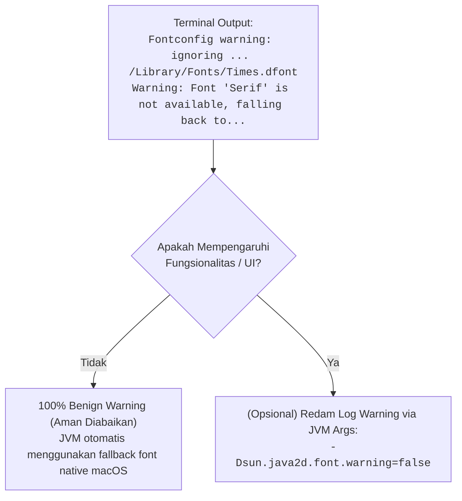
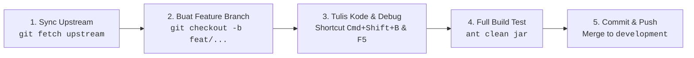

[← Sebelumnya: Arsitektur & Kode Sumber](03-architecture-and-codebase.md) | [Daftar Isi](README.md) | [Selanjutnya: Roadmap & Resep Fitur →](05-feature-roadmap-and-recipes.md)

---

# Modul 4: Alur Kerja Pengembangan & Troubleshooting (*Development Workflow & Troubleshooting*)

Selamat datang di modul keempat dokumentasi **SIMRS-Khanza**. Modul ini dirancang sebagai panduan operasional harian bagi pengembang dalam mengelola siklus hidup *build*, memanfaatkan kapabilitas pengujian dan *debugging* modern di Visual Studio Code, menerapkan strategi kolaborasi *branching* Git lintas repositori (*upstream sync*), serta menyelesaikan berbagai kendala teknis umum melalui katalog pemecahan masalah (*troubleshooting catalog*) yang komprehensif.

---

## 1. Siklus Build & Packaging Apache Ant

SIMRS-Khanza mengandalkan **Apache Ant** sebagai *automation build tool* utama. Skrip build didefinisikan dalam file `build.xml` pada direktori *root* proyek, yang mengimpor konfigurasi NetBeans dari `nbproject/build-impl.xml` dan `nbproject/project.properties`.



### 1.1 Target Build Utama Apache Ant

Tabel berikut merangkum target build yang paling sering digunakan dalam pengembangan:

| Perintah Target | Fungsi & Mekanisme Kerja | Kapan Digunakan? |
| :--- | :--- | :--- |
| `ant compile` | Mengompilasi seluruh file `.java` di dalam folder `src/` menjadi *bytecode* `.class` pada folder `build/classes/`. Menggunakan *classpath* dari direktori `lib/`. | Digunakan untuk memvalidasi kesalahan sintaks secara cepat tanpa membuat paket distribusi JAR. |
| `ant run` | Mengompilasi perubahan kode terbaru (inkremental) dan mengeksekusi kelas utama `simrskhanza.SIMRSKhanza`. Membuka jendela GUI login. | Digunakan saat menguji perubahan kode secara langsung di workstation pengembang. |
| `ant clean` | Menghapus direktori `build/` (berkas `.class` sementara) dan direktori `dist/` (hasil kemasan JAR sebelumnya). | Digunakan untuk membersihkan artefak lama sebelum melakukan *clean build*. |
| `ant jar` | Membungkus seluruh berkas `.class` dari `build/classes/` menjadi file biner `dist/SIMRSKhanza.jar`, serta menyalin seluruh pustaka eksternal ke `dist/lib/`. | Digunakan untuk menghasilkan paket distribusi aplikasi. |
| `ant clean jar` | **Target Standar Produksi/Rilis.** Menjalankan `ant clean`, dilanjutkan dengan kompilasi penuh dari nol, dan pengemasan ke `dist/SIMRSKhanza.jar`. | **Sangat disarankan** sebelum melakukan *commit* Git atau merilis pembaruan ke server/klien rumah sakit. |

---

### 1.2 Struktur Hasil Build di Folder `dist/`

Setelah perintah `ant clean jar` selesai dieksekusi, direktori `dist/` akan memiliki struktur fisik sebagai berikut:

```
dist/
├── SIMRSKhanza.jar              # Biner eksekusi utama aplikasi
└── lib/                         # Direktori berisi ~318 file JAR dependensi runtime
    ├── activation-1.1.1.jar
    ├── jasperreports-6.8.0.jar
    ├── mysql-connector-java-5.1.49.jar
    ├── spring-web-4.3.25.RELEASE.jar
    └── ... (seluruh pustaka runtime lainnya)
```

> [!IMPORTANT]
> **Keterikatan Relatif antara JAR dan Folder `dist/lib/`**  
> File `dist/SIMRSKhanza.jar` dikonfigurasi melalui berkas `manifest.mf` dengan atribut `Class-Path` yang merujuk secara relatif ke folder `lib/`. Jika Anda memindahkan `SIMRSKhanza.jar` ke komputer lain atau ke folder rilis rumah sakit, **folder `lib/` (beserta isinya), folder `setting/`, dan folder `report/` harus selalu berada di direktori yang sama** dengan file JAR tersebut.

Contoh struktur direktori deployment mandiri (*standalone deployment*):
```
KhanzaHMS-Release/
├── SIMRSKhanza.jar              # Dijalankan via: java -jar SIMRSKhanza.jar
├── lib/                         # Dependensi JAR
├── setting/                     # Konfigurasi database.xml
└── report/                      # File template laporan *.jasper & *.jrxml
```

---

### 1.3 Manajemen Memori Heap Apache Ant (`ANT_OPTS`)

SIMRS-Khanza memiliki basis kode yang sangat masif (>3.500 file sumber Java dan lebih dari 300 pustaka eksternal). Proses kompilasi dapat memicu kehabisan memori (*out of memory*) jika alokasi Java Virtual Machine default untuk Ant terlalu kecil.

Untuk mencegah error `java.lang.OutOfMemoryError: Java heap space`, atur variabel lingkungan `ANT_OPTS` pada konfigurasi shell Anda:

#### Pada macOS / Linux (`~/.zshrc` atau `~/.bashrc`):
```bash
# Tambahkan konfigurasi memori Ant di baris paling bawah
export ANT_OPTS="-Xms512m -Xmx2048m -XX:+UseG1GC"
```

Terapkan perubahan dengan memuat ulang shell:
```bash
source ~/.zshrc   # atau source ~/.bashrc
```

#### Pada Windows (Command Prompt / PowerShell):
```cmd
set ANT_OPTS=-Xms512m -Xmx2048m
```
*Atau tambahkan secara permanen melalui **System Properties → Environment Variables → User/System Variables**.*

---

## 2. Iterasi Cepat (*Fast-Iteration*) & Debugging di Visual Studio Code

Visual Studio Code dengan ekstensi **Extension Pack for Java** menyediakan alur kerja yang sangat efisien untuk pengembangan SIMRS-Khanza tanpa perlu bergantung pada IDE NetBeans yang berat.



---

### 2.1 Menjalankan Build Task via Shortcut (`Cmd+Shift+B` / `Ctrl+Shift+B`)

File konfigurasi `.vscode/tasks.json` telah dikonfigurasi untuk menghubungkan shortcut build standar VSCode langsung dengan target Apache Ant.

Buka atau verifikasi file `.vscode/tasks.json`:

```json
{
  "version": "2.0.0",
  "options": {
    "env": {
      "JAVA_HOME": "/Library/Java/JavaVirtualMachines/temurin-8.jdk/Contents/Home"
    }
  },
  "tasks": [
    {
      "label": "Ant: Clean & Build JAR",
      "type": "shell",
      "command": "ant clean jar",
      "group": {
        "kind": "build",
        "isDefault": true
      },
      "problemMatcher": ["$javac"]
    },
    {
      "label": "Ant: Compile",
      "type": "shell",
      "command": "ant compile",
      "group": "none",
      "problemMatcher": ["$javac"]
    },
    {
      "label": "Ant: Run",
      "type": "shell",
      "command": "ant run",
      "group": "none",
      "problemMatcher": ["$javac"]
    }
  ]
}
```

#### Alur Kerja Shortcut:
1. Tekan `Cmd+Shift+B` (macOS) atau `Ctrl+Shift+B` (Linux/Windows).
2. VSCode otomatis menjalankan task default: `ant clean jar`.
3. Jika terjadi kesalahan kompilasi, ekstensi `$javac` problem matcher akan langsung memetakan nomor baris dan berkas yang error ke panel **Problems** di VSCode.
4. Untuk menjalankan aplikasi, buka *Command Palette* (`Cmd+Shift+P` / `Ctrl+Shift+P`), ketik `Tasks: Run Task`, dan pilih **Ant: Run**.

---

### 2.2 Konfigurasi Debugger Java VSCode (`.vscode/launch.json`)

Untuk melakukan *debugging* interaktif (memasang *breakpoint*, menelusuri eksekusi baris demi baris, dan menginspeksi nilai variabel), buat file konfigurasi `.vscode/launch.json`:

```json
{
  "version": "0.2.0",
  "configurations": [
    {
      "type": "java",
      "name": "Debug SIMRS-Khanza (Main)",
      "request": "launch",
      "mainClass": "simrskhanza.SIMRSKhanza",
      "projectName": "SIMRS-Khanza",
      "vmArgs": "-Xms512m -Xmx2048m -Dfile.encoding=UTF-8",
      "preLaunchTask": "Ant: Compile"
    },
    {
      "type": "java",
      "name": "Attach to Running Khanza (Remote Debug)",
      "request": "attach",
      "hostName": "localhost",
      "port": 5005
    }
  ]
}
```

---

### 2.3 Panduan Praktik Debugging Interaktif



#### Langkah-Langkah Debugging:
1. **Pasang Breakpoint**: Buka file Java target (misalnya `src/simrskhanza/DlgRegistrasi.java`), klik pada margin kiri nomor baris yang ingin diperiksa (akan muncul titik merah).
2. **Mulai Sesi Debug**: Tekan tombol `F5` pada keyboard atau pilih menu **Run → Start Debugging**.
3. **Pemicu Event di UI**: Lakukan aksi pada antarmuka SIMRS-Khanza yang memicu kode tersebut (misalnya mengklik tombol simpan atau memilih baris pada tabel).
4. **Analisis State pada Panel Debug**:
   - **Variables**: Melihat seluruh variabel lokal, nilai teks pada `JTextField`, indeks baris terpilih pada `JTable`, dan objek koneksi database.
   - **Watch**: Tambahkan ekspresi khusus untuk dipantau secara langsung, misalnya `akses.getkode()`, `Sequel.cariIsi("SELECT ...")`, atau `tbObat.getSelectedRow()`.
   - **Call Stack**: Menelusuri rantai pemanggilan fungsi (*stack trace*) dari *Event Dispatch Thread (EDT)* hingga ke method yang sedang berhenti.
5. **Navigasi Eksekusi**:
   - `F10` (**Step Over**): Jalankan baris saat ini dan pindah ke baris berikutnya.
   - `F11` (**Step Into**): Masuk ke dalam isi method yang sedang dipanggil.
   - `Shift+F11` (**Step Out**): Selesaikan method saat ini dan kembali ke pemanggilnya.
   - `F5` (**Continue**): Lanjutkan eksekusi normal hingga menemukan *breakpoint* berikutnya.

---

## 3. Alur Kolaborasi Git & Sinkronisasi Upstream

Pengembangan SIMRS-Khanza di lingkungan rumah sakit memerlukan strategi percabangan (*branching strategy*) yang disiplin. Repositori resmi SIMRS-Khanza (*upstream*) terus menerima pembaruan berkala dari komunitas pusat, sementara rumah sakit Anda memiliki kebutuhan kustomisasi lokal (penyesuaian tarif, bridging mesin laboratorium internal, layout kwitansi khusus, dll.).

### 3.1 Model 3-Tier Branching

Model percabangan 3-tier memisahkan antara kode resmi, *mirror* fork rumah sakit, dan branch kerja kustom:



#### Definisi 3 Tingkatan Branch:

| Tingkatan | Nama Branch / Remote | Karakteristik & Peruntukan |
| :--- | :--- | :--- |
| **Tier 1 (Upstream)** | `upstream/master` | Repositori resmi pusat SIMRS-Khanza (`mas-khanza/SIMRS-Khanza`). Bersifat *read-only* bagi tim IT rumah sakit. Sumber resmi *bugfix* dan regulasi pemerintah (BPJS/SatuSehat). |
| **Tier 2 (Origin Mirror)** | `origin/master` | Fork resmi milik rumah sakit di GitHub/GitLab internal. Selalu disinkronkan secara identik dengan `upstream/master` tanpa ada kustomisasi lokal langsung di branch ini. |
| **Tier 3 (Development & Feature)** | `development` / `feature/*` | Tempat seluruh pengembang rumah sakit bekerja. Seluruh kustomisasi lokal (bridging lokal, modul internal, form kustom) dibuat di branch ini atau branch turunannya. |

---

### 3.2 Prosedur Sinkronisasi Berkala (Langkah demi Langkah)

Lakukan prosedur ini secara rutin (misalnya mingguan atau saat ada pembaruan bridging nasional dari pusat):



#### 1. Mendaftarkan Remote Upstream (Hanya Sekali)
Pastikan remote upstream resmi sudah terdaftar di repositori lokal Anda:
```bash
# Tambahkan upstream resmi
git remote add upstream https://github.com/mas-khanza/SIMRS-Khanza.git

# Verifikasi konfigurasi remote
git remote -v
```
Output yang benar akan menampilkan dua remote (`origin` untuk fork RS Anda dan `upstream` untuk repositori pusat):
```text
origin    https://github.com/rs-kalian/SIMRS-Khanza.git (fetch)
origin    https://github.com/rs-kalian/SIMRS-Khanza.git (push)
upstream  https://github.com/mas-khanza/SIMRS-Khanza.git (fetch)
upstream  https://github.com/mas-khanza/SIMRS-Khanza.git (push)
```

#### 2. Mengambil dan Menggabungkan Update ke Branch Master
```bash
# Ambil seluruh commit terbaru dari upstream
git fetch upstream

# Pindah ke branch master lokal
git checkout master

# Gabungkan commit upstream (fast-forward jika master bersih)
git merge upstream/master

# Perbarui repositori remote fork rumah sakit Anda
git push origin master
```

#### 3. Mengintegrasikan Update ke Branch Kerja Rumah Sakit
```bash
# Pindah ke branch development lokal
git checkout development

# Gabungkan perubahan dari master ke development
git merge master
```

---

### 3.3 Panduan Praktis Resolusi *Merge Conflict*

Saat menggabungkan perubahan upstream ke branch kustomisasi rumah sakit, Anda mungkin menemui konflik (*merge conflict*). Berikut panduan menangani konflik berdasarkan tipe berkas:

```mermaid
flowchart TD
    Conflict{"Tipe File yang Mengalami Konflik"}
    
    Conflict -->|Berkas .java| Java["1. Buka File Java di VSCode<br/>2. Bandingkan marker konflik (HEAD vs Upstream)<br/>3. Pertahankan logika RS + bugfix Upstream<br/>4. Jalankan ant compile"]
    
    Conflict -->|Berkas .form (Matisse)| Form["1. HINDARI EDIT MANUAL XML JIKA RAGU<br/>2. Ambil versi upstream: git checkout --theirs Form.form<br/>3. Buka form di NetBeans GUI Builder<br/>4. Terapkan ulang komponen visual kustom RS"]
    
    Conflict -->|Berkas .jrxml (Jasper)| Report["1. Buka berkas .jrxml di Jaspersoft Studio / VSCode<br/>2. Harmonisasikan field/parameter query<br/>3. Kompilasi ulang template menjadi berkas .jasper"]
```

#### 1. Konflik pada File Kode Sumber Java (`*.java`)
Tanda konflik standar Git akan muncul di dalam berkas:
```java
<<<<<<< HEAD (Branch development - Kustom RS)
        // Penyesuaian tarif lokal RS
        Sequel.menyimpan("billing","'"+TNoRw.getText()+"','"+kdbilling.getText()+"','50000'","Billing");
=======
        // Pembaruan resmi upstream (validasi baru)
        if(Valid.cekKosong(TNoRw.getText())){
            Sequel.menyimpan("billing","'"+TNoRw.getText()+"','"+kdbilling.getText()+"','0'","Billing");
        }
>>>>>>> master (Pembaruan Upstream)
```
**Solusi:** Gabungkan kedua maksud logika secara harmonis:
```java
        // Hasil Resolusi: Mengadopsi validasi upstream + tarif kustom RS
        if(!Valid.cekKosong(TNoRw.getText())){
            Sequel.menyimpan("billing","'"+TNoRw.getText()+"','"+kdbilling.getText()+"','50000'","Billing");
        }
```

#### 2. Konflik pada File NetBeans GUI Designer (`*.form`)
> [!WARNING]
> **Bahaya Kerusakan Struktur Visual GUI (.form)**  
> File `.form` adalah file XML internal NetBeans yang memetakan posisi drag-and-drop komponen GUI Swing. Menyunting file `.form` secara manual saat merge conflict berisiko merusak parser Matisse, sehingga form tidak bisa lagi dibuka di GUI builder.

**Strategi Aman Penanganan File `.form`:**
- Jika konflik bersifat minor (hanya penambahan properti), selesaikan konflik XML dengan teliti.
- Jika konflik bersifat struktural besar:
  1. Pilih versi upstream: `git checkout --theirs src/simrskhanza/DlgNamaForm.form`
  2. Pilih versi Java upstream: `git checkout --theirs src/simrskhanza/DlgNamaForm.java`
  3. Buka form tersebut di **NetBeans IDE**, lalu pasang kembali tombol atau komponen kustom RS Anda secara visual.

#### 3. Konflik pada File Desain Laporan (`*.jrxml`)
- File `.jrxml` adalah dokumen XML JasperReports.
- Selesaikan konflik pada teks XML `.jrxml` di VSCode atau buka menggunakan **Jaspersoft Studio**.
- **Wajib:** Kompilasi ulang file `.jrxml` menjadi file `.jasper` biner setelah konflik teratasi.

#### 4. Verifikasi Wajib Pasca-Resolusi
Setelah semua konflik diselesaikan dan ditandai (`git add .`), jalankan build menyeluruh:
```bash
ant clean jar
```
Jika kompilasi berhasil tanpa error, selesaikan proses merge:
```bash
git commit -m "chore: merge upstream updates into development and resolve conflicts"
git push origin development
```

---

## 4. Katalog Troubleshooting Komprehensif

Bagian ini menyajikan panduan diagnosis akar masalah (*root-cause*) dan prosedur solusi praktis untuk empat masalah paling umum yang dihadapi pengembang SIMRS-Khanza.

---

### Masalah 1: Gagal Koneksi Database (`Gagal koneksi ke database. Sisa percobaan: ...`)



#### Gejala:
Saat menjalankan `ant run` atau membuka `dist/SIMRSKhanza.jar`, muncul popup dialog:
```
Gagal koneksi ke database. Sisa percobaan: 2
Gagal koneksi ke database. Sisa percobaan: 1
```
Setelah percobaan ketiga habis, aplikasi otomatis menutup diri (*terminate*).

#### Diagnosis Akar Masalah (*Root Cause*):
1. **Service MySQL Mati**: Service database MySQL/MariaDB lokal belum dijalankan.
2. **Port 3306 Terblokir / Bentrok**: Port default 3306 digunakan oleh aplikasi lain (misal XAMPP, MAMP, atau Docker container).
3. **Database Belum Siap**: Database dengan nama `sik` belum dibuat atau belum diisi skema awal `sik.sql`.
4. **Kredensial Terenkripsi Salah**: Nilai host, port, nama database, username, atau password pada file `setting/database.xml` tidak cocok dengan konfigurasi MySQL lokal setelah didekripsi AES-128.
5. **Hak Akses User Terbatas**: Pengguna database tidak memiliki izin koneksi dari `localhost` atau IP workstation Anda.

#### Prosedur Pemecahan Masalah:

**Langkah 1: Periksa Status Service MySQL**
- **macOS (Homebrew):**
  ```bash
  brew services list
  # Jika stopped, jalankan:
  brew services start mysql
  ```
- **Linux (Ubuntu/Debian):**
  ```bash
  sudo systemctl status mysql
  # Jika inactive, jalankan:
  sudo systemctl start mysql
  ```
- **Windows:** Buka `services.msc`, cari service **MySQL** atau **MariaDB**, klik kanan lalu pilih **Start**.

**Langkah 2: Uji Koneksi Database via Terminal Langsung**
Pastikan database `sik` dapat diakses langsung menggunakan kredensial Anda:
```bash
mysql -h 127.0.0.1 -P 3306 -u root -p sik
```
Jika gagal login atau database `sik` tidak ditemukan, buat database dan impor skema:
```sql
CREATE DATABASE sik CHARACTER SET utf8mb4 COLLATE utf8mb4_unicode_ci;
USE sik;
SOURCE ./sik.sql; -- atau: SOURCE /path/to/SIMRS-Khanza/sik.sql;
```

**Langkah 3: Perbaiki Konfigurasi Terenkripsi di `setting/database.xml`**
File `setting/database.xml` menyimpan string terenkripsi AES-128. Jika password database MySQL Anda berbeda dari default Khanza, lakukan enkripsi ulang menggunakan sub-project `KhanzaPengenkripsiTeks`:

1. Buka sub-project enkripsi di terminal:
   ```bash
   cd KhanzaPengenkripsiTeks
   java -jar dist/KhanzaPengenkripsiTeks.jar
   ```
2. Masukkan parameter *plain-text* database Anda:
   - **Host:** `localhost` atau `127.0.0.1`
   - **Database:** `sik`
   - **Port:** `3306`
   - **User:** `root`
   - **Password:** *(password MySQL lokal Anda)*
3. Klik tombol **Enkripsi**, salin ciphertext yang dihasilkan, dan tempelkan ke elemen terkait di file `setting/database.xml`:
   ```xml
   <?xml version="1.0" encoding="UTF-8"?>
   <settings>
       <host>CBPKqU2x5z3o...</host>
       <database>P9sZ7...</database>
       <port>kXy8...</port>
       <user>r0oT...</user>
       <password>PwD123...</password>
   </settings>
   ```

**Langkah 4: Periksa Hak Akses Pengguna MySQL**
Jalankan query SQL berikut di MySQL client untuk memastikan akun memiliki hak penuh:
```sql
GRANT ALL PRIVILEGES ON sik.* TO 'root'@'localhost' IDENTIFIED BY 'password_anda';
GRANT ALL PRIVILEGES ON sik.* TO 'root'@'127.0.0.1' IDENTIFIED BY 'password_anda';
FLUSH PRIVILEGES;
```

---

### Masalah 2: Symbol / Package Not Found di Visual Studio Code



#### Gejala:
Editor VSCode menampilkan ratusan garis merah di panel *Problems* dengan pesan:
- `The import ... cannot be resolved`
- `cannot find symbol: class DlgReg`
- `package widget does not exist`
Namun, saat Anda menjalankan perintah `ant compile` di terminal, proses kompilasi berjalan sukses 100% tanpa error (*BUILD SUCCESSFUL*).

#### Diagnosis Akar Masalah (*Root Cause*):
Java Language Server (Eclipse JDT.LS) yang digunakan oleh ekstensi VSCode mengalami *stale cache* atau korupsi metadata indeks *classpath*. Kondisi ini umum terjadi setelah:
- Menambahkan atau memperbarui file `.jar` baru di dalam direktori `lib/`.
- Melakukan perpindahan branch Git (*checkout*) dalam skala besar.
- Menghapus folder `build/` secara manual di luar kendali VSCode.

#### Prosedur Pemecahan Masalah:

**Langkah 1: Bersihkan Workspace Java Language Server**
1. Buka *Command Palette* di VSCode dengan menekan `Cmd+Shift+P` (macOS) atau `Ctrl+Shift+P` (Linux/Windows).
2. Ketik: `Java: Clean Java Language Server Workspace`.
3. Tekan **Enter**, kemudian pilih opsi **Restart and Delete**.
4. VSCode akan memuat ulang jendela, menghapus seluruh cache indeks lama di latar belakang, dan memindai ulang seluruh berkas di `src/` serta pustaka di `lib/`.

**Langkah 2: Verifikasi Konfigurasi Library di `.vscode/settings.json`**
Pastikan pengaturan pustaka pada `.vscode/settings.json` menyertakan seluruh JAR secara rekursif:
```json
{
  "java.project.sourcePaths": ["src"],
  "java.project.referencedLibraries": [
    "lib/**/*.jar"
  ],
  "java.configuration.runtimes": [
    {
      "name": "JavaSE-1.8",
      "path": "/Library/Java/JavaVirtualMachines/temurin-8.jdk/Contents/Home",
      "default": true
    }
  ]
}
```

**Langkah 3: Muat Ulang Window VSCode (*Developer: Reload Window*)**
Jika garis merah masih muncul setelah pembersihan cache:
1. Tekan `Cmd+Shift+P` / `Ctrl+Shift+P`.
2. Ketik dan pilih: `Developer: Reload Window`.

---

### Masalah 3: OutOfMemoryError / Java Heap Space saat Build Ant



#### Gejala:
Saat menjalankan perintah `ant compile` atau `ant clean jar`, proses kompilasi berhenti di tengah jalan dengan output error:
```text
[javac] Compiling 3542 source files to /path/to/SIMRS-Khanza/build/classes
[javac] The system is out of resources.
[javac] java.lang.OutOfMemoryError: Java heap space
[javac]     at com.sun.tools.javac.util.Bits.dup(Bits.java:78)
...
BUILD FAILED
```

#### Diagnosis Akar Masalah (*Root Cause*):
Kompilasi serentak lebih dari 3.500 file Java beserta analisis ratusan pustaka eksternal membutuhkan memori kerja compiler (*javac heap memory*) yang jauh lebih besar dari alokasi default JVM bawaan Ant (default 256MB atau 512MB).

#### Prosedur Pemecahan Masalah:

**Langkah 1: Konfigurasi Variabel Lingkungan `ANT_OPTS`**
Tambahkan alokasi heap memori minimum 512 MB dan maksimum 2048 MB (2 GB):

- **macOS / Linux (`~/.zshrc` atau `~/.bashrc`):**
  ```bash
  echo 'export ANT_OPTS="-Xms512m -Xmx2048m -XX:+UseG1GC"' >> ~/.zshrc
  source ~/.zshrc
  ```
- **Windows (Command Prompt / PowerShell):**
  ```powershell
  [System.Environment]::SetEnvironmentVariable('ANT_OPTS', '-Xms512m -Xmx2048m', 'User')
  ```

**Langkah 2: Menyesuaikan Konfigurasi VM Args di VSCode Settings**
Pastikan Java Language Server di VSCode juga mendapatkan alokasi memori yang memadai pada file `.vscode/settings.json`:
```json
{
  "java.jdt.ls.vmargs": "-XX:+UseG1GC -XX:+UseStringDeduplication -Xms1G -Xmx4G -Dsun.zip.disableMemoryMapping=true -Xlog:disable"
}
```

**Langkah 3: Uji Ulang Kompilasi**
Jalankan kembali build bersih:
```bash
ant clean jar
```
Proses akan berjalan lancar hingga menampilkan status `BUILD SUCCESSFUL`.

---

### Masalah 4: Peringatan Font (Times / Serif) di macOS



#### Gejala:
Saat menjalankan SIMRS-Khanza di macOS (khususnya Apple Silicon M1/M2/M3/M4 atau macOS Monterey, Ventura, Sonoma, Sequoia), terminal mengeluarkan pesan peringatan:
```text
Fontconfig warning: ignoring /Library/Fonts/Times.dfont: not a valid font file
Fontconfig warning: ignoring /Library/Fonts/Courier.dfont: not a valid font file
Warning: Font "Serif" is not available, falling back to "Lucida Grande"
```

#### Diagnosis Akar Masalah (*Root Cause*):
- Sistem grafis Java Swing/AWT (*Java 2D Font Manager*) pada JDK 8 mencari font standar berbasis format TrueType (`.ttf`) menggunakan library *Fontconfig* (standar Linux/X11).
- Pada macOS versi modern, Apple mengemas font bawaan sistem seperti Times, Courier, dan Helvetica dalam format koleksi biner `.dfont` (*Data Fork Font*) atau `.ttc` (*TrueType Collection*).
- Mesin AWT font parser pada Java 8 mengabaikan file format `.dfont` tersebut dan mencatat pesan peringatan di terminal.

#### Penjelasan Teknis & Solusi:

> [!NOTE]
> **Peringatan Bersifat Kosmetik (*100% Safe to Ignore*)**  
> Pesan peringatan font ini **sama sekali tidak berbahaya** dan **tidak memengaruhi logika bisnis, kestabilan aplikasi, maupun fungsionalitas SIMRS-Khanza**. Java Virtual Machine secara otomatis mengalihkan (*fallback*) rendering teks ke font native sistem operasi (seperti *Lucida Grande* atau *San Francisco*), sehingga seluruh komponen antarmuka (tombol, input teks, tabel) tetap ter-render secara tajam dan proporsional.

Jika Anda ingin meredam log peringatan tersebut agar terminal tetap bersih saat menjalankan aplikasi, Anda dapat menambahkan parameter Java2D saat menjalankan Java:

```bash
java -Dsun.java2d.font.warning=false -jar dist/SIMRSKhanza.jar
```
Atau tambahkan ke dalam `run.jvmargs` pada `nbproject/project.properties`:
```properties
run.jvmargs=-Dsun.java2d.font.warning=false
```

---

## 5. Rangkuman & Lembar Pantau Kerja Pengembang (*Developer Daily Checklist*)

Untuk menjaga kualitas kode dan kelancaran kolaborasi tim, ikuti daftar periksa harian (*daily workflow checklist*) berikut:



### Lembar Pantau Kerja Harian:

- [ ] **Sinkronisasi Upstream**: Tarik pembaruan upstream ke branch master lokal minimal sekali seminggu sebelum memulai fitur baru.
- [ ] **Branching Disiplin**: Jangan pernah mengubah kode langsung pada branch `master`. Gunakan branch `development` atau `feature/nama-fitur`.
- [ ] **Format Keamanan**: Jangan pernah melakukan commit file `setting/database.xml` yang memuat password *plain-text*. Selalu gunakan ciphertext AES-128.
- [ ] **Integritas GUI Form**: Jangan mengedit blok kode `// <editor-fold defaultstate="collapsed" desc="Generated Code">` pada file `.java` secara manual. Gunakan NetBeans GUI Builder untuk mengubah tata letak form.
- [ ] **Validasi Build Mandiri**: Selalu pastikan `ant clean jar` menghasilkan status `BUILD SUCCESSFUL` di terminal lokal sebelum membuat *Pull Request* atau menggabungkan ke branch utama.

---

[← Sebelumnya: Arsitektur & Kode Sumber](03-architecture-and-codebase.md) | [Daftar Isi](README.md) | [Selanjutnya: Roadmap & Resep Fitur →](05-feature-roadmap-and-recipes.md)
