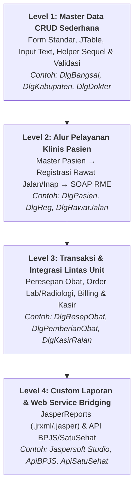
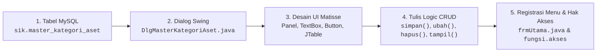
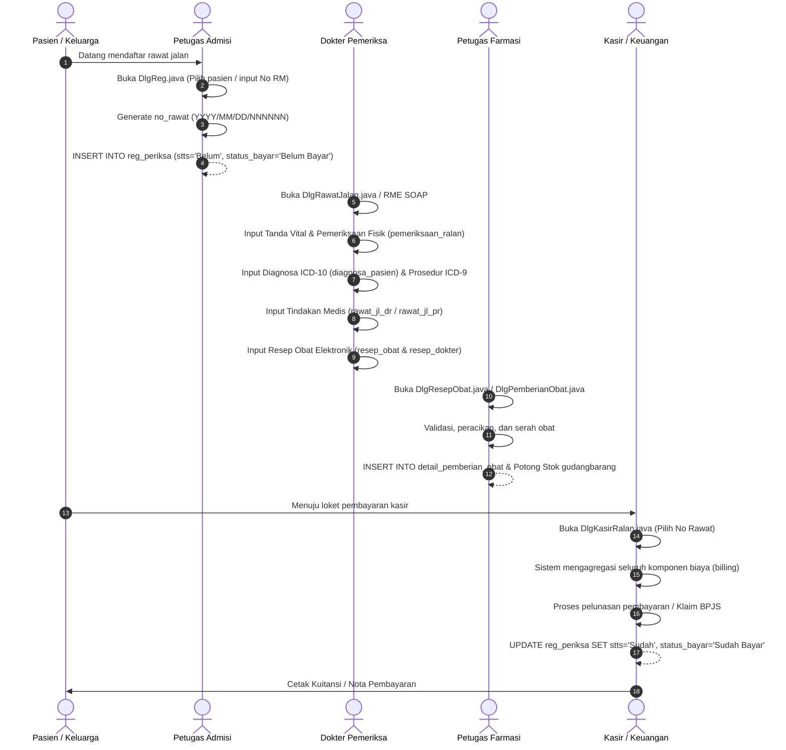
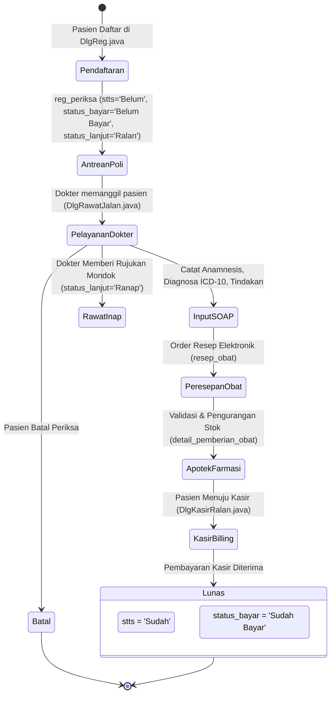
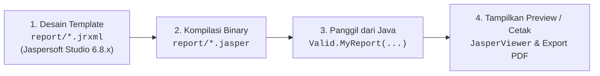
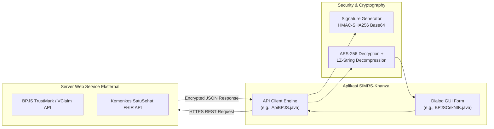
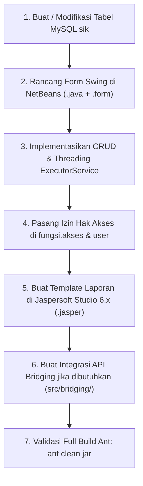

[← Sebelumnya: Alur Kerja & Troubleshooting](04-development-workflow.md) | [Daftar Isi](README.md)

---

# Modul 5: Roadmap Pembelajaran & Resep Pengembangan Fitur (*Feature Roadmap & Recipes*)

Selamat datang di modul kelima dokumentasi **SIMRS-Khanza**. Jika modul-modul sebelumnya telah membekali Anda dengan pemahaman arsitektur, database, konsep Java desktop, dan alur kerja harian, maka modul ini adalah **buku resep praktis (*cookbook*) dan peta jalan (*roadmap*)** untuk mengimplementasikan fitur-fitur baru di SIMRS-Khanza secara mandiri dan profesional.

Dokumen ini disusun berjenjang mulai dari kurikulum belajar 4 level hingga panduan langkah-demi-langkah (*step-by-step recipes*) yang dilengkapi diagram alur, potongan kode Java 8 nyata, struktur query SQL, dan teknik integrasi sistem.

---

## 1. Roadmap 4 Level Pembelajaran & Pengembangan SIMRS-Khanza

Arsitektur monolitik SIMRS-Khanza memiliki cakupan bisnis rumah sakit yang sangat luas (lebih dari 1.000 form dan tabel). Untuk menguasai pengembangannya secara efektif tanpa merasa kewalahan (*overwhelmed*), ikuti kurikulum belajar bertahap 4 level berikut:



### Penjelasan Detail 4 Level Pengembangan:

| Level | Fokus Utama | Target Kompetensi | Contoh Kelas Sumber |
| :--- | :--- | :--- | :--- |
| **Level 1** | **Master Data CRUD** | Memahami anatomi form Java Swing (`.java` & `.form`), manajemen model tabel `DefaultTableModel`, validasi input `batasInput`, eksekusi operasi database via helper `fungsi.sekuel` (`menyimpantf`, `mengedittf`, `meghapus`), dan threading `ExecutorService` / `SwingWorker`. | [`DlgBangsal.java`](file:///Users/adijaya/MyFiles/Projects/SIMRS-Khanza/src/simrskhanza/DlgBangsal.java)<br/>[`DlgKabupaten.java`](file:///Users/adijaya/MyFiles/Projects/SIMRS-Khanza/src/simrskhanza/DlgKabupaten.java)<br/>[`DlgDokter.java`](file:///Users/adijaya/MyFiles/Projects/SIMRS-Khanza/src/kepegawaian/DlgDokter.java) |
| **Level 2** | **Alur Pelayanan Klinis Pasien** | Menguasai relasi entitas pasien (`pasien`) dan kunjungan (`reg_periksa`), pembuatan nomor rawat terstruktur, pengisian data triase, pemeriksaan fisik/tanda vital (`pemeriksaan_ralan`), kodifikasi diagnosa ICD-10 & prosedur ICD-9, serta pencatatan Rekam Medis Elektronik (RME SOAP). | [`DlgPasien.java`](file:///Users/adijaya/MyFiles/Projects/SIMRS-Khanza/src/simrskhanza/DlgPasien.java)<br/>[`DlgReg.java`](file:///Users/adijaya/MyFiles/Projects/SIMRS-Khanza/src/simrskhanza/DlgReg.java)<br/>[`DlgRawatJalan.java`](file:///Users/adijaya/MyFiles/Projects/SIMRS-Khanza/src/simrskhanza/DlgRawatJalan.java) |
| **Level 3** | **Transaksi & Integrasi Lintas Unit** | Mengelola alur transaksi kompleks: penulisan resep obat oleh dokter (`resep_obat`), validasi dan penyerahan obat di apotek farmasi (`detail_pemberian_obat`), pengurangan stok mutasi gudang (`gudangbarang`), order penunjang laboratorium/radiologi, hingga agregasi seluruh tagihan di kasir/billing (`DlgKasirRalan`). | [`DlgResepObat.java`](file:///Users/adijaya/MyFiles/Projects/SIMRS-Khanza/src/inventory/DlgResepObat.java)<br/>[`DlgPemberianObat.java`](file:///Users/adijaya/MyFiles/Projects/SIMRS-Khanza/src/inventory/DlgPemberianObat.java)<br/>[`DlgKasirRalan.java`](file:///Users/adijaya/MyFiles/Projects/SIMRS-Khanza/src/simrskhanza/DlgKasirRalan.java) |
| **Level 4** | **Custom Laporan & Bridging API** | Mendesain template cetakan laporan dokumen medis (resume pasien, bukti bayar, surat rujukan) menggunakan Jaspersoft Studio 6.x (`.jrxml` → `.jasper`), serta membangun integrasi REST API web service eksternal (BPJS VClaim/PCare/Antrean dan Kemenkes SatuSehat FHIR). | [`Valid.MyReport(...)`](file:///Users/adijaya/MyFiles/Projects/SIMRS-Khanza/src/fungsi/validasi.java)<br/>[`ApiBPJS.java`](file:///Users/adijaya/MyFiles/Projects/SIMRS-Khanza/src/bridging/ApiBPJS.java)<br/>[`ApiSatuSehat.java`](file:///Users/adijaya/MyFiles/Projects/SIMRS-Khanza/src/bridging/ApiSatuSehat.java) |

---

## 2. Resep Praktik 1: Panduan Lengkap Membuat Form CRUD Master Baru dari Nol

Resep ini memandu Anda membuat form master data baru secara utuh. Sebagai studi kasus, kita akan membangun modul **Master Kategori Aset Medis** (`master_kategori_aset`).



---

### Langkah 1: Merancang Tabel di Database MySQL `sik`

Buka klien MySQL / terminal dan buat tabel baru di database `sik`. Selalu sertakan kolom `status` bertipe `enum('0','1')` untuk mendukung fitur *soft-delete* (data sampah / restore) standar Khanza.

```sql
USE sik;

CREATE TABLE IF NOT EXISTS `master_kategori_aset` (
  `kd_kategori` varchar(5) NOT NULL,
  `nm_kategori` varchar(50) NOT NULL,
  `status` enum('0','1') NOT NULL DEFAULT '1',
  PRIMARY KEY (`kd_kategori`),
  KEY `nm_kategori` (`nm_kategori`)
) ENGINE=InnoDB DEFAULT CHARSET=latin1;
```

---

### Langkah 2 & 3: Membuat Dialog GUI & Mendesain Komponen UI

1. Di NetBeans IDE atau VSCode, buat file baru di package `simrskhanza` bernama `DlgMasterKategoriAset.java` (turunan dari `javax.swing.JDialog`).
2. Pastikan file `.form` pasangan terbuat (`DlgMasterKategoriAset.form`) untuk memudahkan *layouting* visual di NetBeans GUI Builder.
3. Susun hierarki komponen UI standar Khanza:
   - `internalFrame1` (`widget.InternalFrame`): Kontainer utama dengan layout `BorderLayout`.
   - `panelGlass8` (`widget.panelisi` di bagian `NORTH`): Berisi label dan input:
     - `TKd` (`widget.TextBox`): Input kode kategori (maksimal 5 karakter).
     - `TNm` (`widget.TextBox`): Input nama kategori (maksimal 50 karakter).
   - `Scroll` (`widget.ScrollPane` di bagian `CENTER`): Menampung tabel data `tbKategori` (`widget.Table`).
   - `jPanel1` di bagian `SOUTH`: Menampung dua panel fungsional:
     - `panelGlass7` (`widget.panelisi` atas): Input pencarian `TCari`, tombol `BtnCari`, tombol `BtnAll`, dan label penghitung jumlah baris `LCount`.
     - `panelGlass5` (`widget.panelisi` bawah): Tombol aksi `BtnSimpan`, `BtnBatal`, `BtnHapus`, `BtnEdit`, `BtnPrint`, dan `BtnKeluar`.

---

### Langkah 4: Menulis Logic Method CRUD

Berikut adalah implementasi kode Java 8 lengkap yang menerapkan standar mesin Khanza (`fungsi.sekuel`, `fungsi.validasi`, `fungsi.koneksiDB`, dan `ExecutorService` untuk mencegah UI freeze):

```java
package simrskhanza;

import fungsi.WarnaTable;
import fungsi.batasInput;
import fungsi.koneksiDB;
import fungsi.sekuel;
import fungsi.validasi;
import fungsi.akses;
import java.awt.Cursor;
import java.awt.Dimension;
import java.awt.event.KeyEvent;
import java.sql.Connection;
import java.sql.PreparedStatement;
import java.sql.ResultSet;
import java.sql.SQLException;
import java.util.HashMap;
import java.util.Map;
import java.util.concurrent.ExecutorService;
import java.util.concurrent.Executors;
import java.util.concurrent.RejectedExecutionException;
import javax.swing.JOptionPane;
import javax.swing.JTable;
import javax.swing.JTextField;
import javax.swing.SwingUtilities;
import javax.swing.event.DocumentEvent;
import javax.swing.table.DefaultTableModel;
import javax.swing.table.TableColumn;

public final class DlgMasterKategoriAset extends javax.swing.JDialog {
    private final DefaultTableModel tabMode;
    private Connection koneksi = koneksiDB.condb();
    private sekuel Sequel = new sekuel();
    private validasi Valid = new validasi();
    private PreparedStatement ps;
    private ResultSet rs;
    private int i = 0;
    private final ExecutorService executor = Executors.newSingleThreadExecutor();
    private volatile boolean ceksukses = false;

    public DlgMasterKategoriAset(java.awt.Frame parent, boolean modal) {
        super(parent, modal);
        initComponents();
        this.setLocation(10, 10);
        setSize(545, 599);

        // 1. Inisialisasi Model Tabel (Kolom 0 bertipe Boolean untuk Checkbox seleksi)
        tabMode = new DefaultTableModel(null, new Object[]{"P", "Kode Kategori", "Nama Kategori"}) {
            @Override
            public boolean isCellEditable(int rowIndex, int colIndex) {
                return colIndex == 0; // Hanya kolom checkbox yang dapat diedit di tabel
            }
            Class[] types = new Class[]{
                java.lang.Boolean.class, java.lang.Object.class, java.lang.Object.class
            };
            @Override
            public Class getColumnClass(int columnIndex) {
                return types[columnIndex];
            }
        };

        tbKategori.setModel(tabMode);
        tbKategori.setPreferredScrollableViewportSize(new Dimension(500, 500));
        tbKategori.setAutoResizeMode(JTable.AUTO_RESIZE_OFF);

        // Atur lebar proporsional setiap kolom
        for (i = 0; i < 3; i++) {
            TableColumn column = tbKategori.getColumnModel().getColumn(i);
            if (i == 0) {
                column.setPreferredWidth(20);  // Checkbox
            } else if (i == 1) {
                column.setPreferredWidth(120); // Kode
            } else if (i == 2) {
                column.setPreferredWidth(400); // Nama
            }
        }
        tbKategori.setDefaultRenderer(Object.class, new WarnaTable());

        // 2. Pasang Pembatas Panjang Karakter Input
        TKd.setDocument(new batasInput((byte) 5).getKata(TKd));
        TNm.setDocument(new batasInput((byte) 50).getKata(TNm));
        TCari.setDocument(new batasInput((byte) 100).getKata(TCari));
        TKd.requestFocus();
    }

    // =========================================================================
    // METODE CRUD & HELPER LOGIC
    // =========================================================================

    /**
     * Mengambil dan menampilkan data dari tabel MySQL ke JTable secara asynchronous.
     */
    private void tampil() {
        Valid.tabelKosong(tabMode);
        try {
            String sql = "SELECT kd_kategori, nm_kategori FROM master_kategori_aset WHERE status='1' "
                    + (TCari.getText().trim().isEmpty() ? "" : "AND (kd_kategori LIKE ? OR nm_kategori LIKE ?) ")
                    + "ORDER BY kd_kategori";
            ps = koneksi.prepareStatement(sql);
            try {
                if (!TCari.getText().trim().isEmpty()) {
                    ps.setString(1, "%" + TCari.getText().trim() + "%");
                    ps.setString(2, "%" + TCari.getText().trim() + "%");
                }
                rs = ps.executeQuery();
                while (rs.next()) {
                    tabMode.addRow(new Object[]{
                        false,
                        rs.getString("kd_kategori"),
                        rs.getString("nm_kategori")
                    });
                }
            } catch (Exception e) {
                System.out.println("Notifikasi Master Kategori Aset: " + e);
            } finally {
                if (rs != null) rs.close();
                if (ps != null) ps.close();
            }
        } catch (SQLException e) {
            System.out.println("Notifikasi SQL: " + e);
        }
        LCount.setText("" + tabMode.getRowCount());
    }

    /**
     * Membersihkan input field dan menghasilkan auto-number kode berikutnya.
     */
    public void emptTeks() {
        TKd.setText("");
        TNm.setText("");
        TCari.setText("");
        TKd.requestFocus();
        // Menghasilkan format kode otomatis: KA001, KA002, dst.
        Valid.autoNomer(" master_kategori_aset ", "KA", 3, TKd);
    }

    /**
     * Mengambil data dari baris tabel yang diklik menuju input field.
     */
    private void getData() {
        if (tbKategori.getSelectedRow() != -1) {
            TKd.setText(tbKategori.getValueAt(tbKategori.getSelectedRow(), 1).toString());
            TNm.setText(tbKategori.getValueAt(tbKategori.getSelectedRow(), 2).toString());
        }
    }

    /**
     * Eksekusi penyimpanan data baru (INSERT).
     */
    private void simpan() {
        if (TKd.getText().trim().isEmpty()) {
            Valid.textKosong(TKd, "Kode Kategori");
        } else if (TNm.getText().trim().isEmpty()) {
            Valid.textKosong(TNm, "Nama Kategori");
        } else {
            // Sequel.menyimpantf(tabel, placeholder, field_kunci, jumlah_parameter, data_array)
            if (Sequel.menyimpantf("master_kategori_aset", "?,?,?", "Kode Kategori", 3,
                    new String[]{TKd.getText(), TNm.getText(), "1"})) {
                tabMode.addRow(new Object[]{false, TKd.getText(), TNm.getText()});
                emptTeks();
                LCount.setText("" + tabMode.getRowCount());
            } else {
                TKd.requestFocus();
            }
        }
    }

    /**
     * Eksekusi pengubahan data (UPDATE).
     */
    private void ubah() {
        if (TKd.getText().trim().isEmpty()) {
            Valid.textKosong(TKd, "Kode Kategori");
        } else if (TNm.getText().trim().isEmpty()) {
            Valid.textKosong(TNm, "Nama Kategori");
        } else {
            if (tbKategori.getSelectedRow() > -1) {
                // Sequel.mengedittf(tabel, klausa_where, field_set, jumlah_parameter, data_array)
                if (Sequel.mengedittf("master_kategori_aset", "kd_kategori=?", "nm_kategori=?,kd_kategori=?", 3,
                        new String[]{
                            TNm.getText(),
                            TKd.getText(),
                            tbKategori.getValueAt(tbKategori.getSelectedRow(), 1).toString()
                        })) {
                    tabMode.setValueAt(TKd.getText(), tbKategori.getSelectedRow(), 1);
                    tabMode.setValueAt(TNm.getText(), tbKategori.getSelectedRow(), 2);
                    emptTeks();
                }
            } else {
                JOptionPane.showMessageDialog(null, "Silahkan pilih baris data yang ingin diubah pada tabel!");
            }
        }
    }

    /**
     * Eksekusi penghapusan data secara Soft-Delete (UPDATE status='0').
     */
    private void hapus() {
        for (i = 0; i < tbKategori.getRowCount(); i++) {
            if (tbKategori.getValueAt(i, 0).toString().equals("true")) {
                Sequel.mengedit("master_kategori_aset",
                        "kd_kategori='" + tbKategori.getValueAt(i, 1).toString() + "'",
                        "status='0'");
                tabMode.removeRow(i);
                i--;
            }
        }
        LCount.setText("" + tabMode.getRowCount());
        emptTeks();
    }

    /**
     * Menjalankan query background thread agar UI tidak mengalami freeze/stutter.
     */
    private void runBackground(Runnable task) {
        if (ceksukses) return;
        if (executor.isShutdown() || executor.isTerminated()) return;
        if (!isDisplayable()) return;

        ceksukses = true;
        setCursor(Cursor.getPredefinedCursor(Cursor.WAIT_CURSOR));

        try {
            executor.submit(() -> {
                try {
                    task.run();
                } finally {
                    ceksukses = false;
                    SwingUtilities.invokeLater(() -> {
                        if (isDisplayable()) {
                            setCursor(Cursor.getDefaultCursor());
                        }
                    });
                }
            });
        } catch (RejectedExecutionException ex) {
            ceksukses = false;
        }
    }

    @Override
    public void dispose() {
        executor.shutdownNow();
        super.dispose();
    }
}
```

---

### Langkah 5: Mendaftarkan Form ke Menu Utama & Hak Akses Pengguna

Agar form baru dapat diakses oleh user dan dibatasi sesuai jabatan, lakukan 3 langkah registrasi berikut:

#### 1. Tambah Kolom Hak Akses di Tabel `sik.user`
```sql
ALTER TABLE `sik`.`user` ADD COLUMN `master_kategori_aset` ENUM('false','true') NOT NULL DEFAULT 'false';
```

#### 2. Daftarkan Izin Akses di `src/fungsi/akses.java`
Buka `src/fungsi/akses.java`, lalu tambahkan field boolean dan *getter method*:
```java
// Di bagian deklarasi variabel hak akses:
private static boolean master_kategori_aset = false;

// Di dalam blok admin utama:
akses.master_kategori_aset = true;

// Di dalam blok pembacaan user biasa (rs2):
akses.master_kategori_aset = rs2.getBoolean("master_kategori_aset");

// Buat public getter method:
public static boolean getmaster_kategori_aset() {
    return master_kategori_aset;
}
```

#### 3. Buka Form dari Menu Utama di `src/simrskhanza/frmUtama.java`
Buat menu item baru di NetBeans GUI Builder pada `frmUtama.form` (misal: `MnMasterKategoriAset`), lalu isi event handler aksinya:
```java
private void MnMasterKategoriAsetActionPerformed(java.awt.event.ActionEvent evt) {
    if (akses.getmaster_kategori_aset() == true) {
        DlgMasterKategoriAset master = new DlgMasterKategoriAset(this, false);
        master.setSize(internalFrame1.getWidth() - 20, internalFrame1.getHeight() - 20);
        master.setLocationRelativeTo(internalFrame1);
        master.emptTeks();
        master.setVisible(true);
    } else {
        JOptionPane.showMessageDialog(null, "Maaf, Anda tidak memiliki hak akses ke menu ini!");
    }
}
```

---

## 3. Resep Praktik 2: Menelusuri & Memahami Alur Transaksi Inti Pasien

Pelayanan pasien di SIMRS-Khanza merupakan alur transaksi berantai (*transactional lifecycle chain*) yang menghubungkan unit admisi pendaftaran, poli rawat jalan/inap, dokter pemeriksa, laboratorium, radiologi, instalasi farmasi, dan kasir/billing.

### 3.1 Diagram Alur Transaksi Pelayanan Pasien (End-to-End)



---

### 3.2 State Tracking: Siklus Hidup Status Pendaftaran Pasien

Di dalam database `sik`, tabel `reg_periksa` bertindak sebagai *master header record* bagi seluruh transaksi klinis pasien. Tiga kolom status utama yang wajib dipahami oleh pengembang adalah:

| Nama Kolom | Tipe Data | Nilai (*Enum Values*) | Makna & Dampak Logika Bisnis |
| :--- | :--- | :--- | :--- |
| `stts` | `enum` | `'Belum'`, `'Sudah'`, `'Batal'`, `'Dirujuk'`, `'Meninggal'` | **Status Pelayanan Klinis**: Menandai apakah pasien masih dalam antrean dokter (`'Belum'`) atau telah selesai diperiksa/dilayani (`'Sudah'`). Jika pasien membatalkan antrean, status menjadi `'Batal'`. |
| `status_bayar` | `enum` | `'Belum Bayar'`, `'Sudah Bayar'` | **Status Keuangan / Kasir**: Pasien tidak dapat ditutup transaksinya atau dicetak billing final jika status masih `'Belum Bayar'`. Diperbarui otomatis saat kasir memvalidasi pembayaran di `DlgKasirRalan.java`. |
| `status_lanjut` | `enum` | `'Ralan'`, `'Ranap'` | **Status Perawatan**: Menentukan apakah alur pelayanan berada di jalur Rawat Jalan (`'Ralan'`) atau dialihkan/didaftarkan ke Kamar Rawat Inap (`'Ranap'`). |



---

## 4. Resep Praktik 3: Kustomisasi & Pembuatan Laporan JasperReports

JasperReports adalah mesin pelaporan (*reporting engine*) utama di SIMRS-Khanza. Seluruh formulir cetakan (kuitansi kasir, nota resep, surat sakit/rujukan, resume medis, hingga laporan eksekutif) dibangun menggunakan template JasperReports.



---

### 4.1 Perbedaan Format `.jrxml` vs `.jasper`

- **Berkas `.jrxml` (JasperReports XML)**: File kode sumber XML yang memuat struktur visual laporan (koordinat band, font, tabel, ekspresi query SQL, parameter, dan variabel). File ini diedit menggunakan aplikasi visual **Jaspersoft Studio**.
- **Berkas `.jasper` (JasperReports Compiled Binary)**: File biner hasil kompilasi dari berkas `.jrxml` oleh compiler Jasper. Aplikasi Java SIMRS-Khanza saat runtime **hanya membaca berkas biner `.jasper`** agar proses rendering laporan berlangsung instan tanpa membebani CPU.

> [!WARNING]
> **Kompatibilitas Versi Jaspersoft Studio**  
> Dependensi JasperReports yang digunakan di `lib/` SIMRS-Khanza adalah **JasperReports 6.8.x**. Selalu gunakan **Jaspersoft Studio versi 6.8.0 s/d 6.20.x** untuk mendesain dan mengompilasi laporan.  
> **JANGAN gunakan Jaspersoft Studio versi 7.x ke atas**, karena pada versi 7 JasperReports mengubah package namespace Java secara drastis, sehingga berkas `.jasper` yang dihasilkan tidak akan bisa dibaca oleh SIMRS-Khanza (menimbulkan error `java.lang.NoClassDefFoundError`).

---

### 4.2 Struktur Anatomi Band pada Template JasperReports

Template laporan Jasper terbagi menjadi beberapa seksi pita (*bands*):
1. **Title**: Dicetak sekali di awal halaman pertama (biasanya memuat KOP Surat Rumah Sakit dan judul laporan).
2. **Page Header**: Dicetak di bagian atas setiap halaman laporan.
3. **Column Header**: Dicetak sebelum daftar baris data (judul kolom tabel: No, Kode, Nama, Jumlah).
4. **Detail**: Berulang (*looping*) sebanyak jumlah baris data (*recordset*) yang dihasilkan oleh query SQL.
5. **Column Footer**: Dicetak di bawah data per halaman.
6. **Page Footer**: Dicetak di bagian bawah setiap halaman (nomor halaman, tanggal cetak).
7. **Summary**: Dicetak di akhir laporan (total kalkulasi, kolom tanda tangan dokter/direktur).

---

### 4.3 Pemanggilan Laporan JasperReports dari Java

Di dalam kode Java form Khanza, pelaporan dipanggil melalui helper class `fungsi.validasi` (`Valid.MyReport` atau `Valid.MyReportqry`):

```java
// 1. Siapkan Parameter Map untuk Dikirim ke Template Jasper
Map<String, Object> param = new HashMap<>();
param.put("parameter", "%" + TCari.getText().trim() + "%");
param.put("namars", akses.getnamars());
param.put("alamatrs", akses.getalamatrs());
param.put("kotars", akses.getkabupatenrs());
param.put("propinsirs", akses.getpropinsirs());
param.put("kontakrs", akses.getkontakrs());
param.put("emailrs", akses.getemailrs());

// Mengambil logo rumah sakit langsung dari database sik tabel setting
param.put("logo", Sequel.cariGambar("SELECT setting.logo FROM setting"));

// 2. Eksekusi Pemanggilan Laporan
// File 'rptKategoriAset.jasper' harus berada di dalam folder './report/'
Valid.MyReport("rptKategoriAset.jasper", param, "::[ Laporan Master Kategori Aset ]::");
```

### 4.4 Implementasi Query Dinamis dengan `Valid.MyReportqry`

Jika laporan membutuhkan query SQL yang sangat spesifik dan dinamis dari form Java, gunakan metode `MyReportqry`:

```java
String sqlQuery = "SELECT master_kategori_aset.kd_kategori, master_kategori_aset.nm_kategori "
        + "FROM master_kategori_aset WHERE master_kategori_aset.status='1' "
        + "AND master_kategori_aset.nm_kategori LIKE '%" + TCari.getText().trim() + "%' "
        + "ORDER BY master_kategori_aset.kd_kategori";

Valid.MyReportqry("rptKategoriAset.jasper", "report", "::[ Laporan Master Kategori Aset ]::", sqlQuery, param);
```

> [!TIP]
> **Lokasi File Laporan**:  
> Seluruh berkas laporan `.jrxml` dan `.jasper` disimpan secara terpusat pada direktori `report/` di *root* repositori. Jika Anda menambahkan laporan baru, pastikan file `.jasper` telah disalin ke folder `report/` sebelum diuji dari aplikasi.

---

## 5. Resep Praktik 4: Dasar Implementasi Integrasi Web Service Bridging Baru

SIMRS-Khanza memiliki arsitektur terisolasi di dalam package `src/bridging/` untuk menangani integrasi web service REST API pihak ketiga (BPJS Kesehatan, BPJS Ketenagakerjaan, PCare, SatuSehat Kemenkes, Bank Host-to-Host, dan LIS Laboratorium).



---

### 5.1 Pola Arsitektur Komunikasi API di Khanza

Setiap integrasi API di `src/bridging/` umumnya dibangun dari 3 komponen utama:
1. **Core Client Engine (`Api*.java`)**: Mengelola URL *endpoint*, kredensial (`ConsID`, `SecretKey`, `UserKey`), konfigurasi SSL TrustManager, pembentukan *request header*, dan algoritma dekripsi respon.
2. **Data Transfer Helper / Model (`*Cek*.java` atau `*Kirim*.java`)**: Membentuk payload JSON dan mem-parsing data respon JSON menggunakan pustaka **Jackson `ObjectMapper`**.
3. **Dialog Form Antarmuka (`Dlg*.java`)**: Menampilkan jendela pencarian dan tombol sinkronisasi data bagi staf rumah sakit.

---

### 5.2 Blueprint Membuat API Client Baru (Java 8 Standar)

Berikut adalah contoh cetak biru (*blueprint*) class API Client standar yang dapat Anda jadikan pondasi untuk menghubungkan SIMRS-Khanza ke Web Service REST API baru:

```java
package bridging;

import com.fasterxml.jackson.databind.JsonNode;
import com.fasterxml.jackson.databind.ObjectMapper;
import fungsi.koneksiDB;
import java.security.KeyManagementException;
import java.security.NoSuchAlgorithmException;
import java.security.SecureRandom;
import java.security.cert.CertificateException;
import java.security.cert.X509Certificate;
import javax.crypto.Mac;
import javax.crypto.spec.SecretKeySpec;
import javax.net.ssl.SSLContext;
import javax.net.ssl.TrustManager;
import javax.net.ssl.X509TrustManager;
import org.apache.http.conn.scheme.Scheme;
import org.apache.http.conn.ssl.SSLSocketFactory;
import org.springframework.http.HttpEntity;
import org.springframework.http.HttpHeaders;
import org.springframework.http.HttpMethod;
import org.springframework.http.MediaType;
import org.springframework.http.client.HttpComponentsClientHttpRequestFactory;
import org.springframework.security.crypto.codec.Base64;
import org.springframework.web.client.RestTemplate;

public class ApiInovasiKlinis {
    private String clientId;
    private String clientSecret;
    private String baseUrl;
    private final ObjectMapper mapper = new ObjectMapper();

    public ApiInovasiKlinis() {
        // Ambil konfigurasi URL dan token dari koneksiDB / setting database
        try {
            this.clientId = "RS_KHANZA_CLIENT_01";
            this.clientSecret = "SECRET_KEY_SUPER_SECURE";
            this.baseUrl = "https://api-partner.rs.co.id/v1";
        } catch (Exception e) {
            System.out.println("Gagal memuat konfigurasi API: " + e);
        }
    }

    /**
     * Menghasilkan tanda tangan HMAC-SHA256 ter-encode Base64
     */
    public String generateSignature(String data, String secretKey) {
        try {
            SecretKeySpec keySpec = new SecretKeySpec(secretKey.getBytes("UTF-8"), "HmacSHA256");
            Mac mac = Mac.getInstance("HmacSHA256");
            mac.init(keySpec);
            byte[] rawHmac = mac.doFinal(data.getBytes("UTF-8"));
            return new String(Base64.encode(rawHmac), "UTF-8");
        } catch (Exception ex) {
            System.out.println("Error saat membuat signature HMAC: " + ex);
            return "";
        }
    }

    /**
     * Konfigurasi RestTemplate dengan Bypass SSL (untuk kemudahan koneksi SSL internal)
     */
    public RestTemplate getRest() throws NoSuchAlgorithmException, KeyManagementException {
        SSLContext sslContext = SSLContext.getInstance("TLSv1.2");
        TrustManager[] trustManagers = {
            new X509TrustManager() {
                public X509Certificate[] getAcceptedIssuers() { return null; }
                public void checkServerTrusted(X509Certificate[] arg0, String arg1) throws CertificateException {}
                public void checkClientTrusted(X509Certificate[] arg0, String arg1) throws CertificateException {}
            }
        };
        sslContext.init(null, trustManagers, new SecureRandom());
        SSLSocketFactory sslFactory = new SSLSocketFactory(sslContext, SSLSocketFactory.ALLOW_ALL_HOSTNAME_VERIFIER);
        Scheme scheme = new Scheme("https", 443, sslFactory);
        HttpComponentsClientHttpRequestFactory factory = new HttpComponentsClientHttpRequestFactory();
        factory.getHttpClient().getConnectionManager().getSchemeRegistry().register(scheme);
        return new RestTemplate(factory);
    }

    /**
     * Mengirim data JSON ke server eksternal dan membaca responsenya
     */
    public JsonNode kirimDataPasien(String jsonPayload) {
        try {
            String timestamp = String.valueOf(System.currentTimeMillis() / 1000);
            String signature = generateSignature(clientId + "&" + timestamp, clientSecret);

            HttpHeaders headers = new HttpHeaders();
            headers.setContentType(MediaType.APPLICATION_JSON);
            headers.add("X-Client-Id", clientId);
            headers.add("X-Timestamp", timestamp);
            headers.add("X-Signature", signature);

            HttpEntity<String> requestEntity = new HttpEntity<>(jsonPayload, headers);
            String url = baseUrl + "/pasien/sinkronisasi";

            String responseBody = getRest().exchange(url, HttpMethod.POST, requestEntity, String.class).getBody();
            return mapper.readTree(responseBody);
        } catch (Exception ex) {
            System.out.println("Error kirim data web service: " + ex);
            return null;
        }
    }
}
```

---

## 6. Rangkuman & Ringkasan Langkah Pengembangan (*Quick Development Summary*)

Tabel berikut merangkum tahapan praktis saat Anda akan mengeksekusi proyek kustomisasi fitur baru di SIMRS-Khanza:



Dengan menguasai seluruh prinsip dan resep pada Modul 1 hingga Modul 5 ini, Anda telah memiliki landasan teknis yang lengkap dan kokoh untuk mengembangkan, memelihara, dan mengintegrasikan SIMRS-Khanza di fasilitas pelayanan kesehatan skala apa pun.

---

[← Sebelumnya: Alur Kerja & Troubleshooting](04-development-workflow.md) | [Daftar Isi](README.md)
