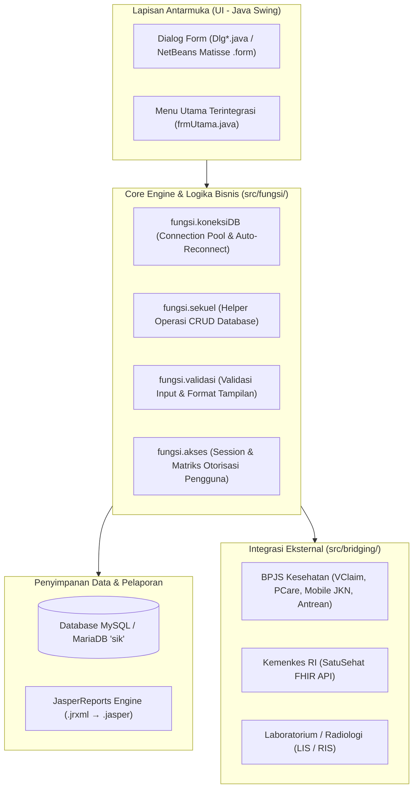
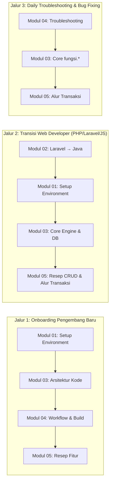
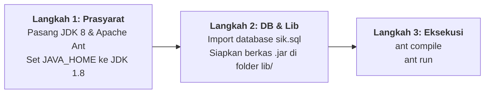

# Dokumentasi Resmi SIMRS-Khanza (Progressive Modular Suite)

Selamat datang di pusat dokumentasi resmi pengembangan **SIMRS-Khanza**. Dokumentasi ini disusun secara terstruktur (*Progressive Modular Suite*) untuk memandu tim pengembang, teknisi medis, analis sistem, dan *software engineer* dalam memahami, mengonfigurasi, mengembangkan, serta memelihara sistem informasi manajemen rumah sakit berbasis Java Desktop ini secara profesional.

---

## 1. Pengantar & Ikhtisar Proyek SIMRS-Khanza

**SIMRS-Khanza** adalah aplikasi Sistem Informasi Manajemen Rumah Sakit (*Hospital Information Management System*) *open-source* berbasis **Java Swing (Desktop)** yang telah diadopsi secara luas oleh ratusan rumah sakit, klinik, puskesmas, dan fasilitas kesehatan di seluruh Indonesia.



### Karakteristik Arsitektur Utama:
- **Arsitektur Desktop Monolitik State-Full**: Menggunakan Java Swing dengan rendering antarmuka cepat, responsif, dan stabil tanpa latensi koneksi halaman web.
- **Engine Database Terpadu**: Berinteraksi langsung dengan database relasional MySQL/MariaDB bernama `sik` yang memuat lebih dari 1.000 tabel transaksi medis, keuangan, farmasi, kepegawaian, dan logistik.
- **Sistem Keamanan Terenkripsi**: Konfigurasi koneksi database diamankan menggunakan algoritma enkripsi simetris **AES-128 bit** (`setting/database.xml`).
- **Integrasi Web Service Lengkap (*Bridging*)**: Menyediakan modul terintegrasi untuk BPJS Kesehatan (VClaim, Antrean RS, Aplicares, PCare, Mobile JKN), Kemenkes SatuSehat (OAuth2 & JSON FHIR Resource), serta integrasi LIS/RIS.
- **Mesin Pelaporan Standar Industri**: Template laporan dokumen medis dan bukti transaksi dikelola melalui berkas desain **JasperReports** (`.jrxml` $\rightarrow$ `.jasper`).
- **Lisensi**: Proyek ini dikembangkan di bawah lisensi *open-source* (GPL / YASKI - Yayasan SIMRS Khanza Indonesia) dengan komitmen keterbukaan kode demi kemandirian teknologi faskes nasional.

> [!NOTE]
> **Spesifikasi Target Standar**: Seluruh modul dokumentasi ini mengacu pada target kompilasi **JDK 8 (JavaSE-1.8)**, build system **Apache Ant**, dan output binary utama **`dist/SIMRSKhanza.jar`**.

---

## 2. Tabel Peta Navigasi Terpadu (Modul 01 s/d 05)

Dokumentasi ini dirancang modular agar Anda dapat langsung mengakses topik yang relevan dengan kebutuhan tugas Anda:

| Modul | Nama Panduan | Target Pembaca & Cakupan Materi | Tautan Modul |
| :---: | :--- | :--- | :---: |
| **01** | **Setup Environment dari Nol** | **Onboarding & Teknisi Baru**: Panduan instalasi JDK 8 (Temurin), Apache Ant, MySQL/MariaDB `sik`, penataan folder `lib/` (300+ JAR), konfigurasi VS Code teroptimasi, hingga aplikasi berhasil login. | [Buka Panduan Modul 01](01-getting-started.md) |
| **02** | **Panduan Konsep (Laravel → Java)** | **Web Developer / Transisi**: Jembatan mental model arsitektur web (Stateless/Blade/Eloquent/Middleware) menuju arsitektur desktop Java Swing (Stateful/Matisse/JDBC/EDT Threading) dilengkapi glosarium istilah Java. | [Buka Panduan Modul 02](02-laravel-to-java-guide.md) |
| **03** | **Arsitektur & Anatomi Kode Sumber** | **Software Architect & Core Dev**: Bedah direktori package `src/`, core engine `src/fungsi/` (`koneksiDB`, `sekuel`, `validasi`, `akses`), mekanisme enkripsi AES-128 `setting/database.xml`, anatomi NetBeans Matisse GUI, serta protokol bridging BPJS & SatuSehat. | [Buka Panduan Modul 03](03-architecture-and-codebase.md) |
| **04** | **Alur Kerja Pengembangan & Troubleshooting** | **Daily Engineer & DevOps**: Siklus *build* Apache Ant (`compile`, `run`, `jar`), *fast-iteration workflow* VS Code, manajemen Git & sinkronisasi upstream resmi, serta katalog solusi error database, memory, dan IDE. | [Buka Panduan Modul 04](04-development-workflow.md) |
| **05** | **Roadmap Pembelajaran & Resep Fitur** | **Fullstack Feature Developer**: Kurikulum 4 level belajar, resep pembuatan form CRUD Master baru dari nol, penelusuran alur transaksi inti RS (Registrasi → Rawat Jalan/SOAP → Farmasi → Kasir), kustomisasi JasperReports, dan blueprint REST API bridging. | [Buka Panduan Modul 05](05-feature-roadmap-and-recipes.md) |

---

## 3. Jalur Rekomendasi Membaca (*Learning Paths*)

Pilihlah jalur penelusuran dokumentasi yang paling sesuai dengan latar belakang dan tujuan Anda:



- **Jalur 1 — Pengembang Baru (*Fresh Onboarding*)**: Mulai dari [Modul 01](01-getting-started.md) untuk setup environment lokal, lanjutkan ke [Modul 03](03-architecture-and-codebase.md) untuk memahami struktur folder, lalu pelajari alur build di [Modul 04](04-development-workflow.md) dan praktikkan [Modul 05](05-feature-roadmap-and-recipes.md).
- **Jalur 2 — Pengembang Web (*Laravel/Node.js/Django*)**: Wajib membaca [Modul 02](02-laravel-to-java-guide.md) terlebih dahulu untuk memetakan analogi konsep web ke desktop, kemudian ikuti [Modul 01](01-getting-started.md) dan [Modul 03](03-architecture-and-codebase.md).
- **Jalur 3 — Penanganan Masalah & Pemeliharaan (*Maintenance*)**: Buka langsung [Modul 04 (Katalog Troubleshooting)](04-development-workflow.md#4-katalog-troubleshooting-komprehensif) dan [Modul 03 (Bedah Core Engine)](03-architecture-and-codebase.md#2-bedah-core-engine-di-srcfungsi).

---

## 4. Panduan Memulai Cepat (*Quick Start in 3 Steps*)

Bagi Anda yang sudah memiliki pemahaman dasar dan ingin menjalankan SIMRS-Khanza secepat mungkin di komputer lokal, ikuti 3 langkah utama berikut:



### Langkah 1: Pasang JDK 8 & Apache Ant
Pastikan Anda menggunakan **Java 8 (JavaSE-1.8)** dan **Apache Ant**:

```bash
# macOS (Homebrew)
brew install --cask temurin@8
brew install ant

# Linux Ubuntu / Debian
sudo apt update && sudo apt install openjdk-8-jdk ant

# Verifikasi versi yang aktif
java -version    # Harus menampilkan 1.8.x
javac -version   # Harus menampilkan 1.8.x
ant -version     # Menampilkan Apache Ant version 1.10.x atau lebih baru
```

> [!IMPORTANT]
> Pastikan variabel lingkungan `JAVA_HOME` mengarah ke instalasi JDK 8 (misal: `/Library/Java/JavaVirtualMachines/temurin-8.jdk/Contents/Home` di macOS atau `/usr/lib/jvm/java-8-openjdk-amd64` di Ubuntu).

---

### Langkah 2: Setup Database MySQL & Pustaka Dependensi (`lib/`)

1. **Buat Database dan Import Skema `sik`**:
   ```bash
   # Buat database dengan encoding utf8mb4
   mysql -u root -p -e "CREATE DATABASE sik CHARACTER SET utf8mb4 COLLATE utf8mb4_unicode_ci;"

   # Import skema database utama
   mysql -u root -p sik < sik.sql
   ```

2. **Siapkan Folder Dependensi Fisik `lib/`**:
   Salin seluruh file JAR dependensi (~318 berkas) ke dalam direktori `lib/` di root proyek. Folder ini diabaikan oleh Git (*git-ignored*) karena ukurannya yang besar (>300 MB).

3. **Konfigurasi Kredensial Database**:
   Pastikan konfigurasi host, port, user, dan password pada file `setting/database.xml` sesuai dengan MySQL lokal Anda (gunakan kredensial bawaan atau enkripsi teks AES-128 via modul pembantu).

---

### Langkah 3: Kompilasi & Jalankan Aplikasi

Jalankan perintah Ant langsung dari terminal di direktori root proyek:

```bash
# Kompilasi kode sumber
ant compile

# Jalankan aplikasi SIMRS-Khanza
ant run
```

Setelah jendela GUI muncul, login menggunakan akun supervisor/administrator default (misalnya ID: `spv` / Password: `spv` atau ID: `admin` / Password: `admin` sesuai data di tabel `user`).

---

## 5. Cheatsheet Perintah CLI Esensial (*Essential Commands*)

Berikut adalah ringkasan perintah baris perintah (*command line interface*) yang paling sering digunakan dalam pengembangan harian SIMRS-Khanza:

### A. Siklus Build Apache Ant
| Perintah | Fungsi / Kegunaan |
| :--- | :--- |
| `ant compile` | Mengompilasi seluruh kode sumber Java di folder `src/` ke berkas `.class` di `build/classes/`. |
| `ant run` | Mengompilasi kode dan langsung menjalankan kelas utama `simrskhanza.frmUtama`. |
| `ant jar` | Memaketkan seluruh hasil kompilasi menjadi berkas binary `dist/SIMRSKhanza.jar`. |
| `ant clean` | Menghapus seluruh folder output kompilasi (`build/` dan `dist/`). |
| `ant clean jar` | Membersihkan artefak lama, kompilasi ulang dari nol, dan membuat berkas `dist/SIMRSKhanza.jar` produksi. |

### B. Manajemen Database MySQL (`sik`)
| Perintah | Fungsi / Kegunaan |
| :--- | :--- |
| `mysql -u root -p` | Masuk ke interaktif prompt MySQL/MariaDB server lokal. |
| `mysql -u root -p -e "CREATE DATABASE sik;"` | Membuat database kosong bernama `sik`. |
| `mysql -u root -p sik < sik.sql` | Mengimpor struktur tabel dan data inisial utama SIMRS. |
| `mysql -u root -p sik < sik_bridging_lab.sql` | Mengimpor skema pendukung bridging modul laboratorium. |
| `mysqldump -u root -p sik > backup_sik_$(date +%Y%m%d).sql` | Membuat berkas cadangan (*dump*) lengkap database `sik`. |

### C. Alur Kerja Git & Kolaborasi Upstream
| Perintah | Fungsi / Kegunaan |
| :--- | :--- |
| `git remote add upstream https://github.com/mas-khanza/SIMRS-Khanza.git` | Menghubungkan repositori lokal ke repositori hulu (*upstream*) resmi Khanza. |
| `git fetch upstream` | Mengambil seluruh riwayat pembaruan commit dari upstream tanpa mengubah branch lokal. |
| `git checkout master && git merge upstream/master` | Melakukan sinkronisasi pembaruan resmi upstream ke branch `master` lokal. |
| `git checkout -b feature/nama-fitur` | Membuat dan berpindah ke branch baru untuk pengembangan fitur/kustomisasi RS. |
| `git status -s` | Melihat ringkasan berkas yang telah dimodifikasi secara ringkas. |

### D. Optimasi Memory Build (Mencegah `OutOfMemoryError`)
Jika proses kompilasi gagal akibat keterbatasan memori Java heap:
```bash
# Set alokasi heap RAM untuk Apache Ant (2 GB)
export ANT_OPTS="-Xms512m -Xmx2048m"

# Lalu jalankan build
ant clean jar
```

---

## 6. Standar Teknis & Konvensi Dokumentasi

Untuk menjaga konsistensi, keakuratan, dan keterbacaan suite dokumentasi ini di masa mendatang, seluruh kontributor dokumentasi wajib mematuhi standar berikut:

### 1. Ketetapan Versi & Parameter Teknis Baku
- **Target Java**: Selalu rujuk ke **JDK 8 / JavaSE-1.8** (`source="1.8"` dan `target="1.8"`). Jangan merujuk Java versi lain sebagai runtime target build Khanza.
- **Nama Berkas Biner JAR**: Output kompilasi packaging Apache Ant adalah **`dist/SIMRSKhanza.jar`** (sesuai definisi target `jar` pada `build.xml`).
- **Pustaka Dependensi**: Folder pustaka fisik selalu dirujuk sebagai **`lib/`** (bukan `dist/lib/` untuk sumber build, dan `lib/*.jar` di root).

### 2. Standar Notasi & Komponen Markdown
- **Gaya Kotak Info (*Alerts*)**: Gunakan sintaks GitHub Markdown Alerts standar:
  - `> [!NOTE]` : Untuk konteks tambahan, catatan latar belakang, atau penjelasan teoritis.
  - `> [!TIP]` : Untuk praktik terbaik (*best practices*), tips efisiensi, dan shortcut produktivitas.
  - `> [!IMPORTANT]` : Untuk prasyarat wajib, peringatan kompabilitas, atau langkah krusial yang tidak boleh dilewati.
  - `> [!WARNING]` : Untuk potensi galat fatal, konflik memori, atau larangan modifikasi kode generated.
- **Visualisasi Alur & Arsitektur**: Gunakan diagram blok berbasis teks **Mermaid** (`flowchart`, `sequenceDiagram`, `graph TD/LR`, `stateDiagram-v2`).
- **Navigasi & Tautan Relatif**: Setiap berkas modul wajib memuat tautan navigasi di bagian paling atas (*Header Nav*) dan paling bawah (*Footer Nav*) untuk memudahkan pembaca berpindah antar-bab.
- **Bahasa & Typografi**: Bahasa pengantar adalah **Bahasa Indonesia formal-teknis yang komunikatif**. Simbol alur menggunakan unicode panah lurus (`→`). Nama class, method, variabel, file, dan query SQL wajib diformat sebagai *inline code* (misal: `` `DlgReg.java` ``, `` `PreparedStatement` ``).

---

## 7. Indeks Direktori Dokumentasi

Berikut struktur berkas lengkap di dalam direktori `docs/`:

```
docs/
├── README.md                              # (Modul 0) Hub Navigasi Utama, Ringkasan, & Cheatsheet CLI
├── 01-getting-started.md                  # (Modul 1) Setup Environment dari Nol (macOS, Linux, Windows)
├── 02-laravel-to-java-guide.md            # (Modul 2) Jembatan Konsep Laravel vs Java & Glosarium
├── 03-architecture-and-codebase.md        # (Modul 3) Arsitektur Kode, Core Engine, Database & Bridging
├── 04-development-workflow.md             # (Modul 4) Alur Kerja Ant, VSCode Tasks, Git & Troubleshooting
├── 05-feature-roadmap-and-recipes.md      # (Modul 5) Roadmap Belajar, Resep CRUD Master, & JasperReports
└── superpowers/
    └── specs/
        └── 2026-08-27-documentation-modular-suite-design.md
```

---

*SIMRS-Khanza Documentation Suite — Dikembangkan dengan standar rekayasa perangkat lunak modern demi kemajuan teknologi informasi kesehatan Indonesia.*
